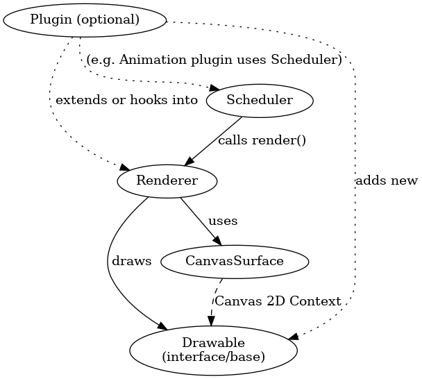

# CanvasSDK: A TypeScript-First Canvas Rendering Engine – Architecture and Plan

## Overview and Core Architecture

The **CanvasSDK** architecture centers on four core modules – **Renderer**, **CanvasSurface**, **Drawable**, and **Scheduler** – which work together to provide a lightweight, cross-platform 2D rendering engine.

The **Renderer** is responsible for orchestrating drawing operations; it uses a **CanvasSurface** (an abstraction of the underlying canvas/context) to issue drawing commands, and it iterates over one or more **Drawable** objects to render shapes or images onto the canvas. The **Scheduler** (optional) can drive the rendering loop, calling the Renderer’s render function on a timed interval (typically each animation frame).



This design cleanly separates concerns: the Renderer manages *what* to draw, the CanvasSurface handles *where* to draw (browser canvas, offscreen, or Node canvas), Drawables encapsulate *how* to draw a particular shape, and the Scheduler decides *when* to draw (for animations or continuous updates). Such modular separation echoes the design of other engines; for example, PixiJS also splits rendering, scene graph objects, and timing into distinct components ([Architecture Overview | PixiJS](https://pixijs.com/8.x/guides/basics/architecture-overview#:~:text=Component%20Description%20Renderer%20The%20core,Your%20game%20update)) ([Architecture Overview | PixiJS](https://pixijs.com/8.x/guides/basics/architecture-overview#:~:text=Assets%20The%20Asset%20system%20provides,making%20objects%20clickable)).

- **CanvasSurface:** This module abstracts the **rendering target**. It wraps the creation and management of a Canvas 2D context in a **runtime-agnostic** way. Whether the target is an HTML5 `<canvas>` element in the DOM, an `OffscreenCanvas` in a web worker, or a Node.js canvas object in a server environment, the CanvasSurface provides a uniform interface to obtain a `CanvasRenderingContext2D`. Internally, it can detect or be configured for the environment: e.g. using `canvasElement.getContext('2d')` in browsers, `OffscreenCanvas.getContext('2d')` in a worker, or invoking the Node canvas API. This design isolates environment-specific differences. The HTML canvas and OffscreenCanvas share the same API, so CanvasSurface can call `.getContext('2d')` on either. In a Node context, CanvasSurface can accept an injected canvas (from the **`canvas`** npm package) and call its context similarly. By abstracting these in CanvasSurface, the Renderer and Drawables can remain oblivious to the execution environment. This achieves *runtime agnosticism*: the drawing code works the same regardless of where it runs. (We discuss cross-environment details further in a later section.)

- **Drawable:** This is an interface or base class for any object that can be drawn on the canvas. Each Drawable encapsulates the instructions to render a specific shape or asset. For example, a `Rect` drawable might store properties like position, width, height, and fill style, and its implementation of `draw(context)` uses the 2D context API to draw a rectangle (e.g. `context.fillRect` or path drawing). By defining a common interface (`Drawable.draw(ctx: CanvasRenderingContext2D): void`), the Renderer can treat all drawables uniformly. Primitive shapes (rectangles, circles, bezier paths, text, images, etc.) will be implemented as Drawable classes. This design allows easy extension – developers can create custom Drawables by implementing the interface. The engine does not need to know about every shape type; it simply calls `drawable.draw(ctx)` on each item. (In an optional scene-graph mode, a Drawable could also carry a transform or layer information, but by default CanvasSDK keeps this minimal.) The **explicit rendering order** is preserved by the order in which drawables are rendered: unlike a retained scene graph that may have its own z-index sorting, CanvasSDK’s Renderer will draw in the sequence given (first added, first drawn, so earlier drawables can be overpainted by later ones if they overlap). This gives developers fine-grained control akin to immediate-mode drawing. If needed, an optional layering system (see plugins) can be introduced, but it’s not mandated by core.

- **Renderer:** The Renderer is the central coordinator. In a minimal use case, developers can use it in an immediate-mode style: e.g. instruct the Renderer to draw a list of drawables once. In a more managed scenario, the Renderer can hold an internal list of Drawables (acting as a simple scene list) which it will draw every time `renderer.render()` is called. By default, the Renderer does not assume a complex scene graph or perform automatic reordering; it simply clears the CanvasSurface (if desired) and iterates through drawables calling their draw routines in order. This explicit approach avoids the overhead of maintaining a heavy scene graph when not needed, aligning with our goal of being imperative and lightweight. (Notably, Paper.js and similar frameworks use a retained-mode scene graph which simplifies certain tasks but can add overhead; we make this **optional** in CanvasSDK to keep the core lean.) The Renderer interacts closely with CanvasSurface: it may request the CanvasSurface to prepare the drawing context (setting size, device pixel ratio, etc.) and uses the context for all drawing calls. This is analogous to how PixiJS’s core `Renderer` works with a rendering context and a scene graph: *“The core of the PixiJS system is the renderer, which displays the scene graph and draws it to the screen.”* ([Architecture Overview | PixiJS](https://pixijs.com/8.x/guides/basics/architecture-overview#:~:text=Component%20Description%20Renderer%20The%20core,Scene%20Graph%20for%20more%20details)) In our case, the “scene graph” is just a list of Drawables unless a plugin provides a more complex structure. The Renderer also provides an API for plugins or higher-level systems to hook into the drawing cycle (for example, a debug plugin might want to draw overlays *after* the main drawing, or an animation system might want to update properties *before* each render).

- **Scheduler:** The Scheduler is a utility for timing and game-loop control. It can be used to create an **automatic render loop** (e.g. using `window.requestAnimationFrame` in the browser, or a `setInterval`/`setTimeout` in non-browser contexts). Developers can use CanvasSDK in a **manual render** mode by simply calling `renderer.render()` whenever an update is needed, or they can use the Scheduler to animate continuously. The Scheduler can emit tick events or callbacks, often passing a delta time, and on each tick the Renderer can be invoked to draw the next frame. This pattern is similar to PixiJS’s **Ticker** which *“provides periodic callbacks based on a clock… generally run once per frame.”* ([Architecture Overview | PixiJS](https://pixijs.com/8.x/guides/basics/architecture-overview#:~:text=Assets%20The%20Asset%20system%20provides,making%20objects%20clickable)) We similarly allow multiple Schedulers or timers if needed (for example, one could have a Scheduler dedicated to animations at 60 FPS and another at a slower rate for physics or updates, if desired). The Scheduler ensures that when nothing is changing, it can pause or reduce the frame rate to save resources (more on performance strategy below). In a browser, Scheduler will default to `requestAnimationFrame` for smooth visuals, whereas in Node it might use `setImmediate` or a custom timing since there is no concept of a visual frame.

These core pieces interact as follows during a typical cycle: The **Scheduler** (if used) triggers a tick, the **Renderer** prepares the canvas (clearing it or other prep), then iterates through each **Drawable**, calling its draw method with the **CanvasSurface**’s context. Each Drawable executes high-performance Canvas 2D API calls (like `fillRect`, `beginPath`/`arc`/`fill`, `drawImage`, etc.), which are implemented in native code by the browser or Node canvas (so our engine mostly issues draw commands rather than doing heavy computations in JavaScript). This immediate drawing approach leverages the optimized Canvas API – as one discussion notes, the Canvas API functions can be thought of like a drawing language (similar to PostScript or Cairo commands) that the browser executes natively ([Paper.js — The Swiss Army Knife of Vector Graphics Scripting | Hacker News](https://news.ycombinator.com/item?id=2701609#:~:text=epistasis%20%20%2020%20,22%20%5B%E2%80%93)). After drawables are rendered, the frame is complete. If any plugins are present (e.g. a debug overlay plugin), they might hook into the Renderer to draw additional content on top, or if an animation plugin is driving state changes, it will update the Drawables’ properties each tick before rendering.

This design is **side-effect free** by default – simply importing the library does not automatically start any loops or draw to any canvas until the user instantiates and uses these classes. This ensures that unused parts of the library can be tree-shaken out by modern bundlers. In fact, the architecture is influenced by the **modular design** of frameworks like PixiJS, which is described as *“a modular rendering engine”* where *“each task required for generating, updating and displaying content is broken out into its own component… allowing for greater extensibility”* ([Architecture Overview | PixiJS](https://pixijs.com/7.x/guides/basics/architecture-overview#:~:text=PixiJS%20is%20a%20modular%20rendering,project%20needs%2C%20saving%20download%20size)). CanvasSDK takes a similar approach: core components are separated and additional features (tasks like animation, interaction, extra shapes) can be added without bloating the core.

## Project Structure and Module Organization

A clean, logical file/folder structure will help developers navigate CanvasSDK’s codebase and allow tree-shaking of unused modules. The layout is inspired by successful libraries like **Three.js**, **Pixi.js**, and **Tone.js**, which organize code by functionality and use ES modules for each class or feature. We propose the following high-level structure for the CanvasSDK repository (and its distribution as an npm package):

```plaintext
canvas-sdk/
├── src/
│   ├── core/                         # Core modules (no external dependencies, minimal API)
│   │   ├── CanvasSurface.ts          # CanvasSurface class (abstracts HTMLCanvas/Offscreen/Node surfaces)
│   │   ├── Renderer.ts               # Renderer class (orchestrates drawing)
│   │   ├── Drawable.ts               # Base interface or abstract class for drawable objects
│   │   ├── Scheduler.ts              # Scheduler/Timer for animation loops
│   │   └── types.ts                  # Core types and interfaces (e.g. DrawableConfig, Plugin interfaces)
│   ├── plugins/                      # Optional plugin modules (each in its own subfolder)
│   │   ├── shapes/                   # Plugin: basic shape primitives
│   │   │   ├── Rect.ts               # Rectangle shape implementation (implements Drawable)
│   │   │   ├── Circle.ts             # Circle shape implementation
│   │   │   ├── Path.ts               # Arbitrary path/Bezier shape
│   │   │   ├── Text.ts               # Text drawing (wraps context.fillText/strokeText)
│   │   │   └── Image.ts              # Image drawing (for bitmaps/sprites)
│   │   ├── animation/                # Plugin: lightweight animation/tween system
│   │   │   ├── Animator.ts           # Manages animated properties, uses Scheduler
│   │   │   ├── Tween.ts              # Tweening utility for interpolating values
│   │   │   └── easing.ts             # Common easing functions for animations
│   │   ├── interaction/              # Plugin: event handling and interactivity
│   │   │   ├── InteractionManager.ts # Handles pointer events, hit-testing drawables
│   │   │   └── Draggable.ts          # (Example: a mixin or subclass enabling drag & drop behavior)
│   │   ├── debug/                    # Plugin: debug overlays and tools
│   │   │   └── DebugOverlay.ts       # Draws visual debugging info (e.g. bounding boxes, FPS counter)
│   │   └── scenegraph/               # Plugin: optional scene graph (retained mode) support
│   │       ├── Node.ts               # Scene graph Node (could extend Drawable for rendering)
│   │       ├── Group.ts              # Grouping container (a Node that holds children)
│   │       └── Layer.ts              # Layer or Stage for grouping drawables, possibly backing its own CanvasSurface
│   ├── platform/                     # Environment-specific adapters (if needed)
│   │   ├── browser.ts                # Code for browser-specific helpers (e.g. createCanvasSurface from HTMLCanvas)
│   │   ├── worker.ts                 # Helpers for OffscreenCanvas usage in Web Workers
│   │   └── node.ts                   # Node environment detection and integration (using node-canvas)
│   ├── react-bindings/               # (Optional separate package or module) React integration
│   │   └── CanvasSDKCanvas.tsx       # React component that wraps a CanvasSurface and provides a declarative API
│   └── index.ts                      # Entry point that re-exports core (and maybe default plugins)
├── tests/                            # Unit tests for core and plugins
├── examples/                         # Example projects (browser demos, Node scripts, etc.)
└── package.json
```

In this structure, each major class or module lives in its own file (or few related files), enabling fine-grained imports. For instance, a user who only needs to draw basic shapes might import `Renderer` and `CanvasSurface` from `core`, and specific shapes from the `plugins/shapes` module. Unused modules (e.g. interaction or animation) will not be pulled into the bundle unless explicitly imported, which the ES module format supports for tree shaking ([Architecture Overview | PixiJS](https://pixijs.com/7.x/guides/basics/architecture-overview#:~:text=PixiJS%20is%20a%20modular%20rendering,project%20needs%2C%20saving%20download%20size)). This approach is similar to PixiJS v7+, where the library is broken into packages like `@pixi/core`, `@pixi/graphics`, `@pixi/interaction`, etc., and one can even build a custom bundle containing only needed parts ([Architecture Overview | PixiJS](https://pixijs.com/7.x/guides/basics/architecture-overview#:~:text=PixiJS%20is%20a%20modular%20rendering,project%20needs%2C%20saving%20download%20size)) ([Architecture Overview | PixiJS](https://pixijs.com/7.x/guides/basics/architecture-overview#:~:text=Component%20Description%20Renderer%20,Your)). Our `plugins` directory is conceptually similar – each plugin can be published as an independent sub-module (or even a separate npm package under the `@canvas-sdk` namespace, such as `@reliverse/csdk-shapes` or `@reliverse/csdk-animation`).

**Core vs Plugins:** The `core` directory contains only the fundamental building blocks that are always needed: context management, the rendering loop, and the Drawable interface. Everything else is opt-in. For example, shape classes (Rect, Circle, etc.) could be considered “extras” – one could use CanvasSDK without them by writing custom draw calls, but practically they are common enough that we provide them as a default plugin module. By keeping even shapes modular, we adhere to the “tree-shakable and side-effect free” principle. In practice, we might bundle the basic shapes with the library distribution for convenience, but they will be implemented in a separate module so that advanced users can exclude or replace them. A developer concerned about bundle size could choose to import only the specific shapes they need (e.g. only `Rect` and `Text` but not `Circle`), since each shape is in its own file. Tone.js had a similar structure for its components, where one could import individual files (e.g. `Tone/core/Transport`) to reduce package size ([Installation · Tonejs/Tone.js Wiki · GitHub](https://github.com/Tonejs/Tone.js/wiki/Installation#:~:text=)) ([Installation · Tonejs/Tone.js Wiki · GitHub](https://github.com/Tonejs/Tone.js/wiki/Installation#:~:text=)). CanvasSDK aims for a clean separation to allow this granular usage if needed.

**Platform adapters:** The `platform` folder is optional and would contain any code that is environment-specific (to avoid cluttering the main modules with `if (typeof window !== 'undefined')` checks, etc.). For instance, `node.ts` might export a function to create a Node-compatible CanvasSurface by requiring the `canvas` package (Node-canvas). This file would only be imported in a Node context (or dynamically at runtime), ensuring that browser bundles don’t accidentally include Node-only code. Similarly, if we provide helper functions to create an OffscreenCanvas and transfer control of it to a worker, those could reside in `platform/worker.ts`. However, most environment handling can be done within CanvasSurface itself (using feature detection), so these adapters are mainly for convenience.

**Integrations:** Finally, the `react-bindings` (and similarly `vue-bindings` or `svelte-bindings` if provided) would contain framework-specific integration code. We envision a small React library (possibly as a separate package `canvas-sdk-react`) that offers React components for CanvasSDK (much like **React Konva** or **React Three Fiber**). This keeps framework-related code out of the core. The core remains framework-agnostic and imperative, but these integration modules can provide a declarative API on top (more in Extensions section).

Overall, this structure keeps the code **modular and organized by feature**, making it easy for contributors to work on specific aspects (like adding a new shape plugin or improving the scheduler) without touching unrelated parts. It also mirrors the conceptual separation in the architecture diagram: core engine vs optional plugins. The benefit of this modular approach is clearly seen in how PixiJS and Three.js manage their codebases – e.g., Three.js has separate folders for `geometries`, `materials`, `renderers`, `scenes`, etc., which improves clarity and maintainability. CanvasSDK’s folders (core, plugins, platform, etc.) serve a similar purpose, mapping directly to the conceptual components of the engine.

## Alternative Potential Approaches

The modern web demands flexible, performant rendering tools that work across various environments without compromise. CanvasSDK aims to be a lightweight, modular, and runtime-flexible graphics engine that decouples Canvas 2D rendering capabilities from the DOM, enabling consistent rendering in browsers, headless environments, and even Node.js.

## Architecture Overview

The architecture of CanvasSDK follows a clear separation of concerns, enabling modular composition while maintaining high performance and runtime flexibility.

### High-Level Architecture Diagram

```mermaid
└────────────────────────────────────────────────────────────────────┐
│                          CanvasSDK Core                            │
├────────────┬─────────────┬────────────┬────────────┬──────────────┤
│            │             │            │            │              │
│  Surface   │  Renderer   │ Drawable   │ Scheduler  │    Events    │
│    API     │             │    API     │            │              │
│            │             │            │            │              │
├────────────┴─────────────┴────────────┴────────────┴──────────────┤
│                             Utils                                  │
├─────────────────────────────────────────────────────────────────────┤
│                        Extension Modules                           │
│                                                                    │
│  @reliverse/csdk-react  │  @reliverse/csdk-particles  │  @reliverse/csdk-gui  │
└────────────────────────────────────────────────────────────────────┘
```

### Core Components

1. **Surface API**: Abstracts the canvas rendering surface across environments.
2. **Renderer**: Manages the rendering pipeline and optimization strategies.
3. **Drawable API**: Defines interfaces for shapes and other drawing primitives.
4. **Scheduler**: Manages timing, animation frames, and render loops.
5. **Events**: Handles input events and interactions.
6. **Utils**: Common utilities for math, color, performance, and debugging.

Each of these components can be used independently, and the architecture supports tree-shaking to ensure minimal bundle sizes.

## File Structure and Organization

```bash
/packages
  /core
    /src
      /surface
        index.ts
        base-surface.ts
        browser-surface.ts
        offscreen-surface.ts
        node-surface.ts
      /renderer
        index.ts
        base-renderer.ts
        batch-renderer.ts
        utils/
      /drawable
        index.ts
        base-drawable.ts
        shapes/
        text.ts
        image.ts
        group.ts
      /scheduler
        index.ts
        frame-scheduler.ts
        animation.ts
        timeline.ts
        easing.ts
      /events
        index.ts
        event-manager.ts
        pointer-events.ts
      /utils
        math.ts
        color.ts
        debug.ts
        performance.ts
      index.ts (main exports)
  /react
    /src
      hooks/
      components/
      context/
  /particles
    /src
      particle.ts
      emitter.ts
      effects/
  /examples
    /basic
    /react
    /node
    /animation
```

This structure facilitates:

- Clear separation of concerns
- Modular, tree-shakable exports
- Independent versioning of packages
- Clean developer experience with explicit imports

## Surface API: Runtime-Agnostic Canvas Handling

The Surface API is the foundation of CanvasSDK's environment flexibility. It abstracts away the differences between various canvas implementations:

```typescript
interface CanvasSurface {
  // Core properties
  readonly width: number;
  readonly height: number;
  readonly devicePixelRatio: number;
  
  // Context access
  getContext(): CanvasRenderingContext2D | OffscreenCanvasRenderingContext2D;
  
  // Surface operations
  resize(width: number, height: number): void;
  clear(x?: number, y?: number, width?: number, height?: number): void;
  
  // Export capabilities
  toDataURL(type?: string, quality?: number): string | Promise;
  toBlob(callback: (blob: Blob | null) => void, type?: string, quality?: number): void;
  
  // Environment capabilities
  isOffscreen(): boolean;
  supportsImageSmoothing(): boolean;
}
```

Implementation examples for different environments:

```typescript
// Browser implementation
class BrowserCanvasSurface implements CanvasSurface {
  private element: HTMLCanvasElement;
  private context: CanvasRenderingContext2D;
  
  constructor(element: HTMLCanvasElement) {
    this.element = element;
    const ctx = element.getContext('2d');
    if (!ctx) throw new Error('Could not get 2D context from canvas element');
    this.context = ctx;
    this.setupHighDPI();
  }
  
  // Implementation details...
}

// Node.js implementation
class NodeCanvasSurface implements CanvasSurface {
  private canvas: any; // node-canvas instance
  private context: any; // node-canvas context
  
  constructor(canvas: any) {
    this.canvas = canvas;
    this.context = canvas.getContext('2d');
  }
  
  // Implementation details...
}

// OffscreenCanvas implementation
class OffscreenCanvasSurface implements CanvasSurface {
  private canvas: OffscreenCanvas;
  private context: OffscreenCanvasRenderingContext2D;
  
  constructor(canvas: OffscreenCanvas) {
    this.canvas = canvas;
    const ctx = canvas.getContext('2d');
    if (!ctx) throw new Error('Could not get 2D context from OffscreenCanvas');
    this.context = ctx;
  }
  
  // Implementation details...
}
```

## Update Loop and Performance Strategies

CanvasSDK offers flexible update and rendering strategies to balance performance and developer experience:

### Update Strategies

```typescript
interface UpdateStrategy {
  shouldUpdate(drawable: Drawable): boolean;
  markDirty(region?: Region): void;
  clear(): void;
}

// Full redraw strategy (simplest)
class FullUpdateStrategy implements UpdateStrategy {
  shouldUpdate(drawable: Drawable): boolean {
    return drawable.visible;
  }
  
  markDirty(): void {
    // Always fully dirty
  }
  
  clear(): void {
    // Nothing to clear
  }
}

// Dirty region tracking (better performance)
class DirtyRegionStrategy implements UpdateStrategy {
  private dirtyRegions: Region[] = [];
  
  shouldUpdate(drawable: Drawable): boolean {
    if (!drawable.visible) return false;
    
    const bounds = drawable.getBounds();
    return this.dirtyRegions.some(region => 
      intersects(region, bounds)
    );
  }
  
  markDirty(region?: Region): void {
    if (region) {
      this.dirtyRegions.push(region);
    } else {
      // Mark everything dirty
      this.dirtyRegions = [{ x: 0, y: 0, width: Infinity, height: Infinity }];
    }
  }
  
  clear(): void {
    this.dirtyRegions = [];
  }
}
```

### Render Loop Management

```typescript
interface Scheduler {
  // Frame scheduling
  requestFrame(callback: FrameCallback): FrameRequest;
  cancelFrame(request: FrameRequest): void;
  
  // Animation loop
  start(): void;
  stop(): void;
  pause(): void;
  resume(): void;
  
  // Timing
  getDeltaTime(): number;
  getElapsedTime(): number;
  
  // FPS monitoring
  getFPS(): number;
}

// Browser implementation with requestAnimationFrame
class BrowserScheduler implements Scheduler {
  private isRunning = false;
  private lastTime = 0;
  private frameRequest: number | null = null;
  private callback: FrameCallback | null = null;
  
  start(callback: FrameCallback): void {
    this.isRunning = true;
    this.callback = callback;
    this.lastTime = performance.now();
    this.scheduleNextFrame();
  }
  
  private scheduleNextFrame(): void {
    if (!this.isRunning || !this.callback) return;
    
    this.frameRequest = requestAnimationFrame((time) => {
      const delta = time - this.lastTime;
      this.lastTime = time;
      
      if (this.callback) {
        this.callback(delta, time);
      }
      
      this.scheduleNextFrame();
    });
  }
  
  // Other methods...
}

// Node.js implementation with setImmediate/setTimeout
class NodeScheduler implements Scheduler {
  private isRunning = false;
  private lastTime = 0;
  private frameRequest: NodeJS.Immediate | null = null;
  private callback: FrameCallback | null = null;
  private targetFPS: number;
  
  constructor(options: { targetFPS?: number } = {}) {
    this.targetFPS = options.targetFPS || 60;
  }
  
  start(callback: FrameCallback): void {
    this.isRunning = true;
    this.callback = callback;
    this.lastTime = Date.now();
    this.scheduleNextFrame();
  }
  
  private scheduleNextFrame(): void {
    if (!this.isRunning || !this.callback) return;
    
    const frameTime = 1000 / this.targetFPS;
    const now = Date.now();
    const delta = now - this.lastTime;
    
    const delay = Math.max(0, frameTime - delta);
    
    this.frameRequest = setTimeout(() => {
      const currentTime = Date.now();
      const actualDelta = currentTime - this.lastTime;
      this.lastTime = currentTime;
      
      if (this.callback) {
        this.callback(actualDelta, currentTime);
      }
      
      this.scheduleNextFrame();
    }, delay);
  }
  
  // Other methods...
}
```

## Plugin System

CanvasSDK provides a simple but powerful plugin system:

```typescript
interface Plugin {
  name: string;
  install(sdk: CanvasSDK): void;
  uninstall?(sdk: CanvasSDK): void;
}

// In CanvasSDK core
class CanvasSDK {
  private plugins: Map = new Map();
  
  use(plugin: Plugin): this {
    if (this.plugins.has(plugin.name)) {
      console.warn(`Plugin ${plugin.name} is already installed.`);
      return this;
    }
    
    plugin.install(this);
    this.plugins.set(plugin.name, plugin);
    return this;
  }
  
  remove(pluginName: string): this {
    const plugin = this.plugins.get(pluginName);
    if (plugin && plugin.uninstall) {
      plugin.uninstall(this);
    }
    this.plugins.delete(pluginName);
    return this;
  }
}

// Example plugin
const ParticlesPlugin: Plugin = {
  name: 'particles',
  
  install(sdk: CanvasSDK): void {
    // Add particle system capabilities
    sdk.registerDrawable('particle', ParticleDrawable);
    sdk.registerFactory('createEmitter', createParticleEmitter);
    
    // Could also extend prototype, add methods, etc.
  }
};

// Usage
const sdk = new CanvasSDK();
sdk.use(ParticlesPlugin);

// Now we can use particles functionality
const emitter = sdk.createEmitter({/* options */});
```

## API Examples

### Declarative Shape Creation

```typescript
import { CanvasSDK, Rectangle, Circle, Path } from 'canvas-sdk';

// Create SDK instance
const sdk = new CanvasSDK({
  surface: { 
    type: 'browser', 
    element: document.getElementById('canvas') 
  }
});

// Create shapes
const rect = new Rectangle({
  x: 100,
  y: 100,
  width: 200,
  height: 150,
  fill: 'red',
  stroke: 'black',
  strokeWidth: 2,
});

const circle = new Circle({
  x: 300,
  y: 200,
  radius: 50,
  fill: 'blue',
});

// Add to renderer and draw
sdk.renderer.add(rect);
sdk.renderer.add(circle);
sdk.renderer.render();
```

### Manual vs Auto-Render Loop

```typescript
// Manual rendering
const sdk = new CanvasSDK({ /* options */ });

function updateAndRender() {
  // Update logic
  circle.x += 1;
  
  // Render frame
  sdk.renderer.render();
  
  // Manual control of timing
  setTimeout(updateAndRender, 16); // ~60fps
}

updateAndRender();

// Auto rendering with animation loop
const autoSdk = new CanvasSDK({ 
  autoRender: true, // Enable auto rendering
  targetFPS: 60,    // Optional FPS target
});

// Register update callback
autoSdk.scheduler.onUpdate((deltaTime) => {
  // Update logic based on deltaTime
  circle.x += deltaTime * 0.1;
  
  // No need to call render() - handled automatically
});

// Start/stop the render loop
autoSdk.scheduler.start();
// Later...
autoSdk.scheduler.stop();
```

### Headless Canvas in Node.js

```typescript
// Node.js environment
import { CanvasSDK } from 'canvas-sdk';
import { createCanvas } from 'canvas'; // node-canvas

// Create a node-canvas instance
const nodeCanvas = createCanvas(800, 600);

// Create SDK with node canvas surface
const sdk = new CanvasSDK({
  surface: {
    type: 'node',
    canvas: nodeCanvas,
  }
});

// Add drawables and render
const circle = new Circle({ x: 400, y: 300, radius: 100, fill: 'green' });
sdk.renderer.add(circle);
sdk.renderer.render();

// Export to file
const fs = require('fs');
const buffer = nodeCanvas.toBuffer('image/png');
fs.writeFileSync('output.png', buffer);

// Generate animation frames
for (let frame = 0; frame (null);
  const { sdk, drawable } = useCanvasSDK(canvasRef);
  
  useEffect(() => {
    if (!sdk) return;
    
    // Create and add shapes
    const circle = drawable.circle({
      x: 100,
      y: 100,
      radius: 50,
      fill: 'red',
    });
    
    // Animate with React state
    const handleClick = () => {
      sdk.animate(circle, {
        properties: { radius: circle.radius === 50 ? 80 : 50 },
        duration: 500,
      });
    };
    
    // Add event listener
    circle.on('click', handleClick);
    
    return () => {
      // Cleanup
      circle.destroy();
    };
  }, [sdk, drawable]);
  
  return ;
}

// Declarative component approach
function DeclarativeCanvas() {
  const [position, setPosition] = useState({ x: 100, y: 100 });
  
  return (
    
       setPosition({ x: 200, y: 200 })}
      />
      
      
        
        
      
    
  );
}
```

## Architecture Tradeoffs

### Scene Graph vs. Flat Drawing List

**Recommended approach**: Optional layering system, not mandatory scene graph

- **Pros of scene graph**:
  - Hierarchical transformations (child elements inherit parent transforms)
  - Logical grouping of related elements
  - Easier hit testing and event propagation

- **Cons of scene graph**:
  - Performance overhead for deep hierarchies
  - More complex implementation
  - Not always needed for simple visualizations

CanvasSDK offers a simple `Group` drawable for basic grouping without forcing a full scene graph model:

```typescript
// Lightweight grouping with optional z-indexing
const group = new Group({
  x: 100,
  y: 100,
  children: [
    new Circle({ x: 0, y: 0, radius: 50, fill: 'red' }), // relative to group
    new Rectangle({ x: 50, y: 50, width: 100, height: 100, fill: 'blue' })
  ]
});

sdk.renderer.add(group);
```

### Immediate Mode vs. Retained Mode

**Recommended approach**: Hybrid model - retained objects with immediate-mode-like API

- **Pros of immediate mode** (direct drawing commands):
  - Simpler mental model (just call drawing functions)
  - Matches the Canvas 2D API directly
  - Lower memory footprint for static scenes

- **Pros of retained mode** (stored objects):
  - Enables optimizations like dirty region tracking
  - Makes hit testing and event handling easier
  - Better for interactive elements that change over time

CanvasSDK combines both approaches:

```typescript
// Retained mode (store objects)
const circle = new Circle({ x: 100, y: 100, radius: 50, fill: 'red' });
sdk.renderer.add(circle);

// But also immediate-mode API for simple cases
sdk.draw.circle(200, 200, 50, { fill: 'blue' });
sdk.draw.rect(300, 300, 100, 80, { fill: 'green' });
```

### Performance vs. Simplicity

**Recommended approach**: Progressive optimization

- Start with full redraw by default (simpler)
- Provide opt-in performance features:
  - Dirty region tracking
  - Object culling (don't draw offscreen objects)
  - Canvas state batching (minimize context state changes)

```typescript
// Default simple behavior
const sdk = new CanvasSDK();

// Opt-in to performance features
const optimizedSdk = new CanvasSDK({
  updateStrategy: 'dirtyRegion',
  enableCulling: true,
  batchOperations: true
});

// Progressive optimization 
sdk.setUpdateStrategy(new DirtyRegionStrategy());
```

## Prior Art and Inspiration

CanvasSDK draws inspiration from several existing libraries while addressing their limitations:

### PixiJS

- **Strengths**: Excellent performance, rich feature set, good plugin ecosystem

- **Limitations**: Large bundle size, WebGL-first approach, monolithic architecture
- **CanvasSDK improvement**: Focus on Canvas 2D API, modular architecture, smaller footprint

### p5.js

- **Strengths**: Intuitive API, excellent for sketching, strong community

- **Limitations**: Global state, not tree-shakable, limited optimization options
- **CanvasSDK improvement**: No globals, modular design, better TypeScript support

### Konva

- **Strengths**: Good event system, stage/layer concept, established patterns

- **Limitations**: Forces scene graph model, less flexible rendering pipeline
- **CanvasSDK improvement**: Optional scene graph, flexible render strategies

### react-konva

- **Strengths**: Declarative React API for canvas

- **Limitations**: Tied to Konva, React reconciliation performance issues
- **CanvasSDK improvement**: Custom React renderer optimization, independent core

## Potential Extensions

### Framework Bindings

- **@reliverse/csdk-react**: React components and hooks for declarative canvas
- **@reliverse/csdk-vue**: Vue components and composables
- **@reliverse/csdk-svelte**: Svelte components and stores

### Advanced Features

- **@reliverse/csdk-particles**: Particle system plugin
- **@reliverse/csdk-physics**: Basic 2D physics simulation
- **@reliverse/csdk-gui**: UI controls rendered on canvas

### WebGL Abstraction Layer

Future versions could include a WebGL renderer option that maintains the same API surface:

```typescript
const sdk = new CanvasSDK({
  renderer: 'webgl', // Use WebGL instead of Canvas 2D
  fallback: 'canvas' // Fallback if WebGL isn't available
});
```

## Cross-Environment Rendering (Browser, OffscreenCanvas, Node.js)

CanvasSDK is designed to work consistently across multiple JavaScript environments. The primary targets are:

- **Web Browsers (main thread):** Using a traditional `HTMLCanvasElement` in the DOM.
- **Web Workers:** Using `OffscreenCanvas` for rendering off the main thread.
- **Node.js (Headless):** Using a Node canvas implementation (like the **`canvas`** npm package, which is backed by Cairo) for server-side or scripting use cases.

Achieving this requires careful abstraction of the canvas handling. The key is that all environments provide a **Canvas 2D Context** with (almost) the same API. In browsers, `CanvasRenderingContext2D` is obtained from a canvas element; in workers, from an OffscreenCanvas; in Node, from a `Canvas` instance. The **CanvasSurface** module is responsible for managing these differences. It can be implemented to handle three scenarios:

- **Browser DOM:** The user provides an existing `<canvas>` element (or a canvas ID) to CanvasSurface. CanvasSurface stores a reference to the element and calls `getContext('2d')` on it, obtaining the drawing context. It may also handle device pixel ratio scaling (to support high-DPI displays) by setting canvas width/height according to `window.devicePixelRatio`. The CanvasSurface could optionally attach the canvas element to the document if needed (though typically the user does that).

- **OffscreenCanvas (Web Worker):** The OffscreenCanvas can be created in the main thread and passed to a Worker, or created directly in the Worker (if the API is available there). CanvasSurface will detect if the provided canvas object is an `OffscreenCanvas` (for example by checking `canvas instanceof OffscreenCanvas` if available, or simply by the absence of `nodeName` property that HTML elements have). It then calls `canvas.getContext('2d')` in the worker context. The rest of the rendering code is identical – we draw to that offscreen context. The OffscreenCanvas can then be transferred to an onscreen canvas for display. According to MDN, *“OffscreenCanvas… decoupl[es] the DOM and the Canvas API so that the `<canvas>` element is no longer entirely dependent on the DOM. Rendering operations can also be run inside a worker, allowing you to run some tasks in a separate thread and avoid heavy work on the main thread.”* ([OffscreenCanvas - Web APIs | MDN](https://developer.mozilla.org/en-US/docs/Web/API/OffscreenCanvas#:~:text=The%20,work%20on%20the%20main%20thread)) CanvasSDK leverages this by making no assumption that a DOM is present. There’s no use of `document.getElementById` or similar in core code – it all works with the generic CanvasSurface interface.

- **Node.js:** In Node, there is obviously no DOM, so one cannot create an HTMLCanvasElement. Instead, we can implement `@reliverse/csdk-node` or just rely on a library like **node-canvas** (which implements the Canvas API using native code). A Node developer would do something like: `const { createCanvas } = require('canvas'); const nodeCanvas = createCanvas(width, height);`. The `nodeCanvas` object behaves similar to an HTML canvas element – it has a `.getContext('2d')` method returning a context. CanvasSurface can detect a Node canvas by checking for the presence of Node-specific fields (for instance, the node-canvas context might have a different prototype or the canvas might not be an instance of HTMLCanvasElement/OffscreenCanvas). In practice, we might require the user to explicitly indicate the Node environment, or simply attempt to `require('canvas')` if no DOM is present. Konva.js, for example, included a separate build or package (`konva-node`) that patches Konva to use node-canvas, allowing the same drawing commands to run in Node ([Rendering Videos in Node.JS with Konva and FFmpeg](https://leanylabs.com/blog/node-videos-konva/#:~:text=Konva%20also%20works%20in%20Node,on%20top%20of%20Cairo%2C%20a)). In our case, CanvasSDK could provide a utility (in `platform/node.ts`) to create a CanvasSurface from given width/height in Node, encapsulating the `createCanvas` call. Once we have a Node 2D context, the Renderer and Drawables operate on it just like in the browser. This enables **headless rendering** – the drawn result isn’t displayed on a screen but can be exported to an image file or used further in Node.

**Unified API:** To the rest of CanvasSDK, a CanvasSurface just yields a context and perhaps some canvas-related metadata (like size). The Renderer doesn’t care if the context came from a DOM canvas, an OffscreenCanvas, or a Node canvas; it calls the same 2D drawing methods on it. This uniform approach is why the library can be largely agnostic to the environment. For example, drawing a circle with `context.arc()` and `context.fill()` works identically whether `context` is a browser CanvasRenderingContext2D or a node-canvas Context2D.

One subtle difference is output handling: in a browser, the results appear on screen automatically when you draw on the context; in an OffscreenCanvas, you might transfer the result back to a visible canvas; in Node, you likely want to output to a file or buffer. CanvasSDK will provide methods for these when relevant. The CanvasSurface could have a method like `toBlob()` or `toBuffer()` that calls the appropriate underlying API: in a browser canvas, one would use `canvas.toBlob()` or `toDataURL()`, in OffscreenCanvas there’s `OffscreenCanvas.convertToBlob()` ([OffscreenCanvas - Web APIs | MDN](https://developer.mozilla.org/en-US/docs/Web/API/OffscreenCanvas#:~:text=OffscreenCanvas)), and in Node we have `canvas.toBuffer()`. This could be part of an optional **export plugin** (since not every app will need to export images), but it shows the flexibility of handling runtime differences.

**Example usage across environments:**

- *Browser main thread:*

  ```typescript
  const canvasElem = document.getElementById('myCanvas') as HTMLCanvasElement;
  const surface = new CanvasSurface(canvasElem);
  const renderer = new Renderer(surface);
  // ... use renderer to draw ...
  ```

  Here CanvasSurface just uses the element directly.

- *Web Worker with OffscreenCanvas:* (pseudo-code)

  ```javascript
  // In main thread:
  const offscreen = canvasElem.transferControlToOffscreen();
  worker.postMessage({ canvas: offscreen }, [offscreen]);
  // In worker script:
  const { canvas } = event.data;
  const surface = new CanvasSurface(canvas);  // canvas is an OffscreenCanvas
  const renderer = new Renderer(surface);
  // proceed to draw offscreen
  ```

  The OffscreenCanvas rendering calls in the worker do not block the UI. The main thread can use an `ImageBitmapRenderingContext` to display the offscreen’s content if needed ([OffscreenCanvas - Web APIs | MDN](https://developer.mozilla.org/en-US/docs/Web/API/OffscreenCanvas#:~:text=Synchronous%20display%20of%20frames%20produced,by%20an%20OffscreenCanvas)) ([OffscreenCanvas - Web APIs | MDN](https://developer.mozilla.org/en-US/docs/Web/API/OffscreenCanvas#:~:text=To%20display%20the%20,A%20single)), but CanvasSDK itself doesn’t manage that – it just draws offscreen.

- *Node.js:*

  ```typescript
  import { createCanvas } from 'canvas';
  import { CanvasSurface, Renderer, Rect } from 'canvas-sdk';
  const nodeCanvas = createCanvas(800, 600);
  const surface = new CanvasSurface(nodeCanvas);
  const renderer = new Renderer(surface);
  renderer.add(new Rect({x:0, y:0, width:800, height:600, fill: 'blue'}));
  renderer.render();
  // Export to file:
  const fs = require('fs');
  fs.writeFileSync('output.png', nodeCanvas.toBuffer('image/png'));
  ```

  In this scenario, our library used the Node canvas context to draw (through `CanvasSurface` and `Renderer`), then we manually saved the result. This workflow is similar to how Konva can be used server-side. In fact, Konva’s documentation notes that it works in Node on top of node-canvas ([Rendering Videos in Node.JS with Konva and FFmpeg](https://leanylabs.com/blog/node-videos-konva/#:~:text=Konva%20also%20works%20in%20Node,on%20top%20of%20Cairo%2C%20a)), and their example usage involves calling `toDataURL()` or `toBuffer()` on the stage to get an image. CanvasSDK will support the same.

**SSR Considerations:** Because CanvasSDK does not inherently rely on any DOM APIs, it can be safely imported in a Node.js context (for server-side rendering or prerendering). If used for server-side rendering of graphics, a Node canvas could be used to generate an image during the SSR phase. For instance, if building a charting server, one could use CanvasSDK in Node to produce a PNG that is sent to the client. The important part is that all conditional imports of environment-specific code are isolated, so using the library in a Node environment won’t try to touch `window` or `document` (avoiding ReferenceErrors). Conversely, when bundling for the browser, any Node-specific code (like requiring the `canvas` module) should be excluded. We ensure this by either providing separate entry points or by wrapping such requires in `if (typeof process !== 'undefined')` guards.

To summarize, **CanvasSDK’s cross-environment strategy** is to funnel all drawing through a unified CanvasSurface interface. The differences in canvas creation and output are handled internally or via small adapters. This means as a developer, you use the same API whether drawing to screen, to an offscreen buffer, or to a server-side canvas. The complexity of each environment is abstracted away, fulfilling the goal of a *“works everywhere”* canvas engine. By comparison, libraries like Paper.js and Fabric.js primarily target the browser, and while they can be made to work in Node (Fabric has node-canvas support, Paper.js can run headlessly), those were later adaptations. CanvasSDK is **designed from the start** for multi-environment support, which is a significant ergonomic improvement for developers who might need rendering in web apps and Node apps with the same code.

## Update Loop and Performance Strategy

Performance is critical in a rendering engine, and CanvasSDK’s design employs an explicit rendering loop with **dirty checking** and **virtualized redraw** options to balance efficiency with simplicity. The engine defaults to a straightforward immediate-mode rendering, which is often the fastest path for dynamic content, but it also provides hooks to avoid unnecessary work when the scene is static or only partially changes.

**Immediate vs. Retained Rendering:** By default, CanvasSDK operates in an immediate mode (imperative drawing each frame). This means if you are animating or updating, you’ll typically clear the canvas and redraw all relevant drawables each time `Renderer.render()` is called. This approach is simple and leverages the browser’s optimized drawing routines, but can be wasteful if only a small portion of the scene changes. The alternative is retained-mode (scene graph), where the engine keeps track of objects and only updates those that changed. CanvasSDK can optionally support this via the scenegraph plugin, but in core it takes a lighter approach: **dirty regions / dirty objects**.

**Dirty Checking:** The engine can track a “dirty” flag for each Drawable or for the canvas as a whole. For example, if none of the drawables have changed position, size, or style since the last render, the Renderer can skip issuing draw calls (essentially skipping a frame). This is akin to how UI libraries throttle redraws. In the context of canvas, several libraries implement something similar: CreateJS’s Stage, for instance, only redraws when `.update()` is called, and tools like ZIM and CreateJS recommend calling stage.update only on changes to save CPU ([Selecting a JavaScript Canvas Library or Framework | by Dr Abstract | Medium](https://drabstract.medium.com/your-guide-to-selecting-a-javascript-canvas-library-or-framework-3584f4512a30#:~:text=of%20Flash%2C%20it%20was%20the,to%20conserve%20processing%20and%20battery)). We follow this idea. The Scheduler will not blindly call `render()` every tick if nothing is dirty; it can pause or defer rendering until flagged. This can be as simple as setting `renderer.dirty = true` whenever a drawable property changes, and the Scheduler checking this flag. If using requestAnimationFrame, it might still tick, but we could early-return from the render if `dirty` is false (or even cancel the next rAF until re-dirtied). This **reduces unnecessary work** and saves battery life on devices ([Selecting a JavaScript Canvas Library or Framework | by Dr Abstract | Medium](https://drabstract.medium.com/your-guide-to-selecting-a-javascript-canvas-library-or-framework-3584f4512a30#:~:text=of%20Flash%2C%20it%20was%20the,to%20conserve%20processing%20and%20battery)).

For applications with mostly static content that only occasionally updates (e.g. a diagram editor where nothing changes until the user moves an object), this approach yields significant performance gains by not re-drawing the entire canvas continuously. It aligns with patterns from existing frameworks: *“CreateJS and ZIM make sure that stage updates are only done when needed, for instance, to conserve processing and battery.”* ([Selecting a JavaScript Canvas Library or Framework | by Dr Abstract | Medium](https://drabstract.medium.com/your-guide-to-selecting-a-javascript-canvas-library-or-framework-3584f4512a30#:~:text=of%20Flash%2C%20it%20was%20the,to%20conserve%20processing%20and%20battery)) CanvasSDK will embody that by allowing a manual control or automatic tracking of when to redraw.

**Partial Redraws (Dirty Regions):** A more advanced optimization is redrawing only the parts of the canvas that have changed (dirty regions). Canvas2D doesn’t have a built-in partial redraw – typically one clears the whole canvas. But one can manually avoid clearing and just redraw updated objects over the old frame. This is tricky if objects overlap (you might leave trails). A known technique is **dirty rectangles**: compute the bounding box of the changed area and only repaint objects that intersect that area, possibly using `context.clearRect` for that region only ([Canvas offscreen rendering performance boost seems to be a myth.](https://www.reddit.com/r/javascript/comments/317va2/canvas_offscreen_rendering_performance_boost/#:~:text=Canvas%20offscreen%20rendering%20performance%20boost,than%20just%20blitting%20an%20image)). CanvasSDK could optionally implement a simple version of this: when a Drawable moves or changes, record its old and new bounding boxes, then on render, clear those regions and redraw any affected drawables. However, this can become complex with many objects, and might not always be worth it unless the scene is large and sparsely updating.

Another approach to partial updates is **layering**. If the scene can be split into layers (e.g., background, midground, UI layer), each layer could be its own CanvasSurface (even an OffscreenCanvas for composition). Only the layer with changes needs redrawing. For example, a game might have a static background drawn once on one canvas, and moving sprites drawn each frame on another transparent canvas on top. CanvasSDK’s optional scenegraph/layer plugin could facilitate this by allowing multiple CanvasSurfaces with Z-order. By default, we keep to a single canvas for simplicity, but the architecture doesn’t prevent using multiple canvases if the user wants that optimization.

**Virtualized Draw (Scene Graph option):** With the scenegraph plugin, CanvasSDK can maintain an internal model of all drawables and their properties (retained mode). In that mode, each Drawable can have a flag like `needsRedraw` or events that mark them dirty when a property changes. The Renderer (or actually the scene manager) could then re-render only those or use cached drawings for the rest. For instance, Konva.js allows caching a shape to a bitmap to avoid re-drawing its vector outline repeatedly ([Rendering Videos in Node.JS with Konva and FFmpeg](https://leanylabs.com/blog/node-videos-konva/#:~:text=of%20them%2C%20like%20images%2C%20can,trick%20to%20make%20it%20faster)) ([Rendering Videos in Node.JS with Konva and FFmpeg](https://leanylabs.com/blog/node-videos-konva/#:~:text=match%20at%20L223%20it%E2%80%99s%20better,intermediate%20image%20for%20better%20performance)). We can provide a `.cache()` method in Drawable that renders that shape once to an offscreen canvas, and thereafter the Drawable’s draw method simply draws that cached image (blitting it is much faster than re-computing complex paths). This is very useful for complex shapes that may be static or only occasionally updated. Developers can opt into such caching per object. (The trade-off is memory usage for storing the offscreen bitmaps.)

**Double-buffering:** Canvas surfaces in the browser are already double-buffered (drawing on the context doesn’t show until the script yields control), but in Node or Offscreen scenarios, double buffering can be simulated by drawing on an OffscreenCanvas then transferring to a visible canvas. If an application needed to ensure tear-free partial updates, they could draw on a hidden canvas and then draw that onto the main canvas. CanvasSDK could include support for swapping buffers, but this might be overkill for most 2D use cases (it’s more common in WebGL contexts).

**Clearing strategy:** By default, Renderer will clear the whole canvas at the start of each render call (using `ctx.clearRect(0,0,width,height)` or resetting the canvas). However, if the user wants to draw incrementally (e.g. drawing trails or cumulative drawings), they can disable auto-clear. Also, if using dirty regions, we might not clear everything, just the dirty area. The engine can provide a setting like `renderer.autoClear = true/false` or even a callback `renderer.clear = (ctx) => { ... }` so one can override the clearing behavior.

**Frame Rate Control:** The Scheduler can allow specifying a target FPS or using vsync. For example, a developer might only need 30 FPS for a certain visualization to save CPU. The Scheduler could use `setInterval(1000/30)` in that case instead of `requestAnimationFrame`. Alternatively, we continue using rAF but skip every other frame. Having this built-in means you don’t always have to run at max framerate, which can be useful for less powerful devices. This is another performance knob.

**Example – Manual vs Auto Loop:** If a user opts for manual rendering, they might do:

```typescript
// Suppose shape properties are being updated externally:
shape.x += 5;
shape.rotation += 0.1;
renderer.render();  // call whenever an update has occurred
```

This way, render is only called when needed. In an interactive app, one might tie this to input events (e.g., on slider change, update a shape and render).

On the other hand, auto-loop with the Scheduler:

```typescript
scheduler.onTick(deltaTime => {
    // update animations or physics based on deltaTime
    animateShapes(deltaTime);
    renderer.render();
});
scheduler.start();  // begins continuous loop (rAF in browser)
```

Here `onTick` provides a hook to update any state before drawing. The `deltaTime` (time since last frame) helps make movement smooth and frame-rate independent. If nothing changes in `animateShapes`, our engine could detect that and skip the `renderer.render()` or skip drawing operations internally.

CanvasSDK’s Scheduler will likely tie into `window.requestAnimationFrame` under the hood (in a browser) which typically yields ~60fps. If a user wants to pause, they call `scheduler.stop()`. Also, if the tab is hidden, rAF automatically throttles; if using Node, the Scheduler might fall back to a polyfill that respects a given interval.

**Performance of Canvas 2D vs alternatives:** We acknowledge that a pure Canvas2D engine (immediate mode) may not handle *thousands* of objects as efficiently as a WebGL-based engine that leverages the GPU. For many UI and simple graphics cases (dozens or a few hundreds of drawn elements), Canvas2D is very performant, especially when drawing operations are well-batched (drawn on one canvas with few state changes). We focus on keeping our overhead low – essentially just looping through objects and calling native 2D API calls. That overhead is minimal compared to the actual fill/stroke operations done by the canvas context. In other words, the bottleneck is usually the rasterization of shapes or text by the browser’s engine, not our loop. Our job is to avoid doing extra work (like multiple passes, unnecessary calculations, or too many object allocations) around those calls.

We also ensure to **avoid common performance pitfalls**: for example, not creating new canvas contexts repeatedly (we reuse one), not querying canvas size in the middle of drawing (which can force layout), and using path drawing efficiently (batching drawing commands between `beginPath()` and `fill()` as appropriate). Where possible, if the same shape is drawn often, caching or using `canvasContext.drawImage` for fast blitting will be encouraged.

**Benchmarking and Tuning:** We plan to benchmark common scenarios (large numbers of simple shapes vs small numbers of complex shapes, animation vs mostly static) to determine default behaviors. For instance, a particle system of 1000 moving circles might be faster if we don’t bother with dirty checking (since everything moves anyway, just redraw all), whereas a scene with 100 shapes where only 1 changes at a time might benefit from selective redraw. We might expose options to developers, but ideally the engine “just does the right thing” with minimal config.

In summary, CanvasSDK’s update loop strategy starts simple – clear and redraw what’s needed when needed – and provides **opt-in enhancements** for performance:

- A dirty-flag system to skip rendering when nothing changed.
- The possibility of partial redraws or layer-based redraws to minimize work.
- Caching of expensive drawing operations (via offscreen bitmaps) to reuse results.
- Frame rate control to trade off smoothness vs resource use.

This approach is validated by existing canvas frameworks: e.g., in the article about Konva on Node, the author notes that reusing layers and caching images can *“improve rendering performance even further”* ([Rendering Videos in Node.JS with Konva and FFmpeg](https://leanylabs.com/blog/node-videos-konva/#:~:text=Konva%E2%80%99s%20root%20Stage%20object%20is,possible%20and%20not%20that%20hard)), and that a naive approach of creating new canvases or contexts per frame is costly. We’ve baked in the structure to reuse and cache as needed.

Finally, because CanvasSDK can work with OffscreenCanvas, one could also move the entire update loop to a web worker to keep the main thread free. This doesn’t make rendering faster per se, but prevents frame drops in the UI if the rendering is heavy. It’s another facet of performance: keeping the app responsive. In a worker scenario, the Scheduler would run in the worker, tick the Renderer, and perhaps post a message back when a frame is ready (especially if using `OffscreenCanvas.transferToImageBitmap()` to send the drawn frame to main thread). This architecture is forward-looking, as OffscreenCanvas becomes more widely supported (and indeed it’s now supported in most modern browsers, with Safari catching up ([OffscreenCanvas Browser Compatibility On Safari - LambdaTest](https://www.lambdatest.com/web-technologies/offscreencanvas-safari#:~:text=OffscreenCanvas%20Browser%20Compatibility%20On%20Safari,16.5))).

## Plugin System Design and Extensibility

One of CanvasSDK’s strengths is a **plugin architecture** that lets developers opt in to additional features and allows the library to be extended without modifying core. The plugin system is designed to be *explicit and side-effect-free*: no plugin code runs unless the user registers or imports it, ensuring that unused features don’t bloat the runtime.

**Philosophy:** In CanvasSDK, **plugins** are self-contained modules (often distributed as separate files or packages) that *augment* the capabilities of the core engine. This augmentation can take two forms:

1. *New drawables or rendering primitives* – e.g., a plugin that adds a new shape type (star, polygon, arrow, etc.) by providing a Drawable implementation for it.
2. *New behaviors or systems* – e.g., an interaction system for event handling, an animation/tween system, a physics engine integration, or debugging utilities.

The core architecture already anticipates plugins: for example, the Renderer could expose hooks like `onBeforeRender` or `onAfterRender` events that plugins can use, or the ability to register global draw callbacks. Also, the Drawable interface can be implemented by anyone, so new shapes can be added easily. The plugin system formalizes this by providing a clear way to **register plugins** with a Renderer or with the CanvasSDK global context.

**Registration mechanism:** We can provide a method such as `Renderer.use(plugin)` or a static `CanvasSDK.registerPlugin(plugin)`. A plugin could be an object that adheres to a certain interface, for example:

```typescript
interface CanvasSDKPlugin {
  name: string;
  init(renderer: Renderer): void;
  // possibly hooks like onFrameStart, onFrameEnd, or methods to add new drawables
}
```

When `renderer.use(plugin)` is called, the renderer will invoke `plugin.init(this)`. Through this, the plugin can attach any needed event listeners or modify the renderer instance (within allowed boundaries). For instance, an InteractionPlugin might, in its init, attach mouse/touch event listeners to the underlying canvas element (accessible via renderer’s CanvasSurface) and set up a mechanism to map DOM events to Drawable events. It could also override or wrap the renderer’s render method to inject a hit-testing phase for pointer events, but ideally it would use non-intrusive means (e.g., listen to `pointerdown` on the canvas and then itself iterate the drawables to find hits).

However, **monkey-patching** the core is avoided (we want side-effect free). Instead, many plugins will operate externally:

- Shapes plugins: typically you don’t even need a formal registration. If you import `StarShape` class that implements Drawable, you can just start using it (add to renderer and render). The engine doesn’t need global knowledge of it. The “registration” here is essentially just importing the module so that you have the class available. If we wanted, we could have a registry of drawable factories (e.g., for a hypothetical declarative JSON API where you specify shape by type name), but that’s not needed for core functionality.

- Animation plugin: This might create an **Animator** or **Timeline** object that is independent of the Renderer but uses the Scheduler. For example, you might do:

  ```typescript
  const animator = new Animator(renderer); 
  animator.tween(rect, { x: 100 }, 1000, easing.linear);
  animator.start(); 
  ```

  Under the hood, the Animator plugin could use the Scheduler or its own rAF to update the `rect.x` property over time, and then mark the renderer as dirty or call `renderer.render()` as needed. The integration point is minimal – perhaps the Animator automatically calls `renderer.render()` at the end of each tween tick, or sets up a Scheduler tick. It doesn’t need to plug deeply into Renderer, just needs a reference to it (to flag redraws).

- Interaction plugin: This plugin is a bit more involved. It needs to listen to real DOM events. If running in a browser, it can attach events to `CanvasSurface.canvasElement`. If running in a worker/offscreen, traditional DOM events aren’t available – one would need to forward events from the main thread to the worker (which is possible via postMessage). The plugin can be designed to handle both, but likely we document that interaction plugin is for main-thread usage (since offscreen canvas in worker can’t directly receive user input). The plugin will maintain an internal list of interactive objects or simply reuse the Renderer's drawable list. For each event (click, mousemove, touchstart, etc.), it will perform **hit testing**: iterate in reverse draw order (to get topmost first) and check if the event coordinates fall within a drawable’s shape. This implies each Drawable that should be interactive might implement a method like `containsPoint(x,y): boolean` or provide its bounding box and a shape-specific hit test. For example, Rect can check if point is within its bounds; Circle can check distance from center <= radius; Path could use `context.isPointInPath` with its path. The InteractionPlugin can use these to detect hits. Once a target drawable is found, it can emit an event (e.g., call a handler associated with that drawable). CanvasSDK can define a lightweight event system (even something as simple as each Drawable having an `.on(eventType, handler)` method when the plugin is active, or a global pub-sub). We would ensure that events are **opt-in**. Notably, one Konva user discovered that “all shapes listen to all mouse events by default” and this caused performance issues ([Konva.js - Declarative 2D Canvas for React, Vue, and Svelte | Hacker News](https://news.ycombinator.com/item?id=43410988#:~:text=We%27re%20working%20on%20performance,fixed%20most%20of%20our%20problems)). We will avoid that by not registering any event listeners unless the Interaction plugin is used, and even then, perhaps only attach listeners to shapes that have event handlers. This way, if you have 1000 shapes but only 10 of them are meant to be interactive, we don’t waste time checking the other 990 for pointer events. The plugin could manage a list or use a property on Drawable like `drawable.interactive = true` to know which to test.

- Debug plugin: This might piggyback on Renderer’s hooks. For example, we could have it register an `onAfterRender` callback on the Renderer. After each frame’s normal drawing, the debug plugin draws overlays (like drawing each Drawable’s bounding box in a semi-transparent rectangle, or drawing the current FPS counter). Since the Renderer and CanvasSurface are accessible, it can draw using the same context. Alternatively, the debug plugin could use a separate overlay canvas, but it’s simpler to just draw on top in the same canvas for now. This plugin is mostly for development, so it would likely be imported only in non-production builds.

**Plugin discovery:** How do we make plugins available? Since this is an npm-based module, a plugin can just be another import. For instance:

```typescript
import { Renderer, CanvasSurface } from 'canvas-sdk/core';
import { InteractionPlugin } from 'canvas-sdk/plugins/interaction';
renderer.use(new InteractionPlugin());
```

This explicitly registers the plugin. Some plugins might simply require instantiation (like above), others might just be classes you use (like shapes).

We will document the plugins clearly, but we avoid automatically bundling them unless needed. This is where ESM shines: if you don’t import it, a bundler will drop it. Even so, we mark all plugin modules with no side effects (so just importing them doesn’t trigger code execution except definitions).

In terms of architecture, plugins like interaction or animation might maintain their own internal state and data structures (e.g., lists of tweens, event listeners). They might use the Scheduler or ask the Renderer to schedule things. For instance, an AnimationPlugin could register itself with the Scheduler on init: `scheduler.onTick(plugin.updateAllTweens)`. Or it could create its own instance of Scheduler if we allow multiple.

**Extending Drawables via Plugins:** We should consider if plugins need to augment Drawable classes. For example, an interaction plugin might want to add an `.on()` method to all drawables (so that you can do `circle.on('click', handler)`). In a typed, modular world, how to do that? We could have Drawable class incorporate an event emitter if the interaction plugin is loaded, perhaps through mixin or subclass. Another way is that the InteractionPlugin could maintain a map of drawable -> handlers externally, so you call `interaction.on(rect, 'click', handler)`. That avoids polluting the Drawable class with methods that are only relevant when plugin is present. It’s a design choice: some might prefer the convenience of `drawable.on()`, at the cost of those methods existing even if you didn’t use them. We may lean towards keeping Drawable lean (no built-in event emitter) and let the plugin provide an API. For example:

```typescript
const interaction = new InteractionPlugin();
renderer.use(interaction);
interaction.on(rect, 'click', () => console.log('Rect clicked!'));
```

This clearly indicates that interactivity is mediated by the plugin. The plugin can store the handler and when a click on that rect is detected, call it.

**Registering new primitives:** If a developer wants to add a completely new kind of Drawable outside the provided ones, they simply implement the interface. No registration is strictly required – they can instantiate it and add to the Renderer. If they want their custom drawable to be available in a declarative way (say via JSON or in a future JSX API), they might need to inform that system. For instance, if we had a React integration that transforms JSX elements to drawables, it would need to know about custom ones. In that case, we could provide a registry mapping a string (like `'CustomShape'`) to a class or factory. A plugin could contribute to that registry. Our plugin interface could have an optional method like `registerDrawableTypes(registry)`. But that is speculative; initially we can keep it simple and assume usage via code import.

**Opt-in design:** The key point is, nothing happens until you use it. If you never call `renderer.use(AnimationPlugin)`, no animation loop besides your own will run. If you never import shapes, you can still use CanvasSDK by directly drawing via context if you wanted. This minimalism is what ensures **tree-shakability** and no side effects. In contrast, some libraries integrate everything by default (e.g., Konva automatically sets up event handling for shapes, which had to be later toggled off due to overhead ([Konva.js - Declarative 2D Canvas for React, Vue, and Svelte | Hacker News](https://news.ycombinator.com/item?id=43410988#:~:text=We%27re%20working%20on%20performance,fixed%20most%20of%20our%20problems))). We explicitly avoid global monkeypatches or auto-running code.

**Comparison:** This plugin approach is somewhat analogous to how Chart.js or other libraries allow extending via hooks, or how PixiJS has an **InteractionManager** that you can include. In Pixi, the InteractionManager is part of the renderer by default, but we’ll make it separate. Pixi also has an accessible `Ticker` you can attach to (similar to our Scheduler). Three.js allows extending by adding new pass effects or loaders, etc. We have a more lightweight domain, but the principle is the same: open-closed principle – the core is open to extension without modification.

To illustrate, here are a couple of simple plugin use cases:

- **Using the Shapes plugin:** (this might not even feel like a plugin to the user, just normal usage)

  ```typescript
  import { Renderer, CanvasSurface } from 'canvas-sdk';           // core
  import { Rect, Circle, Text } from 'canvas-sdk/plugins/shapes'; // shapes plugin
  const surface = new CanvasSurface(canvasElement);
  const renderer = new Renderer(surface);
  const rect = new Rect({ x: 50, y: 50, width: 100, height: 80, fill: 'red' });
  const circle = new Circle({ x: 150, y: 90, radius: 40, stroke: 'blue', lineWidth: 5 });
  const label = new Text({ x: 60, y: 120, text: 'Hello', font: '16px Arial', fill: 'black' });
  renderer.add(rect).add(circle).add(label);
  renderer.render();
  ```

  Here, shapes are just classes. The plugin in this case is just the module that provided those classes. No additional init required – they are standard Drawables.

- **Using the Animation plugin:**

  ```typescript
  import { Animator } from 'canvas-sdk/plugins/animation';
  // assume renderer and shape from above
  const animator = new Animator(renderer);
  animator.tween(circle, { x: 300, y: 100 }, 1000, easing.easeOutQuad);
  animator.onComplete(() => console.log('Animation done'));
  animator.start(); // starts the internal Scheduler for animations
  ```

  In this hypothetical API, `Animator` manages a list of tweens. On each tick, it updates the properties of `circle` towards the target, marks the renderer dirty and requests a new frame via renderer or directly calls renderer.render(). The user doesn’t directly involve the core Scheduler here – the Animator likely created one internally or hooked into a global one. Either approach is fine as long as it’s documented.

- **Using the Interaction plugin:**

  ```typescript
  import { InteractionPlugin } from 'canvas-sdk/plugins/interaction';
  const interaction = new InteractionPlugin();
  renderer.use(interaction);
  interaction.on(rect, 'mouseover', () => rect.fill = 'green');
  interaction.on(rect, 'mouseout',  () => rect.fill = 'red');
  interaction.on(rect, 'click', () => console.log('Rectangle clicked'));
  ```

  This sets up basic hover and click for the rectangle. The InteractionPlugin during init probably attached `canvasElement.addEventListener('mousemove', ...)` and similar for click. As the mouse moves, it will use the current list of drawables in the renderer to determine if the cursor is over `rect` or not, and emit the appropriate events, allowing dynamic fill color change and logging on click. The next frame will reflect the color change (we’d ensure that setting `rect.fill` flags the renderer as dirty, or simply call render after changing fill in the handler).

- **Using the Debug plugin:**

  ```typescript
  import { DebugOverlayPlugin } from 'canvas-sdk/plugins/debug';
  renderer.use(new DebugOverlayPlugin({ showBounds: true, showFPS: true }));
  ```

  This plugin might draw each shape’s bounding box in a semi-transparent outline and display an FPS counter. It would calculate FPS by averaging Scheduler ticks and draw text via the context. Because it’s only for development, you’d not include it in production.

Implementing plugins as separate modules also means the community can develop and share their own plugins. For example, someone might create a `canvas-sdk-plugin-chart` that adds higher-level primitives like BarChart or PieChart drawables, or a physics plugin that integrates a library like Planck.js to update object positions, or an export plugin that can record a sequence of frames to a video or GIF. These can all use the public API (Renderer, Drawables, Scheduler) to integrate, without needing special support in core.

To facilitate that, we will document the internal extension points:

- How to get the list of drawables from a renderer (e.g., `renderer.drawables` array if exposed).
- How to hook into the render loop (maybe an event or by subclassing Renderer – though subclassing in TS across module boundaries is less ideal; events or composition is better).
- How to access the underlying canvas or context if needed (e.g., `renderer.surface.canvas`).
- Ensuring core classes have the necessary openness (like maybe the Drawable interface includes `getBounds()` for convenience in interaction or debug plugins).

All considered, the plugin architecture is a balance of **flexibility** and **explicit control**. The developer consciously opts in to the features needed, and in doing so, they compose the engine to fit their use case (be it an interactive app, an animated game, a static chart renderer, etc.). This avoids paying a performance cost for features that aren’t in use. It also aligns with our modular file structure – each plugin lives separately. As a reference point, PixiJS’s major components (Renderer, Ticker, Interaction, etc.) are modular and even their docs state that you can include only a subset for a custom build ([Architecture Overview | PixiJS](https://pixijs.com/7.x/guides/basics/architecture-overview#:~:text=PixiJS%20is%20a%20modular%20rendering,project%20needs%2C%20saving%20download%20size)) ([Architecture Overview | PixiJS](https://pixijs.com/7.x/guides/basics/architecture-overview#:~:text=Component%20Description%20Renderer%20,as%20images%20and%20audio%20files)). We follow the same principle but perhaps with even more granularity.

## Usage Examples

Let’s walk through a few concrete examples of using CanvasSDK in different scenarios to demonstrate the API and capabilities:

### 1. Basic Drawing and Declarative Shape Creation

**Goal:** Draw a couple of shapes on a canvas (for example, a red rectangle and a blue circle with an outline) using CanvasSDK’s API, in a declarative style (meaning we create shape objects with properties instead of manually issuing drawing commands).

**Example Code:**

```typescript
import { CanvasSurface, Renderer } from 'canvas-sdk/core';
import { Rect, Circle } from 'canvas-sdk/plugins/shapes';

// Assume there's a <canvas id="myCanvas" width="400" height="300"></canvas> in HTML
const canvasElem = document.getElementById('myCanvas') as HTMLCanvasElement;
const surface = new CanvasSurface(canvasElem);
const renderer = new Renderer(surface);

// Create some shape drawables with specified properties
const redRect = new Rect({
  x: 50, y: 40, 
  width: 120, height: 80, 
  fill: 'red'
});
const blueCircle = new Circle({
  x: 220, y: 80, 
  radius: 50, 
  stroke: 'blue', strokeWidth: 5, 
  fill: 'rgba(0,0,255,0.1)'  // light translucent fill
});

// Add shapes to the renderer's draw list
renderer.add(redRect).add(blueCircle);

// Render the scene once
renderer.render();
```

In this example, we first set up the canvas with a CanvasSurface and create a Renderer. Then we instantiate a `Rect` and `Circle` from the shapes plugin, passing configuration objects that define their properties (position, size, fill color, stroke, etc.). This is what we call “declarative” shape creation – we describe *what* to draw in terms of objects and properties. Under the hood, these objects know how to draw themselves (the Rect’s draw method will call `ctx.fillRect` or path drawing for rounded corners; the Circle’s draw will likely use `ctx.arc` and `ctx.stroke`/`ctx.fill`). We then tell the renderer to add these drawables to its list and render them. The result on the canvas should be a red rectangle and a semi-transparent blue circle with a blue outline.

This usage is similar to using a retained-mode library (like creating shapes in Konva or Paper.js), except that CanvasSDK’s renderer is not automatically looping or re-rendering – it only draws when `renderer.render()` is called. We could have also drawn immediately without storing shapes:

```typescript
// Immediate drawing without adding to renderer list:
const ctx = surface.getContext();
redRect.draw(ctx);
blueCircle.draw(ctx);
```

This would draw them once without the renderer tracking them. However, by adding to the renderer, we make it easier to re-render later (for example, if we change a shape’s property and want to redraw).

**Output:** The canvas now displays the shapes. If we want to update something, say move the circle:

```typescript
blueCircle.x += 30;
renderer.render();
```

This would move the circle 30px to the right and redraw both shapes. If performance is a concern, we could optimize by telling the renderer only the circle changed – but since there are just two shapes, re-drawing both is trivial. The engine would handle it fine.

This example shows how developers can avoid writing low-level canvas commands directly. They get a **strongly-typed** shape object with properties they can read/update, which improves ergonomics especially in large applications. This is an improvement over direct Canvas API usage, which can become unwieldy as complexity grows (since you’d otherwise manage state in your own variables and manually re-issue draw calls in correct order each time).

### 2. Manual vs. Automatic Render Loop

**Manual Rendering:** In some cases, you might want full control over when the canvas updates. CanvasSDK allows you to simply call `renderer.render()` whenever needed. For example, in a form-based app, perhaps you only want to redraw when the user clicks a button or changes a value:

```typescript
// Assuming shapes have been added to renderer already (like above)
function updateCircleRadius(newRadius: number) {
    blueCircle.radius = newRadius;
    renderer.render();  // redraws with the updated radius
}
```

Here, each time `updateCircleRadius` is called (maybe bound to a slider input), we explicitly trigger a render. The benefit is that no CPU cycles are wasted when nothing is happening. If the user stops interacting, no renders occur.

**Automatic Animation Loop:** For animations, games, or interactive visuals, you often want a continuous loop. CanvasSDK’s **Scheduler** makes this easy:

```typescript
import { Scheduler } from 'canvas-sdk/core';

const scheduler = new Scheduler();
let angle = 0;
scheduler.onTick(deltaTime => {
    // Update logic: rotate the red rectangle continuously
    angle += 0.001 * deltaTime;  // deltaTime in ms, small increment per ms
    redRect.rotation = angle;    // suppose Rect supports a rotation property
    renderer.render();
});
scheduler.start();  // begin the raf loop
```

In this snippet, we create a Scheduler (which by default will aim for ~60fps using `requestAnimationFrame`). We set up an `onTick` callback that receives `deltaTime` (the time elapsed since last frame, which the Scheduler calculates). We use that to increment an `angle` and apply it to `redRect.rotation`. (We assume the Rect class supports a rotation property that causes it to draw rotated; if not, one could manually use context transforms, but let’s say our Drawable handles its own rotation internally.) Then we call `renderer.render()` each tick to redraw the scene with the updated state. Finally, `scheduler.start()` begins the loop.

Now the rectangle will smoothly rotate. The circle remains static. The nice part is that the Scheduler abstracts the `requestAnimationFrame` (or setInterval) – we didn’t have to manually call rAF or track time differences; it’s done for us. And if we want to stop the animation:

```typescript
scheduler.stop();  // stops the loop, maybe on some condition or user action
```

This will cease calling the tick.

We could have multiple things updating in the tick. If many independent pieces need updates, one might integrate a more elaborate game loop pattern, but this suffices for most straightforward animations. The `deltaTime` usage ensures that even if frame rates fluctuate, the rotation speed remains consistent (time-based, not frame-based).

**Note:** The rotation example implies that our Rect Drawable might apply a canvas transform. If not, another way is to update the rectangle’s coordinates in a circle (doing your own rotation math) – either approach is possible. Having rotation as part of Drawable is a likely extension in the scenegraph plugin (since base Canvas 2D doesn’t have a retained transform, you often handle it via saving context state or computing new coordinates).

**Efficiency:** Using the Scheduler will call `renderer.render()` every frame. If nothing changes, as discussed, we can optimize by checking dirty flags. In our case, `redRect.rotation` changes every tick, so it’s always dirty. If we had a static scene, the onTick could decide not to render. Or we could let the Scheduler run at a lower FPS if high frequency isn’t needed.

### 3. Headless Usage in Node.js (Generating an Image)

A powerful use-case of CanvasSDK is to run it in Node for tasks like server-side rendering or generating graphics (charts, thumbnails, etc.) on the fly. Here’s an example of using CanvasSDK in Node to produce an image file:

```javascript
// Node.js environment (CommonJS syntax for illustration)
const { createCanvas } = require('canvas');          // node-canvas library
const { CanvasSurface, Renderer } = require('canvas-sdk/core');
const { Rect, Text } = require('canvas-sdk/plugins/shapes');

// Create a headless canvas
const nodeCanvas = createCanvas(400, 300);
const surface = new CanvasSurface(nodeCanvas);
const renderer = new Renderer(surface);

// Draw a simple scene: e.g., a banner with text
const bg = new Rect({ x:0, y:0, width:400, height:300, fill: '#ffffff' });        // white background
const helloText = new Text({ x: 50, y: 150, text: 'Hello from CanvasSDK', font: '30px Sans', fill: 'black' });
renderer.add(bg).add(helloText);
renderer.render();

// Get PNG buffer and save to file
const buffer = nodeCanvas.toBuffer('image/png');
require('fs').writeFileSync('hello-banner.png', buffer);
console.log('Image saved!');
```

In this Node script, we first import the Node canvas library and CanvasSDK modules. We create a `nodeCanvas` of size 400x300. Then we make a CanvasSurface from it – CanvasSurface will recognize it’s a Node canvas (likely by checking `nodeCanvas.constructor.name === 'Canvas'` or similar). We set up a Renderer with that surface. We then create a white rectangle covering the whole canvas as a background, and a Text drawable that says "Hello from CanvasSDK". We add them to the renderer and call render. This draws onto the nodeCanvas’s context.

Finally, we use `nodeCanvas.toBuffer('image/png')` to get the PNG image data and write it to a file using Node’s fs module. The result is an image file on disk containing our rendered text on a white background.

This demonstrates CanvasSDK’s usefulness for **server-side rendering** or offline rendering. It could be part of a backend service that generates dynamic images (like personalized graphics, charts for a report, etc.). It’s essentially similar to using pure node-canvas, but with the convenience of our shape classes and layout. The code is more declarative and maintainable than manually using node-canvas drawing commands.

One could extend this example to generate multiple frames (for example, to generate an animation or frames for a video). Combining CanvasSDK with something like FFmpeg (as shown in a Konva + FFmpeg tutorial ([Rendering Videos in Node.JS with Konva and FFmpeg](https://leanylabs.com/blog/node-videos-konva/#:~:text=Every%20video%20consists%20of%20multiple,tools%20to%20do%20that%20programmatically))) could allow video generation. Because CanvasSDK’s rendering is deterministic and can be controlled frame by frame (you could advance some state and call `renderer.render()` in a loop), it’s feasible to generate a sequence of images.

**Performance in Node:** Using node-canvas (Cairo under the hood) is quite fast for drawing, but keep an eye on memory. Each created canvas in Node consumes native memory. The Konva Node article pointed out the importance of reusing a single Stage (canvas) when generating many frames to avoid memory leaks ([Rendering Videos in Node.JS with Konva and FFmpeg](https://leanylabs.com/blog/node-videos-konva/#:~:text=Konva%20is%20a%20bit%20tricky,backend%20that%20should%20run%20constantly)). In our design, we would similarly encourage reusing CanvasSurface for multiple renders if generating lots of images, rather than creating new Canvas instances repeatedly. CanvasSDK doesn’t implicitly create new surfaces unless asked, so that’s naturally in the developer’s control.

### 4. (Optional) Integrating with a UI Framework (React example)

*This example illustrates potential usage with a React binding, though such binding would be a separate package.*

Suppose we have `@reliverse/csdk-react` that exports a React component `<CanvasSDKCanvas>` and React components for shapes (or perhaps a hook-based API). The usage might look like:

```jsx
// In a React component file
import React, { useState } from 'react';
import { CanvasSDKCanvas, Rect, Circle } from '@reliverse/csdk-react';

function MyCanvasGraphic() {
  const [circleColor, setCircleColor] = useState('blue');

  return (
    <CanvasSDKCanvas width={400} height={300}>
      <Rect x={10} y={10} width={100} height={50} fill="red" />
      <Circle x={200} y={80} radius={40} fill={circleColor} 
              onClick={() => setCircleColor('green')} />
    </CanvasSDKCanvas>
  );
}
```

In this hypothetical usage, the React binding would under the hood create a CanvasSurface on a `<canvas>` element and a Renderer. The `<Rect>` and `<Circle>` JSX elements would be components that register drawables with the underlying renderer’s scene. When the React state changes (`circleColor`), the prop change would cause the React canvas component to update the corresponding drawable’s property and trigger a re-render on the canvas. The `onClick` prop in the Circle indicates an event handler – the React integration might actually use the InteractionPlugin behind the scenes to wire that up so that clicking the canvas triggers that callback. Essentially, this would allow a **declarative UI-driven** way to use CanvasSDK, benefiting from React’s reactivity. Similar integrations could be built for Vue (using a Vue component or directive) or Svelte.

The advantage of such integrations is that developers can incorporate CanvasSDK into larger applications seamlessly, using familiar patterns (JSX, state hooks) rather than manually orchestrating the canvas. However, these are beyond the core library and would be provided as addons for those who need them. Many developers will be fine using the imperative API directly.

## Rendering Strategies and Abstraction Trade-offs

The design of CanvasSDK carefully considers the spectrum between immediate-mode (flat, imperative drawing) and retained-mode (scene graph, declarative updates), as well as between imperative vs reactive paradigms. Each approach has pros and cons, and our goal is to cover both ends where appropriate, without compromising the engine’s simplicity and performance.

**Immediate Mode (Flat Rendering):** In immediate mode, drawing functions are called for each frame or event, and nothing is stored between frames except the final pixel state on the canvas. CanvasSDK’s default usage is closer to immediate mode – you explicitly call `render()` to redraw. This gives the developer full control: you decide when to draw and exactly what order things render. The benefit is **predictability and low overhead**. There is no abstraction layer diffing your scene graph or computing changes; if you don’t call draw, nothing happens. Libraries like **p5.js** embrace this mode – you have a `draw()` loop that redraws everything each time, and it’s great for continuously changing visuals. P5 even distinguishes these modes: *“Immediate mode is optimized for shapes that change every frame… it indicates to p5.js that it does not need to spend time storing the shape for reuse”* ([p5.js WebGL Mode Architecture](https://p5js.org/contribute/webgl_mode_architecture/#:~:text=Immediate%20mode%20is%20optimized%20for,following%20functions%20use%20this%20mode)). This matches our approach that if things are frequently changing, just redraw and don’t bother with caching or complex structure.

The trade-off is that if you have a complex static background and a small moving part, immediate mode will by default redraw the whole scene, which can be inefficient. We mitigate that with optional dirty region logic as discussed.

**Retained Mode (Scene Graph):** This is where you maintain an in-memory representation of all objects in the scene and their properties. The engine can then determine what needs updating and handle redrawing accordingly. The scene graph often allows hierarchical transformations (groups, layers) and easier event handling (since objects persist, you can attach events to them). CanvasSDK does not enforce a scene graph, but via the scenegraph plugin we can offer a lightweight one for those who prefer that style. For example, one could create a `Layer` which holds multiple Drawables and treat it somewhat like an HTML DOM tree – moving a Layer moves all its children, etc. **Paper.js** is a classic example of a retained-mode canvas library: it provides a full DOM-like scene graph with groups, layers, symbols, etc., on top of Canvas ([Selecting a JavaScript Canvas Library or Framework | by Dr Abstract | Medium](https://drabstract.medium.com/your-guide-to-selecting-a-javascript-canvas-library-or-framework-3584f4512a30#:~:text=Paper,consistent%20and%20clean%20programming%20interface)). This makes certain operations very easy (you manipulate objects and call a single draw, the library figures out what changed). Paper.js offers *“a clean Scene Graph / DOM… all neatly wrapped up in a well designed, consistent API.”* ([Selecting a JavaScript Canvas Library or Framework | by Dr Abstract | Medium](https://drabstract.medium.com/your-guide-to-selecting-a-javascript-canvas-library-or-framework-3584f4512a30#:~:text=Paper,consistent%20and%20clean%20programming%20interface)). The cost, however, is that maintaining this structure can add overhead and memory usage, especially if the number of objects is large or if the scene graph algorithm isn’t optimal.

For instance, Konva.js and Fabric.js use a retained mode model (Konva has `Stage -> Layer -> Shape` hierarchy, Fabric has a Canvas containing Objects). They automatically handle redrawing on changes. The benefit is convenience and features like **event propagation** (Konva supports event bubbling through its node tree ([Konva - JavaScript Canvas 2d Library](https://konvajs.org/#:~:text=Advanced%20Node%20Management))). The drawback is performance can suffer if not managed carefully; e.g., Konva had to implement caching and manual layer redrawing control to keep performance up in complex scenes ([Rendering Videos in Node.JS with Konva and FFmpeg](https://leanylabs.com/blog/node-videos-konva/#:~:text=Konva%20is%20a%20bit%20tricky,backend%20that%20should%20run%20constantly)) ([Rendering Videos in Node.JS with Konva and FFmpeg](https://leanylabs.com/blog/node-videos-konva/#:~:text=Konva%E2%80%99s%20root%20Stage%20object%20is,possible%20and%20not%20that%20hard)).

CanvasSDK’s approach is to give you the choice. If your application is simple or very dynamic, you might not need a scene graph – you can manually manage drawables and get optimal performance. If your application is more UI-like (where many objects rarely change and you want easy picking of individual objects), you can opt into a scene graph. But unlike some frameworks, we won’t impose the overhead on you if you don’t use it.

**Layered Rendering:** One big advantage of retained mode is easier layering. But we can achieve layering without a full scene graph by using multiple canvases or multiple rendering passes. For example, we could allow a Renderer to manage multiple CanvasSurfaces for layers (each layer could even be an OffscreenCanvas composed onto the main canvas). This way, if one layer (say, background) doesn’t change, we never redraw it – just keep the rendered pixels and maybe copy them if needed. The complexity here is compositing multiple canvases (which can be done via `drawImage` drawing one canvas onto another, or simply stacking canvases in the DOM if in a browser). Some libraries like Konva actually use multiple <canvas> elements – one per layer – under the hood to optimize redrawing. That approach can be implemented in an extension of CanvasSDK (perhaps in the scenegraph plugin’s Layer class). The downside is managing multiple canvases (in DOM, z-index, etc.), but performance can improve for certain scenarios.

**Stateful vs. Stateless Drawing:** Immediate mode can be stateless (each frame is computed from scratch), whereas retained mode holds state. CanvasSDK is somewhat hybrid: you create objects (state) but you control when to use them. We avoid any hidden state in the rendering pipeline; e.g., the CanvasRenderingContext2D does have state (like current fillStyle, transform, etc.), but our Renderer will typically encapsulate each Drawable’s drawing in a `ctx.save()/ctx.restore()` pair (so that one Drawable’s settings don’t leak to the next). This way each Drawable is drawn in a consistent environment, and ordering issues are minimized. If the user doesn’t want to use Drawable objects, they could still obtain the raw context and do custom drawing – this is allowed, but then they take on the responsibility of state management. (We’ll document that if you intermix direct canvas calls with CanvasSDK rendering, you should be careful to restore context state, etc.)

**Imperative vs. Reactive (or Declarative UI):** CanvasSDK core is imperative. That is, you call methods to make things happen (draw this now, change this property now). There is no built-in data binding or reactivity. This is by design to keep it framework-agnostic. However, as shown in the React example, one can wrap it in a reactive layer. The difference is important: an imperative API gives maximal control and typically performance (no abstraction overhead), whereas a reactive or declarative API (like React’s JSX or state-driven rendering) can simplify user code but at a potential cost. For instance, ReactKonva allows you to treat Konva shapes as React components – it diffs the virtual DOM and applies only changes. This is quite convenient in a React app, but you then depend on React’s overhead and have to ensure reconciliation is efficient (which it usually is for moderate numbers of objects).

We ensure that CanvasSDK’s internal design does not preclude building such a layer. By providing clear methods to update shapes and re-render, reactive frameworks can easily integrate. And since we don’t assume we “own” the loop, integration with something like React (which might call our render in `useEffect` or via a custom reconciler) is straightforward.

**Abstraction Trade-offs:**

- A **thinner abstraction** (closer to raw Canvas API) can yield better performance for expert developers, but is harder to use. A **thicker abstraction** (like a full scene graph with layout, styling, etc.) is easier but can hide performance costs. CanvasSDK aims to sit in between: we abstract enough (shapes, an optional scheduler) to simplify common tasks, but we avoid heavy abstractions like auto-layout, constraint systems, etc., that are beyond scope. The idea is to improve *developer ergonomics* without sacrificing much in performance or increasing bundle size too much.

- **Feature set vs Bundle size:** We deliberately left out certain features from core (like pathfinding, physics, heavy text layout, etc.) which some specialized libraries might include, to keep things lean. For example, if someone needs sophisticated text wrapping or font loading, they might integrate with other libraries or we might offer a small util. This is a trade-off: including everything (like an “all batteries included” library) can be convenient but leads to bloat. We prefer a minimal core.

- **WebGL vs Canvas2D:** A significant design trade-off is choosing the Canvas 2D API as the rendering backend. Alternatives would be WebGL/WebGPU (which PixiJS uses) or SVG. We chose Canvas2D for simplicity and broad support. WebGL can yield higher performance for thousands of objects and enables fancy effects (shaders), but it requires managing a lot more (shapes need to be turned into triangles, shaders need to be written for fills, etc.). There are libraries that wrap WebGL to behave like a canvas (like **PixiJS** or experimental projects bridging WebGPU for 2D), but they add complexity and often larger bundle sizes. By focusing on Canvas2D, we leverage a well-optimized engine in browsers. A note from a developer: *“For more performance I switched from canvas to Pixi (WebGL)… if you can manage to put it in a texture, you can have lots of moving shapes… even on mobile”* ([Konva.js - Declarative 2D Canvas for React, Vue, and Svelte | Hacker News](https://news.ycombinator.com/item?id=43410988#:~:text=%22We%27re%20working%20on%20performance)). That’s true – WebGL excels at drawing many sprites via texture batching (the famous Pixi “bunnymark” showing 100k bunnies at 60fps ([Konva.js - Declarative 2D Canvas for React, Vue, and Svelte | Hacker News](https://news.ycombinator.com/item?id=43410988#:~:text=Konva%20looks%20awesome%2C%20but%20canvas,pixi%2C%20which%20is%20webgl%2Fwebgpu%20based))). CanvasSDK will not match that scenario’s performance simply because Canvas2D will get bogged down with that many draw calls. So, for use cases that demand **extremely high object counts or GPU effects**, a Canvas2D engine is not the right tool – PixiJS or a custom WebGL approach would be better. CanvasSDK targets more typical app graphics: think of things like rich charting, small games, interactive diagrams, which usually involve tens or hundreds of elements, not tens of thousands. Within that domain, Canvas2D is sufficient and often simpler to deploy.

- **Memory management:** Retained mode means the library holds references to objects (which could accumulate if not removed). Immediate mode doesn’t – if you stop drawing something, it’s gone (no memory footprint except whatever you store externally). In CanvasSDK, if you remove a Drawable from the renderer’s list (or simply don’t draw it again), and you drop all references to it, it gets garbage-collected normally. There’s no hidden retained memory (except any caching surfaces you explicitly create). This is straightforward. A retained engine might need explicit destroy methods to free resources (Konva nodes have a `destroy()` to remove them from the stage and free up memory; if you forget, you leak). We avoid that by letting JavaScript’s GC handle unused drawables, as long as you remove them from any lists. This is one less worry for developers using immediate approach. Of course, if you use the optional scenegraph plugin, you should follow its API to add/remove objects properly.

In conclusion, CanvasSDK tries to give the **developer control** over these trade-offs: you can use it like a low-level immediate mode library for speed, or opt into higher-level constructs if you need convenience. Unlike some frameworks that force a paradigm (e.g., React’s declarative UI or Konva’s scenegraph), CanvasSDK itself is neutral but *capable* of both. This flexibility is itself a design choice aiming to cater to a wider variety of use cases. It does mean the developer has to decide which path to take, but we provide the tools for either. And because it’s modular, including the scenegraph or not is as simple as importing that plugin or not, meaning you don’t pay for what you don’t use (in both performance and bundle size terms).

## Prior Art: Lessons from Other Canvas Libraries

Before designing CanvasSDK, we surveyed several popular 2D rendering libraries to understand their features, strengths, and weaknesses. These include **Paper.js**, **Pixi.js**, **Konva.js**, **P5.js**, as well as others like Fabric.js and CreateJS. Each of these influenced CanvasSDK’s design decisions in some way:

- **Paper.js:** Paper.js is a vector graphics framework that provides a full scene graph on top of the Canvas API ([Selecting a JavaScript Canvas Library or Framework | by Dr Abstract | Medium](https://drabstract.medium.com/your-guide-to-selecting-a-javascript-canvas-library-or-framework-3584f4512a30#:~:text=Paper,consistent%20and%20clean%20programming%20interface)). It excels at drawing and manipulating Bézier curves, shapes, and even supports boolean operations on paths. Its API is indeed clean and high-level – you deal with `Paper.Path` objects, groups, layers, etc., almost like an SVG DOM, and Paper.js handles rendering to canvas. What works well in Paper.js is its expressiveness for vector art and its Adobe Illustrator scripting heritage (making it very suitable for graphic design tasks). It also has features like mouse and keyboard interaction built-in, and can import/export SVG ([Selecting a JavaScript Canvas Library or Framework | by Dr Abstract | Medium](https://drabstract.medium.com/your-guide-to-selecting-a-javascript-canvas-library-or-framework-3584f4512a30#:~:text=,Vector%20Geometry)). However, Paper.js comes at a cost: it’s relatively heavy (the full build is large), and because it wasn’t written in modern ES modules (it pre-dates them), integrating or tree-shaking it is not straightforward. Also, Paper.js hasn’t seen major updates in years ([Selecting a JavaScript Canvas Library or Framework | by Dr Abstract | Medium](https://drabstract.medium.com/your-guide-to-selecting-a-javascript-canvas-library-or-framework-3584f4512a30#:~:text=W%20hat%20is%20the%20community,all%20are%20doing%20quite%20well)), and it’s written in plain JavaScript (with its own extension to JS called PaperScript). Developer ergonomics suffer from lack of TypeScript support (only community typings exist, not always complete), and performance-wise, the scene graph abstraction can slow things down for very dynamic scenes (it’s better for static or illustrator-like scenarios). **How CanvasSDK improves:** We provide strong TypeScript typings and focus on being lightweight. If someone only needs a subset of what Paper offers (basic shapes, a bit of interaction), CanvasSDK can do that with much less overhead. Also, CanvasSDK’s modular design means you’re not tied to a huge monolithic codebase.

- **Pixi.js:** Pixi is a powerhouse aimed at high-performance 2D rendering, using WebGL under the hood (with a Canvas fallback for legacy). It has a full scene graph (`Container` and `Sprite` hierarchy, etc.), and supports advanced features like particle effects, shaders/filters, and spine animations. Pixi’s strengths are **speed and capabilities** – it’s used in many games and interactive sites. As noted, *“Pixi.js targets performance and effects”* ([Selecting a JavaScript Canvas Library or Framework | by Dr Abstract | Medium](https://drabstract.medium.com/your-guide-to-selecting-a-javascript-canvas-library-or-framework-3584f4512a30#:~:text=As%20to%20which%20one,ZIM%20can%20do%20the%20same)). It also has an interaction system for clicks/touches on sprites, and accessibility support for screen readers ([Architecture Overview | PixiJS](https://pixijs.com/8.x/guides/basics/architecture-overview#:~:text=Renderer%20into%20a%20single%2C%20convenient,reader%20accessibility)). Pixi provides a one-stop solution for canvas/WebGL drawing. However, Pixi can be overkill for simpler needs. It requires WebGL context (in Pixi v6+, WebGL is default; they even removed some Canvas features in v5). If someone just needs to draw some 2D shapes without thousands of objects or without needing shaders, using Pixi might add unnecessary complexity. Additionally, Pixi’s bundle size is not trivial (though v7 made it more modular). Pixi is written in TS now, but historically, using it meant possibly pulling in a large library. Another aspect: because it’s WebGL-based, rendering text or shapes involves distinct processes (text gets rendered to textures, vector graphics use a Graphics class that tesselates shapes into triangles). This is all handled internally, but if something goes awry, it’s harder for a developer to debug than plain Canvas API. **How CanvasSDK differs:** We stick to the Canvas2D API which is simpler to reason about and sufficient for many apps. Our focus isn’t raw performance with 100k objects, but being *fast enough* for typical use. Also, our engine can run in a worker with OffscreenCanvas or in Node easily, whereas Pixi (being WebGL) cannot run in a worker unless you use something like OffscreenWebGL (which is not widely supported yet), and using it in Node would require a headless GL context which is complex. Essentially, we trade the extreme upper limit of performance for portability and ease. If needed in the future, we might incorporate WebGL (see Extensions), but that will be optional.

- **Konva.js:** Konva is very much in the same space as CanvasSDK – an HTML5 Canvas 2D framework for shapes and interaction. It provides many built-in shapes (stars, arrows, etc.), support for animations and tweens, drag-and-drop, filters, and a layering system. It’s also framework-agnostic but has official integrations for React/Vue/Svelte (the author of Konva actively promotes these) ([Konva - JavaScript Canvas 2d Library](https://konvajs.org/#:~:text=Framework%20Integration)). Konva’s API is object-oriented and fairly easy to use; many find it intuitive for making interactive drawings ([Konva.js - Declarative 2D Canvas for React, Vue, and Svelte | Hacker News](https://news.ycombinator.com/item?id=43410988#:~:text=I%20joined%20a%20project%20last,been%20enjoying%20quite%20a%20lot)). One can consider Konva a modern successor to the old KineticJS and Fabric.js libraries. Konva’s strengths: it’s fairly high-level (you think in terms of shapes, not pixels), it handles interactivity out-of-the-box (event bubbling, drag and drop support ([Konva - JavaScript Canvas 2d Library](https://konvajs.org/#:~:text=Advanced%20Node%20Management)) ([Konva - JavaScript Canvas 2d Library](https://konvajs.org/#:~:text=drag))), and is quite stable. It even supports Node (via a special canvas patch, as we saw) for SSR or server use. That said, Konva has some downsides which CanvasSDK addresses:
  - **Modularity:** Konva is delivered as one big library (though you can exclude the `konva.min.js` from your bundle if not needed). It’s not tree-shakable; if you only use one shape, you still include all shapes, animations, event logic, etc. CanvasSDK’s modular plugin approach means you include what you use.
  - **Performance overhead:** As mentioned, Konva by default attaches event listeners for every shape, which is convenient but had a performance cost ([Konva.js - Declarative 2D Canvas for React, Vue, and Svelte | Hacker News](https://news.ycombinator.com/item?id=43410988#:~:text=We%27re%20working%20on%20performance,fixed%20most%20of%20our%20problems)). They allowed opting out, but the default could surprise users. CanvasSDK will not attach listeners unless explicitly told, preventing such overhead unless needed.
  - **TypeScript support:** Konva has TypeScript definitions, but I believe the core might still be written in JavaScript. (It’s possible newer versions have TS, but earlier it was JS with JSDoc type annotations). CanvasSDK is **strictly written in TS**, which means the codebase is easier to maintain with type safety and the typings are guaranteed to be in sync.
  - **Scene graph complexity:** Konva’s node tree (Stage -> Layers -> Groups -> Shapes) is powerful, but it can be memory-heavy. As one article noted, *“Konva’s root Stage object is pretty heavy… we can significantly improve performance by reusing it… some nodes can be cached to improve performance further”* ([Rendering Videos in Node.JS with Konva and FFmpeg](https://leanylabs.com/blog/node-videos-konva/#:~:text=Konva%E2%80%99s%20root%20Stage%20object%20is,possible%20and%20not%20that%20hard)). This indicates that if you naively create/destroy lots of Konva objects (for example, in a long-running server process that continuously makes new stages), you might have to manage cleanup actively. CanvasSDK’s simpler core doesn’t impose a stage hierarchy you must use; you can just create drawables as needed and let them be GC’d. Our optional scene graph will be lighter weight (possibly without deep nesting, since layering can be achieved via simpler means).
  - **Bundle size:** Konva’s npm package includes the node-canvas dependency for Node support, which adds weight (and can complicate bundling if not careful). In CanvasSDK, we avoid bundling Node code in the browser build – Node support is an add-on that requires the user to have node-canvas if they use that part, but it won’t be included otherwise. This separation keeps the browser bundle smaller and free of any native dependency.

   Developer ergonomics in Konva are quite good (it’s one of the better-designed Canvas libs in API terms), so we take inspiration from that, but aim to be even more flexible and lean. CanvasSDK also tries to be **more transparent**: since it’s closer to the Canvas API, if needed you can drop down to direct context operations easily. Konva somewhat abstracts the actual drawing context away from you (though you can get it via some methods, it’s not typical to use directly). We keep the door open for combining CanvasSDK drawing with custom canvas calls if needed (some advanced users might mix and match).

- **P5.js:** P5 is the JavaScript incarnation of Processing, targeting artists, educators, and hobbyists. It’s geared towards making it super simple to draw and animate, abstracting the web complexities (like setting up `<canvas>` or the main loop). It provides a global mode where you can call `ellipse(x,y,w,h)` and it just works. P5’s focus is on creative coding and accessibility (they have lots of built-in helpers for input, sound, etc., in extensions). It’s not modular or optimized for embedding in larger apps; it’s more for standalone sketches. P5’s *“immediate mode”* style is great for rapidly changing visuals ([p5.js WebGL Mode Architecture](https://p5js.org/contribute/webgl_mode_architecture/#:~:text=Immediate%20mode%20is%20optimized%20for,following%20functions%20use%20this%20mode)), but if you want to structure a complex app, the global state and loop might be limiting. Also, p5.js is quite large if you include everything (though you can include only the core and specific addons manually). It’s also not deeply concerned with performance or modern JS bundling – it tends to encourage just including the script on a page. **CanvasSDK vs P5:** CanvasSDK is more of a library component to be integrated, rather than a self-contained sketch environment. We assume our users might be building an app or a component that uses the canvas, not necessarily writing a quick art demo (though they could). We provide better integration capabilities (like working nicely with bundlers, frameworks, etc.) and TypeScript types for all methods. P5 does have .d.ts available, but the library itself is not written in TS and can sometimes be quirky to use with module imports. Another difference is that P5 has a lot of features outside drawing (like p5.sound, p5.dom etc. for other media), which we don’t include – we’re focused purely on rendering. If someone just needs to draw a few shapes with known positions in a React app, pulling in p5 might feel awkward, whereas CanvasSDK can slot in naturally.

- **Fabric.js:** (Not explicitly asked, but worth a note) Fabric is an older canvas library for interactive object manipulation, often used for things like image editors or custom design tools. It has a retained object model and supports selecting objects, resizing, rotating via controls on the canvas, etc. Its focus is on ease of creating rich interactive editors (it was used in many “design your T-shirt” type apps). Fabric’s API is somewhat similar to Konva’s in concept. However, Fabric was written a long time ago and sometimes showed its age; Konva largely overtook it in mindshare with a more modern approach. CanvasSDK can serve some of the same use cases (dragging shapes, etc.), but if someone needed the full suite of image editing tools, Fabric might still have more out-of-the-box. Nonetheless, Fabric lacks modular design and TS, so CanvasSDK could be a fresh alternative that users can tailor to their needs.

**Developer Ergonomics Improvements by CanvasSDK:**

- **Complete TypeScript**: All our classes and methods come with rich typings. This reduces bugs (the IDE can catch wrong property names or types) and improves discoverability (intellisense can show you what methods a Rect has, for example). Many older libraries only have external type definitions that may not cover everything or may go out-of-date.
- **ESM-first and Tree-shakable**: Many prior libraries started in the pre-ESM era and thus delivered monolithic bundles. We ensure modern bundler compatibility and dead-code elimination. For instance, if you never use the Text drawing functionality, it won’t be in your bundle. This keeps bundle size low, which is crucial for web apps. Pixi’s team recognized this need and in v7 made it more tree-shakable ([Architecture Overview | PixiJS](https://pixijs.com/7.x/guides/basics/architecture-overview#:~:text=PixiJS%20is%20a%20modular%20rendering,project%20needs%2C%20saving%20download%20size)).
- **No Hidden Side Effects**: Some libraries do things like polyfill canvas features or monkey-patch prototypes for convenience. CanvasSDK avoids any global modifications – you won’t find us changing the CanvasRenderingContext2D prototype or anything. We also won’t start an animation loop or create DOM elements on import (p5 in global mode will create a canvas on load, for example). This makes CanvasSDK *predictable* when included as part of a larger system.
- **Opt-in Features**: As elaborated, you only pay the cost (in CPU and complexity) for what you use. E.g., if you don’t need drag-and-drop, you don’t incur the hit-testing overhead or extra code for it. If you don’t use animations, no extra RAF loops are running. This contrasts with monolithic frameworks that often enable a lot by default (Konva enabling events on all shapes, for instance ([Konva.js - Declarative 2D Canvas for React, Vue, and Svelte | Hacker News](https://news.ycombinator.com/item?id=43410988#:~:text=We%27re%20working%20on%20performance,fixed%20most%20of%20our%20problems))).
- **Cross-Environment**: Not all libraries support running in Node or offscreen contexts. Paper.js can run in Node (with some hacks for document), Konva can with node-canvas, Pixi not really (WebGL in Node is very hard), p5 not natively (though some have gotten it to run in headless-gl contexts). CanvasSDK from the get-go is built to run anywhere, which is a boon for SSR and testing. You can unit-test CanvasSDK drawables in Node by drawing to a node-canvas and perhaps comparing pixel buffers, which is helpful for regression tests.

**Summary of Prior Art Survey:**

- *Paper.js:* Great for vector graphics and complex path ops; lacks TS and has stalled – CanvasSDK offers a more modern, lightweight alternative for general shapes (though we don’t replace all of Paper’s vector math power).
- *Pixi.js:* High-performance WebGL engine for games/graphics; big and feature-rich – CanvasSDK is simpler, smaller, uses Canvas2D, easier for non-game apps or cross-thread usage.
- *Konva.js:* Canvas-based scene graph with excellent interactivity; close competitor to what we aim for – CanvasSDK differentiates by modularity, avoiding default overhead, and focusing on being a library component (Konva is somewhat monolithic but very capable). We take inspiration from Konva’s API ergonomics but attempt to be even more flexible.
- *P5.js:* Beginner-friendly creative coding tool; not modular or app-integration focused – CanvasSDK is more suitable as part of a production app stack, with a cleaner separation of concerns and better TS integration.
- *Others:* CreateJS/EaselJS (an older scene graph lib) had concepts of stage updates on demand (we have similar), but it’s outdated now. Two.js is another interesting lib: it provides a scene graph that can target Canvas, SVG, or WebGL for rendering. Two.js focuses on vector shapes and is quite lightweight. In some ways, Two.js philosophy of multiple backends is beyond our scope (we focus just on Canvas2D), but it reinforced the idea of keeping the API simple (points, shapes, etc.). We decided not to aim for SVG output in core, but an export plugin could produce SVG by analyzing drawn shapes (especially if one uses only vector primitives, we could reconstruct an SVG path – though not trivial if images or advanced fills are used).

By learning from these projects, CanvasSDK tries to combine the **ergonomics of a scene graph library** (easy shape creation, object-oriented interface) with the **minimal overhead of immediate mode** when needed. It is a fusion of ideas: like Konva/Paper, we have objects; like p5/Easel, we allow manual controlled updates. The result is a developer-friendly engine that improves upon prior art in terms of **modern development practices** (TypeScript, modular design) and **adaptability**.

## Future Extensions and Potential Evolution

CanvasSDK is built with future growth in mind. While the initial scope focuses on Canvas2D, modularity allows for extending the library in various directions without breaking or bloating the core. Here are some potential extension paths:

- **React/Vue/Svelte Bindings:** As already discussed, providing official bindings for popular frameworks can greatly improve adoption. A React binding might involve creating a custom React reconciler that maps React components to CanvasSDK drawables (similar to React Konva or React Three Fiber). This would allow developers to write JSX for their canvas content and manage it with React state. For Vue and Svelte, we could have components or actions that do something similar (Vue might use a component `<CanvasSdk :drawables="drawablesArray">` or even template elements for shapes; Svelte could use a <Canvas> component with slot for shapes, or simply rely on stores and imperative calls). These bindings would live outside core, likely as separate packages (`canvas-sdk-react`, `canvas-sdk-vue`, etc.). They would internally use the CanvasSDK imperative API but expose a declarative interface. The result is a more seamless integration into apps that are already using these frameworks for the rest of their UI. We foresee a React binding being quite useful since many developers use React for overall UI and might want a canvas for specific parts (e.g., a custom graph or game area within a React app). Konva and Pixi both have such integrations (React Konva and React Pixi), so there’s clear precedent and demand.

- **JSX/DSL for Canvas Primitives:** Even outside of a full framework like React, we could introduce a small DSL or JSX factory for creating canvas scenes. For example, using hyperscript or template literals:

  ```jsx
  CanvasScene(
    Rect({ x: 0, y: 0, width: 100, height: 100, fill: 'red' }),
    Circle({ cx: 50, cy: 50, r: 20, fill: 'blue' })
  )
  ```

  that returns an object which a renderer can draw. This is speculative, but a mini-declarative format could simplify scene setup in vanilla JS/TS. It would essentially build the drawables for you. Since we already have classes, writing them directly is fine, so this isn’t a high priority, but it’s an idea for syntactic sugar.

- **Server-Side Rendering (SSR) Strategies:** In the context of SSR for frameworks, one might want to generate an initial render of the canvas on the server as an image, and then swap it with an interactive canvas on the client. CanvasSDK could help here by using the Node path to draw the initial state to a PNG, sending that to the client (perhaps as a data URI in an `` or `<canvas>` that is immediately replaced). Then on the client, CanvasSDK can take over with a live canvas. This could improve first paint times or allow non-JS fallback (e.g., an email or PDF generation scenario). As a library, CanvasSDK would just provide the means to do the server render easily (which it does via Node support). Coordinating the swap is up to the application, but documentation or helper functions could be provided. For instance, a React component could detect if running on server, and instead of real canvas, embed an ``. On hydration, it replaces it with a Canvas and reinitializes the scene. Ensuring that the client picks up from the same state is tricky (one might have to re-run the drawing on client too for a smooth transition), but it’s doable. This is more of an application integration pattern than a library feature, but CanvasSDK makes it possible.

- **WebGL/WebGPU Abstraction Layer:** Over time, if the need arises for more performance or 3D capabilities, we could implement a WebGL-based renderer for CanvasSDK. One approach could be to create a parallel set of classes (or a flag on Renderer) that uses WebGL under the hood instead of Canvas2D for rendering shapes. For example, for each shape we could have a WebGL representation (like a buffer of vertices for rect), and the renderer would batch these to draw via shaders. This is essentially reimplementing what Pixi or other engines do, but we could limit to 2D. If done right, users could potentially choose the backend: a `WebGLRenderer` vs `Canvas2DRenderer` that both implement a common interface. The rest of the app could remain the same (using Drawable objects). However, implementing a WebGL backend is non-trivial and would increase the complexity of the project significantly. It might be better spun off as a sibling project (“CanvasSDK-GL”?). Another consideration is **WebGPU** (the next-gen graphics API). As of 2025, WebGPU is gaining adoption. A future-proof idea is to eventually allow CanvasSDK to target WebGPU for those browsers that support it, which could yield better performance and capabilities (like compute shaders for fancy effects). But again, that’s a specialized need.

A more near-term WebGL integration might be in allowing easy interop between CanvasSDK and WebGL content. For example, one might draw some stuff on a canvas with CanvasSDK, then want to hand it off as a texture in a WebGL scene (or vice versa). We can facilitate by exposing the underlying canvas or context so that such mixing is possible. In fact, one can already do: use CanvasSDK to draw to an OffscreenCanvas, then use that OffscreenCanvas’s bitmap in a WebGL context as a texture. This is outside of our library’s concern, but not prevented.

- **Advanced Plugins:** There are many features that could be added as plugins if demand arises:
  - **Physics Engine Integration:** Hooking up with a physics library (like a 2D physics engine such as Matter.js or Planck.js). A plugin could step the physics simulation and update drawables’ positions, then call render. This would allow building simple physics-based games or simulations with CanvasSDK handling rendering and input, and the plugin handling physics. Some engines like Phaser have built-in physics, but we can keep it optional.
  - **Charts and Data Visualization:** Perhaps a set of higher-level components for plotting data (axes, lines, bars). Though many charting libraries exist (often using canvas or SVG), a CanvasSDK-based one could leverage our shapes for rendering and be quite performant for large datasets by drawing directly to canvas. But this would likely be a separate library that *uses* CanvasSDK, not part of CanvasSDK itself.
  - **Text and Font handling:** The core just uses the canvas `fillText` API, but more complex text layout (wrapping text within a shape, or drawing along a path) could be a plugin. Also, font loading events (ensuring a particular web font is loaded before rendering text to avoid measurement issues) could be handled by a plugin that monitors FontFace or uses document.fonts.ready.
  - **SVG export:** While we can always do a pixel-based export (PNG/JPEG), exporting to SVG (vector) would be a nice feature for certain use cases (e.g., you draw a diagram and want to download it as SVG for embedding in a document). This is challenging, because one would have to reconstruct vector primitives from the drawables. If the user only uses basic shapes, it’s feasible to output corresponding SVG `<rect>`, `<circle>`, `<path>`, `<text>` elements with the same attributes. If they use filters or images, it gets more complex (images can be embedded as base64 in SVG; some canvas effects like globalAlpha could be translated to SVG opacity, etc.). We could start with basic coverage. The plugin could provide a `renderer.toSVG()` method that returns an SVG XML string of the current scene. This would effectively treat our drawables as an abstract scene description and serialize it. Paper.js has SVG export and import ([Selecting a JavaScript Canvas Library or Framework | by Dr Abstract | Medium](https://drabstract.medium.com/your-guide-to-selecting-a-javascript-canvas-library-or-framework-3584f4512a30#:~:text=,Vector%20Geometry)), which is something to look at for inspiration. This would enhance CanvasSDK’s utility in design tools – users could draw on canvas for speed and immediacy, but still get a scalable output.
  - **Recording/Replay:** A plugin might allow recording drawing commands or frames. For example, capturing a sequence of frames to make a GIF or recording user interactions for playback. It could intercept each render call and push the image to a list, or record draw# CanvasSDK: A TypeScript-First Canvas 2D Rendering Engine – Architecture and System Plan

## High-Level Architecture (Core Modules and Interaction)


The **CanvasSDK** architecture centers on four core modules – **Renderer**, **CanvasSurface**, **Drawable**, and **Scheduler** – which work together to provide a lightweight, cross-platform 2D rendering engine. The **Renderer** is responsible for orchestrating drawing operations; it uses a **CanvasSurface** (an abstraction of the underlying canvas/context) to issue drawing commands, and it iterates over one or more **Drawable** objects to render shapes or images onto the canvas. The **Scheduler** (optional) can drive the rendering loop, calling the Renderer’s render function on a timed interval (typically each animation frame). This design cleanly separates concerns: the Renderer manages *what* to draw, the CanvasSurface handles *where* to draw (browser canvas, offscreen canvas, or Node canvas), Drawables encapsulate *how* to draw a particular shape, and the Scheduler decides *when* to draw (for animations or continuous updates). Such modular separation echoes the design of other engines; for example, PixiJS also splits rendering, display objects, and timing into distinct components ([Architecture Overview | PixiJS](https://pixijs.com/8.x/guides/basics/architecture-overview#:~:text=Component%20Description%20Renderer%20The%20core,Your%20game%20update)) ([Architecture Overview | PixiJS](https://pixijs.com/8.x/guides/basics/architecture-overview#:~:text=Assets%20The%20Asset%20system%20provides,making%20objects%20clickable)).

- **CanvasSurface:** This module abstracts the **rendering target**. It wraps the creation and management of a Canvas 2D context in a runtime-agnostic way. Whether the target is an HTML5 `<canvas>` element in the DOM, an `OffscreenCanvas` in a web worker, or a Node.js canvas object in a server environment, the CanvasSurface provides a uniform interface to obtain a `CanvasRenderingContext2D`. Internally, it can detect or be configured for the environment: e.g. using `canvasElement.getContext('2d')` in browsers, `OffscreenCanvas.getContext('2d')` in a worker, or invoking the Node canvas API. This design isolates environment-specific differences. The HTML canvas and OffscreenCanvas share the same API, so CanvasSurface can call `.getContext('2d')` on either. In Node, CanvasSurface can accept an injected canvas (from the **`canvas`** npm package) and call its context similarly. By abstracting these details in CanvasSurface, the Renderer and Drawables can remain oblivious to the execution environment. This achieves *runtime agnosticism*: the drawing code works the same regardless of where it runs. (More on cross-environment handling in a later section.)

- **Drawable:** This is an interface or base class for any object that can be drawn on the canvas. Each Drawable encapsulates the instructions to render a specific shape or asset. For example, a `Rect` drawable might store properties like position, width, height, and fill style, and its implementation of `draw(context)` uses the 2D context API to draw a rectangle (e.g. via `context.fillRect` or path drawing). By defining a common interface (e.g. `Drawable.draw(ctx: CanvasRenderingContext2D): void`), the Renderer can treat all drawables uniformly. Primitive shapes (rectangles, circles, paths/beziers, images, text, etc.) will be implemented as Drawable classes. This design allows easy extension – developers can create custom Drawables by implementing the interface. The engine does not need to know about every shape type; it simply calls `drawable.draw(ctx)` on each item. The **explicit rendering order** is preserved by the sequence in which drawables are rendered: unlike a retained scene graph that may sort by z-index, CanvasSDK’s Renderer will draw in the order provided (first added, first drawn, so earlier drawables can be overpainted by later ones if they overlap). This gives developers fine-grained control akin to immediate-mode drawing. (An optional scene graph plugin can introduce layering and grouping, but by default the engine is immediate and flat.)

- **Renderer:** The Renderer is the central coordinator. In a minimal use case, it can be used in an immediate-mode style: e.g. instruct the Renderer to draw a list of Drawables once. In a more managed scenario, the Renderer can hold an internal list of Drawables (acting as a simple scene) which it will draw every time `renderer.render()` is called. By default, the Renderer does not assume a complex scene graph or perform automatic reordering; it simply clears the CanvasSurface (if desired) and iterates through drawables, calling their draw routines in order. This explicit approach avoids the overhead of maintaining a heavy scene graph when not needed, aligning with our goal of being imperative and lightweight. (Notably, Paper.js and similar frameworks use a retained-mode scene graph which simplifies certain tasks but can add overhead; we make that **optional** in CanvasSDK to keep the core lean.) The Renderer interacts closely with CanvasSurface: it may request the CanvasSurface to prepare the drawing context (setting canvas size, pixel ratio, etc.) and then uses that context for all drawing calls. This is analogous to how PixiJS’s core `Renderer` works with a rendering context and a scene graph: *“The core of the PixiJS system is the renderer, which displays the scene graph and draws it to the screen.”* ([Architecture Overview | PixiJS](https://pixijs.com/8.x/guides/basics/architecture-overview#:~:text=Component%20Description%20Renderer%20The%20core,Scene%20Graph%20for%20more%20details)) In our case, the “scene graph” is just a list of drawables unless a plugin provides a more complex structure. The Renderer also provides hooks for plugins or external systems to intervene in the drawing cycle (for example, a debug plugin might draw overlays *after* the main drawing, or an animation system might update properties *before* each render).

- **Scheduler:** The Scheduler is a utility for timing and loop control. It can be used to create an **automatic render loop** (e.g. using `window.requestAnimationFrame` in the browser, or `setInterval` in a Web Worker or Node). Developers can use CanvasSDK in a **manual render** mode by calling `renderer.render()` whenever an update is needed, or they can use the Scheduler to animate continuously. The Scheduler provides periodic tick events or callbacks, often with a delta time parameter, and on each tick the Renderer can be invoked to draw the next frame. This pattern is similar to PixiJS’s **Ticker**, which *“provide[s] periodic callbacks based on a clock”* ([Architecture Overview | PixiJS](https://pixijs.com/8.x/guides/basics/architecture-overview#:~:text=Assets%20The%20Asset%20system%20provides,making%20objects%20clickable)). We similarly allow a Scheduler to drive updates: you can start and stop it, and even have multiple Schedulers if needed (for example, one for physics at a fixed timestep and another tied to rendering at vsync). The Scheduler ensures that when nothing is changing, it can pause or throttle the frame updates to save resources. (We’ll discuss dirty checking in the next section.) In a browser, Scheduler will default to `requestAnimationFrame` for smooth 60fps updates; in Node or headless environments it can use timers since `rAF` isn’t available.

These core pieces interact as follows during a typical frame: the **Scheduler** (if used) triggers a tick; the **Renderer** prepares the canvas (e.g. clears it) via the **CanvasSurface**, then iterates through each **Drawable**, calling its draw method with the CanvasSurface’s 2D context. Each Drawable executes high-performance Canvas API calls (`fillRect`, `arc`, `fillText`, etc.), which the browser or Node canvas performs in native code. This immediate-mode drawing leverages the optimized canvas backend, as one discussion notes: the Canvas API calls are like issuing drawing commands to a graphics engine (similar to PostScript or Cairo) ([Paper.js — The Swiss Army Knife of Vector Graphics Scripting | Hacker News](https://news.ycombinator.com/item?id=2701609#:~:text=epistasis%20%20%2020%20,22%20%5B%E2%80%93)) – our Renderer’s job is primarily to issue these commands in the right order. After all drawables are rendered, the frame is complete. If any plugins are active (e.g. a debug overlay plugin), they might hook in at this point to draw additional visuals on top. If an animation plugin is driving changes, it will typically update Drawable properties before the Renderer runs, and possibly use the Scheduler to continuously tick.

This design is **side-effect free** by default – simply importing the library does not start any loops or draw anything until the user instantiates and invokes these classes. This ensures unused parts of the library can be tree-shaken by modern bundlers. In fact, the architecture is influenced by the modular design of frameworks like PixiJS and Three.js, which organize functionality into separate components. PixiJS’s docs note: *“PixiJS is a modular rendering engine. Each task required for generating, updating and displaying content is broken out into its own component… allowing for greater extensibility.”* ([Architecture Overview | PixiJS](https://pixijs.com/7.x/guides/basics/architecture-overview#:~:text=PixiJS%20is%20a%20modular%20rendering,project%20needs%2C%20saving%20download%20size)) CanvasSDK follows a similar philosophy: core responsibilities are separated, and additional features (e.g. shapes, interaction, animation) are added via plugins rather than baked into core. This yields a cleaner API and smaller bundles, since you include only what you use.

## File and Folder Structure (Modularity and Organization)

A clear project structure ensures CanvasSDK is maintainable and that its modules are easily discoverable. The layout is inspired by projects like **Tone.js**, **Pixi.js**, and **Three.js**, which emphasize modular design and allow tree-shaking by separating features into different files or packages. Below is an idealized file/folder structure for CanvasSDK:

```plaintext
canvas-sdk/
├── src/
│   ├── core/                        # Core engine (framework-agnostic, minimal side effects)
│   │   ├── CanvasSurface.ts         # CanvasSurface class (handles context creation for DOM, Offscreen, Node)
│   │   ├── Renderer.ts              # Renderer class (manages drawables and rendering process)
│   │   ├── Drawable.ts              # Base interface/class for objects that can be drawn
│   │   ├── Scheduler.ts             # Scheduler class (timing loop utility)
│   │   └── types.ts                 # Shared types/interfaces (e.g. config objects for drawables)
│   ├── plugins/                     # Optional feature modules (each feature in its own subfolder)
│   │   ├── shapes/                  # Plugin: basic shape primitives (opt-in)
│   │   │   ├── Rect.ts              # Rectangle shape (implements Drawable)
│   │   │   ├── Circle.ts            # Circle shape 
│   │   │   ├── Path.ts              # Path/Bezier shape
│   │   │   ├── Text.ts              # Text drawable (for canvas text drawing)
│   │   │   └── Image.ts             # Image drawable (for drawing bitmap images)
│   │   ├── animation/               # Plugin: simple animation/tween system
│   │   │   ├── Animator.ts          # Manages animations, uses Scheduler internally
│   │   │   ├── Tween.ts             # Tween class for interpolating properties over time
│   │   │   └── easing.ts            # Common easing functions for animations
│   │   ├── interaction/             # Plugin: user interaction (event handling)
│   │   │   ├── InteractionManager.ts# Handles pointer events, hit-testing drawables
│   │   │   └── Draggable.ts         # (Example) mixin or helper for drag-and-drop behavior
│   │   ├── debug/                   # Plugin: debug utilities (e.g. overlays)
│   │   │   └── DebugOverlay.ts      # Draws debug info (bounding boxes, FPS meter, etc.)
│   │   └── scenegraph/              # Plugin: optional scene graph (retained mode support)
│   │       ├── Layer.ts            # Layer or Group container (could manage a sublist of drawables)
│   │       └── Node.ts             # Basic scene node (might extend Drawable or contain children)
│   ├── platform/                    # Environment-specific helpers (conditionally imported)
│   │   ├── browser.ts               # Code specific to browser (e.g. utility to create CanvasSurface from HTMLCanvasElement)
│   │   ├── worker.ts                # Code specific to web workers/OffscreenCanvas
│   │   └── node.ts                  # Code for Node.js integration (requiring `canvas` package if needed)
│   ├── integrations/                # (Optional) UI framework bindings
│   │   ├── react/                   # React binding (could be in separate package)
│   │   │   └── Canvas.tsx           # React component wrapping a CanvasSurface and Renderer
│   │   └── vue/ ...                 # Similarly for Vue, Svelte, etc.
│   └── index.ts                     # Entry point: re-exports core (and possibly default plugins)
├── tests/                           # Unit tests for core and plugins
├── examples/                        # Example projects or usage demos
└── package.json
```

**Modularity and Tree-shaking:** Each class or module resides in its own file, enabling selective imports. For instance, if a user only needs basic shapes, they might do: `import { Renderer, CanvasSurface } from 'canvas-sdk/core'; import { Rect, Circle } from 'canvas-sdk/plugins/shapes';`. This way, unused modules (like interaction or animation) won’t be included in the bundle. This structure aligns with best practices for tree-shakable library design ([Architecture Overview | PixiJS](https://pixijs.com/7.x/guides/basics/architecture-overview#:~:text=PixiJS%20is%20a%20modular%20rendering,project%20needs%2C%20saving%20download%20size)). PixiJS, for example, moved toward a structure where components like the Renderer, Ticker, Interaction manager, etc., are in separate packages (`@pixi/core`, `@pixi/interaction`, etc.), and they even provide a customize tool to include only needed parts ([Architecture Overview | PixiJS](https://pixijs.com/7.x/guides/basics/architecture-overview#:~:text=PixiJS%20is%20a%20modular%20rendering,project%20needs%2C%20saving%20download%20size)) ([Architecture Overview | PixiJS](https://pixijs.com/7.x/guides/basics/architecture-overview#:~:text=Component%20Description%20Renderer%20,as%20images%20and%20audio%20files)). CanvasSDK’s structure achieves the same through ES module imports: bundlers can drop any file that isn’t referenced. Tone.js similarly allows importing individual files to reduce bundle size ([Installation · Tonejs/Tone.js Wiki · GitHub](https://github.com/Tonejs/Tone.js/wiki/Installation#:~:text=)) ([Installation · Tonejs/Tone.js Wiki · GitHub](https://github.com/Tonejs/Tone.js/wiki/Installation#:~:text=)). Our `core` folder holds only the essentials with no assumptions about environment or extras, and our `plugins` folder contains opt-in features that developers can pull in as needed.

**Core vs Plugins:** The `core` directory contains the minimal engine: setting up a canvas context, a rendering loop, and a definition of drawables. It has no knowledge of specific shapes or behaviors. Everything else is an *extension*. For example, shape classes (Rect, Circle, etc.) could be considered a plugin module. A developer could use CanvasSDK entirely without our shape classes by writing custom Drawable implementations for their specific needs, but in practice we provide a standard set of shapes in the `plugins/shapes` module for convenience. Marking shapes as a plugin means that if someone is extremely size-sensitive and, say, only needs to draw lines and arcs, they might choose to implement just those or include only what they need. (Realistically, including all basic shapes is not heavy, so one might just import the whole shapes plugin, but the key is that it’s **side-effect free** – just defining classes.) Likewise, animation, interaction, debug, and scenegraph capabilities are all opt-in. This keeps the core **side-effect free and tree-shakable**, and also ensures that adding new features (like a new shape type or a new plugin) doesn’t tangle with core logic.

**Platform-Specific Code:** The `platform` folder isolates any code that should run only in certain environments. For example, `node.ts` might export a function to create a CanvasSurface using Node’s `canvas` package (which is only meaningful in Node). We keep such code out of the normal execution path to avoid issues when bundling for the browser. By using conditional imports or requiring users to explicitly import `platform/node` in a Node context, we prevent bundlers from accidentally pulling in Node-only modules (which could cause issues or bloat). Similarly, if certain browser-specific optimizations or APIs (like handling high-DPI scaling or using `OffscreenCanvas.transferToImageBitmap`) need separate handling, those can live here. This structure allows the main classes to remain clean and focused, while environment hacks or polyfills are contained.

**Integrations and Examples:** While not core to the engine, we anticipate having separate sub-packages or examples for integrating with UI frameworks (React, Vue, etc.). These might not live in the same repository (they could be their own repos), but the structure above shows where they conceptually fit. For instance, a `CanvasSDKCanvas.tsx` React component could internally create a CanvasSurface and Renderer, then provide a declarative interface for children (shapes) via context or props. We mark it as separate to emphasize that the engine itself does not depend on React – it’s an add-on. This separation is similar to how Konva provides a separate `react-konva` package, or how Three.js has external projects like `react-three-fiber`.

**Inspiration from Prior Art:** Three.js has a `src/` with subfolders like `core`, `geometries`, `materials`, `scenes`, `renderers`, etc. We take a similar approach by grouping related functionality. PixiJS (v6 and v7) uses a monorepo with packages (core, display, graphics, text, interaction, etc.), which maps to our plugins concept. **Tone.js**, being a large audio library, also organizes by modules (oscillator, filter, etc.) which can be individually imported – this influenced our decision to make even features like shapes plugin-based, though they are integral, they remain separate for clarity and shakeability. The structure proposed above is logical and allows new contributions to be added in the right place. For example, if someone wants to contribute a new shape (say, a Star shape), it would naturally go into `plugins/shapes/Star.ts` and be exported by that module without touching core logic at all.

In summary, the file structure is designed to reinforce **modularity**. Each directory is either core or an optional extension, and each file ideally contains a single class or a closely related set of functions. This makes the developer experience better (you can find the implementation of `Circle` by looking at `plugins/shapes/Circle.ts`, etc.) and ensures the package can be optimized by modern build tools. The project will also provide an `index.ts` (or multiple entry points) to make default use easy – e.g., we might export common shapes and classes in the main index for convenience in small projects, but advanced users can cherry-pick from submodules. Importantly, any such default exports in `index.ts` will be pure exports (no side effects like automatically registering plugins) so that unused ones can still be dropped. This adheres to the tree-shaking best practice that code should be structured as statically analyzable imports/exports ([Architecture Overview | PixiJS](https://pixijs.com/7.x/guides/basics/architecture-overview#:~:text=PixiJS%20is%20a%20modular%20rendering,project%20needs%2C%20saving%20download%20size)).

## Runtime-Agnostic Canvas Handling (Browser, OffscreenCanvas, Node)

CanvasSDK is designed to **work across multiple environments** without code changes, supporting:

- **Browsers (DOM Canvas)** – the traditional `<canvas>` element in the main UI thread.
- **Web Workers (OffscreenCanvas)** – rendering off the main thread using the OffscreenCanvas API.
- **Node.js (Headless)** – using a canvas implementation like *node-canvas* (Cairo-backed) for server-side or CLI rendering.

To achieve this, we abstract away the differences in canvas creation and usage in the **CanvasSurface** class. The goal is that the Renderer and Drawable logic can remain identical whether drawing to an onscreen canvas or an offscreen one.

**Browser (Main Thread):** In the simplest case, the developer passes an existing `HTMLCanvasElement` to CanvasSurface. For example: `new CanvasSurface(document.getElementById('myCanvas'))`. CanvasSurface will call `canvas.getContext('2d')` to obtain the drawing context. It also could handle device pixel ratio scaling here – e.g. if `window.devicePixelRatio` is 2, it might set the canvas width/height to double the CSS dimensions and scale the context accordingly, to ensure crisp rendering on high-DPI screens (this is a common canvas practice). But crucially, all browser specifics (like dealing with resizing on window resize, or handling context lost events) can be managed inside CanvasSurface. The Renderer just asks CanvasSurface for the current `ctx`. In a browser, the actual drawing results appear on screen in that canvas element every time we render.

**OffscreenCanvas (Web Worker):** OffscreenCanvas is an API that allows canvas drawing to occur off the main thread. A developer might transfer a canvas to a worker via `HTMLCanvasElement.transferControlToOffscreen()`, or directly create an `OffscreenCanvas(width, height)`. CanvasSurface can detect if the canvas passed to it is an OffscreenCanvas (for instance by checking `canvas instanceof OffscreenCanvas`, if available). If so, it similarly calls `canvas.getContext('2d')` to get a rendering context. From that point, drawing commands executed on this context happen in the worker thread. The browser can display the result by transferring the offscreen’s bitmap back to the main thread. MDN notes: *“The OffscreenCanvas interface provides a canvas that can be rendered off screen... Rendering operations can also be run inside a worker, allowing you to run some tasks in a separate thread and avoid heavy work on the main thread.”* ([OffscreenCanvas - Web APIs | MDN](https://developer.mozilla.org/en-US/docs/Web/API/OffscreenCanvas#:~:text=The%20,work%20on%20the%20main%20thread)). CanvasSDK fully supports this: since none of our core code assumes a `window` or `document`, you can create a CanvasSurface in a worker with an OffscreenCanvas and use Renderer as normal. The only difference is how you present the final image – often you’d use `postMessage` to send an `ImageBitmap` to the main thread or use the `OffscreenCanvas` in "connected" mode where the browser knows to present it. This presentation detail is usually handled outside CanvasSDK (the developer sets up the worker communication), but our library fits into that pipeline seamlessly.

**Node.js (Headless):** In Node, there is no DOM or built-in canvas. But the popular **`canvas`** package (on npm) provides a Canvas implementation that closely mirrors the browser Canvas API. In fact, Konva and other libraries use this for server-side rendering ([Rendering Videos in Node.JS with Konva and FFmpeg](https://leanylabs.com/blog/node-videos-konva/#:~:text=Konva%20also%20works%20in%20Node,on%20top%20of%20Cairo%2C%20a)). A Node developer would do something like:

```js
const { createCanvas } = require('canvas');
const nodeCanvas = createCanvas(width, height);
const surface = new CanvasSurface(nodeCanvas);
```

CanvasSurface will detect that the passed object is not an HTMLCanvasElement (it might check for the presence of methods like `.getContext` and properties like `.pngStream` which node-canvas has). It then obtains the context via `nodeCanvas.getContext('2d')`. The returned context behaves like a normal CanvasRenderingContext2D. All drawing commands (fillRect, drawImage, etc.) are implemented by node-canvas using the Cairo graphics library. The Renderer and Drawables don’t need to change at all – they issue the same drawing commands. Once drawing is done, the user can call nodeCanvas methods to output the result (e.g. `nodeCanvas.toBuffer()` to get PNG image data). This is how CanvasSDK enables headless rendering. It’s essentially the same approach Konva took: *“Konva also works in Node.JS on top of [node-canvas]. Node-canvas is a Canvas API implementation for Node, built on top of Cairo.”* ([Rendering Videos in Node.JS with Konva and FFmpeg](https://leanylabs.com/blog/node-videos-konva/#:~:text=Konva%20also%20works%20in%20Node,on%20top%20of%20Cairo%2C%20a)).

CanvasSDK keeps Node-specific logic minimal: we don’t bundle `canvas` as a dependency of our library (to avoid forcing it on all users), but we may detect if it’s available. For instance, CanvasSurface might do:

```ts
if (typeof window === 'undefined' && canvas?.getContext === undefined) {
    // Possibly a Node environment without a passed canvas instance
    try {
        const { createCanvas } = require('canvas');
        canvas = createCanvas(defaultWidth, defaultHeight);
    } catch {}
}
```

This would allow `new CanvasSurface()` with no arguments in Node to try to create its own canvas. However, it’s more explicit and flexible to require the user to provide the canvas object (so they can configure the size and any settings). Either way, Node integration is straightforward.

**Unified API via CanvasSurface:** Because CanvasSurface abstracts these differences, using CanvasSDK feels the same in all environments. For example, to clear the canvas, our Renderer might call `ctx.clearRect(0,0,width,height)` – this works whether `ctx` is a browser context, an offscreen context, or a Node context. The output mechanisms differ (on-screen vs off-screen buffer vs saved file), but the drawing code is identical. This is a big advantage of using the Canvas 2D API consistently.

**Performance considerations:** When using OffscreenCanvas, one benefit is that heavy rendering can be offloaded to a worker thread, keeping the main thread responsive ([OffscreenCanvas - Web APIs | MDN](https://developer.mozilla.org/en-US/docs/Web/API/OffscreenCanvas#:~:text=The%20,work%20on%20the%20main%20thread)). CanvasSDK fully supports that use-case. For example, one could animate in a worker and only send the final frames as bitmaps to the UI. Our Scheduler can run in the worker (it will fall back to `setInterval`/`setTimeout` since `requestAnimationFrame` isn’t available in workers, unless using `OffscreenCanvas.requestAnimationFrame` which is a newer concept). The result is smooth animation even if the main thread is busy with other JS. A practical scenario: an data visualization app where a complex chart is drawn in a worker using CanvasSDK, while the main thread handles user input and DOM updates – OffscreenCanvas makes this possible, and our library doesn’t get in the way.

For Node, performance depends on node-canvas and the underlying native libs. It’s generally fast for generating images (Cairo is a native 2D renderer). A note from a Konva user: *“Konva’s root Stage object is pretty heavy… We can significantly improve performance by reusing it between frames.”* ([Rendering Videos in Node.JS with Konva and FFmpeg](https://leanylabs.com/blog/node-videos-konva/#:~:text=Konva%E2%80%99s%20root%20Stage%20object%20is,possible%20and%20not%20that%20hard)). In Node contexts, that means if you’re generating many images (e.g. video frames), reuse the same CanvasSurface and context rather than creating new ones repeatedly, to avoid reinitializing a lot of native state. CanvasSDK allows that reuse easily – you can draw different content on the same surface multiple times. Also, cleaning up (ensuring you drop references to contexts if not needed) helps the garbage collector free memory, especially in Node where the canvas surfaces may allocate large buffers.

**Example scenarios:**

- *Main thread canvas:*

  ```ts
  const canvas = document.querySelector('canvas');
  const surface = new CanvasSurface(canvas);
  const renderer = new Renderer(surface);
  // ... draw using renderer
  ```

  After calling `renderer.render()`, the user sees the result on the page canvas immediately.

- *Worker with OffscreenCanvas:*
  In main script:

  ```js
  const offscreen = canvas.transferControlToOffscreen();
  worker.postMessage({ canvas: offscreen }, [offscreen]);
  ```

  In worker script:

  ```js
  const { CanvasSurface, Renderer, Rect } = importScripts('canvas-sdk.js');
  onmessage = (e) => {
    const offscreen = e.data.canvas;
    const surface = new CanvasSurface(offscreen);
    const renderer = new Renderer(surface);
    // create drawables (e.g., new Rect(...)) and renderer.render() as needed
    // use postMessage to send any acknowledgments or use OffscreenCanvas's methods to display if needed
  };
  ```

  The OffscreenCanvas’s content can be displayed in the UI by using it as an `ImageBitmap` or using the `canvas` element’s `bitmaprenderer` context to consume the offscreen’s output ([OffscreenCanvas - Web APIs | MDN](https://developer.mozilla.org/en-US/docs/Web/API/OffscreenCanvas#:~:text=Synchronous%20display%20of%20frames%20produced,by%20an%20OffscreenCanvas)) ([OffscreenCanvas - Web APIs | MDN](https://developer.mozilla.org/en-US/docs/Web/API/OffscreenCanvas#:~:text=To%20display%20the%20,A%20single)). The specifics are handled by the browser; CanvasSDK’s role is just to draw correctly in the worker.

- *Node.js to file:*

  ```ts
  import { createCanvas } from 'canvas';
  import { CanvasSurface, Renderer, Text } from 'canvas-sdk';
  const nodeCanvas = createCanvas(800, 600);
  const surface = new CanvasSurface(nodeCanvas);
  const renderer = new Renderer(surface);
  renderer.add(new Text({ x:100, y:100, text:'Hello', font:'30px sans-serif', fill:'blue' }));
  renderer.render();
  require('fs').writeFileSync('out.png', nodeCanvas.toBuffer('image/png'));
  ```

  This would produce an `out.png` file with the rendered text. The usage of CanvasSDK here is identical to how you’d use it in a browser (creating a Text drawable and rendering it).

**Dealing with differences:** A few edge differences exist between environments:

- In a browser, the 2D context might throw an exception if the canvas is of zero size or if WebGL context was taken, etc. CanvasSurface can handle or report those errors.
- OffscreenCanvas in workers cannot do certain things like measure text until a font is available (web fonts might not be available in the worker unless you use FontFace API). This is something a user must handle (e.g. ensuring fonts are accessible to the worker). CanvasSDK can’t fully hide that, but it treats text drawing in a worker the same – if the font isn’t there, it’ll use a default or whatever node-canvas has.
- In Node, one should be mindful that node-canvas might not support some quirks exactly like browsers (though it aims to). For example, certain composite operations or font metrics might differ slightly. Our engine usage of the API is standard, so it should translate well.

**Browser compatibility:** OffscreenCanvas is now supported in most modern browsers (Chrome, Firefox, Edge) and in Safari behind a flag or in Technology Preview as of 2025 ([OffscreenCanvas Browser Compatibility On Safari - LambdaTest](https://www.lambdatest.com/web-technologies/offscreencanvas-safari#:~:text=OffscreenCanvas%20Browser%20Compatibility%20On%20Safari,16.5)) ([Safari 18.0 Release Notes | Apple Developer Documentation](https://developer.apple.com/documentation/safari-release-notes/safari-18-release-notes#:~:text=Safari%2018.0%20Release%20Notes%20,in%20web%20apps%20on%20macOS)). If OffscreenCanvas is not available, our engine can still be used in a worker by using a third-party canvas library in the worker (like a headless canvas) or just running on main thread. We might feature-detect OffscreenCanvas and gracefully degrade (e.g. log or throw a clear error if someone tries to use it where not supported).

In conclusion, CanvasSDK’s runtime agnosticism is achieved by **abstracting canvas creation** (via CanvasSurface) and by writing the rendering code against the standard Canvas2D API, which implementations exist for in all target environments. This means developers can, for example, prototype their drawing code in a browser, and later move it to a Node script to batch-generate images, using the same CanvasSDK drawables and Renderer logic. Or develop an interactive main-thread version and later refactor into a worker for performance, without changing the drawing code – only how the canvas context is obtained changes (and CanvasSurface handles that). This flexibility is a major advantage over some older libraries that assumed a DOM or couldn’t easily be moved off main thread. CanvasSDK from the start is built to be **environment-agnostic**, making it suitable for modern use-cases like Web Workers and SSR.

## Update Loop and Performance Strategy (Dirty Checking & Virtualized Redraws)

To maintain high performance, CanvasSDK uses an **explicit update loop** with opportunities for optimization such as dirty checking and partial redraws. The engine’s default behavior is to redraw the required content only when needed, and it provides mechanisms to minimize work when only small changes occur.

**Explicit vs Automatic Redraw:** Unlike DOM frameworks that automatically re-render on state changes, CanvasSDK gives the developer control over the redraw cycle. By default, nothing re-renders unless you call `renderer.render()` (or use a Scheduler to drive it). This means you won’t accidentally waste CPU rendering frames that look the same. It’s up to the developer or an integration layer to decide when something has changed. However, we also provide tools to help track changes (dirty flags) if you want the engine to manage that.

**Dirty Checking (Change Detection):** A common pattern to optimize rendering is to mark when the scene (or a portion of it) has changed since the last draw, so that you only redraw when necessary. CanvasSDK supports this at multiple levels:

- **Global dirty flag:** The Renderer can maintain a boolean like `needsRender`. Initially false, and set to true whenever any drawable’s state changes (position, size, style, etc.). If you call `renderer.render()` when `needsRender` is false, it could simply skip the actual drawing commands (or the Scheduler could skip calling render at all). After a render, the flag resets to false. This way, if nothing changed between frames, we avoid redundant drawing. Libraries like CreateJS encouraged a manual version of this – you would only call `stage.update()` (their render call) when something changed ([Selecting a JavaScript Canvas Library or Framework | by Dr Abstract | Medium](https://drabstract.medium.com/your-guide-to-selecting-a-javascript-canvas-library-or-framework-3584f4512a30#:~:text=of%20Flash%2C%20it%20was%20the,to%20conserve%20processing%20and%20battery)). We automate it by tracking state changes. For example, our shape classes can have setters for properties that flip a dirty flag on the Renderer. If using the Scheduler, it can check `if (renderer.isDirty()) renderer.render(); else {/* skip or delay */}`. Over long idle periods, this can save a lot of needless GPU/CPU usage and thus battery.

- **Per-drawable dirty flag:** In a more granular approach, each Drawable could have a `dirty` property. If a Drawable is dirty, it means it needs to be redrawn. If none are dirty, we skip drawing altogether (as above). If only some are dirty and we had a way to just update those, we could optimize further (more on partial redraw below). This per-object tracking could also be useful if implementing caching: e.g., a complex shape could keep a cached image and only redraw that image if it gets dirty (this is what Konva does with `.cache()` on shapes ([Rendering Videos in Node.JS with Konva and FFmpeg](https://leanylabs.com/blog/node-videos-konva/#:~:text=match%20at%20L223%20it%E2%80%99s%20better,intermediate%20image%20for%20better%20performance))).

- **Regions (dirty rectangles):** The engine could track the bounding box of changes. For example, if a small shape moves slightly, the dirty region is basically the union of its old and new bounding boxes. In theory, we could clear just that region and redraw only affected objects. This technique is known as *dirty rectangle rendering*, used in some GUI frameworks and games to optimize 2D rendering ([Canvas offscreen rendering performance boost seems to be a myth.](https://www.reddit.com/r/javascript/comments/317va2/canvas_offscreen_rendering_performance_boost/#:~:text=Canvas%20offscreen%20rendering%20performance%20boost,than%20just%20blitting%20an%20image)). Implementing this in a canvas is complex if objects overlap arbitrarily (you might need to redraw overlapping ones as well), but it can be worthwhile in certain cases (like a drawing app where only the brush stroke area updates, everything else stays). CanvasSDK’s architecture can accommodate this: the Renderer could maintain a list of “pending redraw regions” and the drawables that fall into them. However, the initial version of CanvasSDK might not include full dirty-rect optimization due to complexity. Instead, we provide simpler strategies (global dirty flag, optional layer separation). Advanced users or plugins could implement dirty rect if needed.

**Partial Redraw via Layering:** One practical approach (used by some libraries like Konva and CreateJS) is to use multiple layers or canvases to limit redraw work. For example, Konva splits the scene into layers so that if one layer changes, only that layer’s canvas is redrawn ([Selecting a JavaScript Canvas Library or Framework | by Dr Abstract | Medium](https://drabstract.medium.com/your-guide-to-selecting-a-javascript-canvas-library-or-framework-3584f4512a30#:~:text=Many%20very%20smart%20Engineers%20and,to%20conserve%20processing%20and%20battery)). We could allow the user to create multiple CanvasSurface/Renderer pairs for different parts of the scene (like background, foreground). But even within one canvas, a scenegraph plugin could maintain layers of drawables and only re-render layers that changed. This can be done by clearing and redrawing just certain drawables while leaving others as is. However, because a single canvas is just a bitmap, leaving part of it as-is while changing another part is tricky unless you manage to *not clear* the static parts. One could cache the static parts as an offscreen image and redraw that each frame behind the moving parts (double-buffering the background). These kinds of optimizations can be handled in a custom way by the developer (e.g., draw background once to an offscreen, then every frame draw that offscreen onto the main canvas and then draw moving objects). CanvasSDK’s plugin architecture could provide helpers for such patterns in the future (maybe a “Layer” object that holds a static snapshot).

**Canvas Clearing Strategy:** By default, Renderer will clear the entire canvas at the start of each `render()` call (e.g., `ctx.clearRect(0,0,width,height)` or resetting the canvas). This ensures we don’t get ghosting of old frames. But clearing is actually a significant operation (especially on large canvases). If large portions of the canvas are unchanged and not overwritten by new draws, clearing them is wasted effort. With dirty region tracking, we might avoid clearing the whole canvas – instead, only clear certain regions that need update, or not clear at all if we plan to overdrawing fully. For example, if you know your scene always draws a full background, you don’t need to clear before drawing it (saving one fill of the canvas). We might expose `renderer.autoClear` property to allow turning off automatic clear, giving control to the developer or a plugin. CreateJS’s Stage had a similar concept where you could only update when needed and it would otherwise not redraw ([Selecting a JavaScript Canvas Library or Framework | by Dr Abstract | Medium](https://drabstract.medium.com/your-guide-to-selecting-a-javascript-canvas-library-or-framework-3584f4512a30#:~:text=of%20Flash%2C%20it%20was%20the,to%20conserve%20processing%20and%20battery)).

**Virtualized/Retained Redraws:** With the optional scenegraph, CanvasSDK can act in a retained mode where it remembers all drawables on the canvas. In that scenario, if only one object changes, an optimal strategy is to redraw only that object (and perhaps anything it overlaps with). The scenegraph plugin could implement a method like `stage.redraw(rectangle)` that specifically redraws one object (potentially by clearing its old area and drawing it in new position). Some canvases (like the DOM canvas) don’t easily support z-index reordering without full redraw, but if objects don’t overlap, targeted redraw is fine. If they do overlap, you might have to redraw the overlapping ones too. Because this gets complex, many frameworks simply mark the whole scene or layer dirty on any change and redraw everything (which is simpler and sometimes acceptable performance-wise). We aim for a middle ground: allow full redraw on major changes, but avoid it during idle or when there are no changes.

**Caching Drawables:** CanvasSDK’s Drawable interface could include methods to facilitate caching. For instance, a Drawable could have a `drawCache(ctx)` method that draws itself onto a provided context for caching purposes. A plugin or user can create an offscreen canvas for a particular Drawable (or group of drawables) and draw it once. Later, the Renderer can simply draw that offscreen canvas onto the main canvas instead of redrawing the complex shape. Konva uses this technique – calling `shape.cache()` renders the shape to an offscreen and subsequent renders just blit that image ([Rendering Videos in Node.JS with Konva and FFmpeg](https://leanylabs.com/blog/node-videos-konva/#:~:text=match%20at%20L223%20it%E2%80%99s%20better,intermediate%20image%20for%20better%20performance)). This is extremely useful for complex vector shapes or text that doesn’t change often. CanvasSDK could expose a simple API for this (perhaps in the debug or performance utility plugins). It’s a trade-off (memory for speed), but often worth it if a shape is expensive to draw (like a path with thousands of segments) and moves around frequently – you’d rather pay the cost once and then treat it as an image.

**Scheduler and Tuning Frame Rate:** The Scheduler class can also help with performance by enabling or disabling the loop dynamically. For example, if using `Scheduler.start()` for a game loop, the app could monitor user activity or visibility. If the canvas is not in view or the app tab is hidden, one could stop or slow the Scheduler (though modern browsers auto-throttle rAF in background tabs). We might add convenience features: e.g., a Scheduler method to use `requestAnimationFrame` when page is visible and fall back to a lower-frequency interval when hidden. This ensures battery isn’t drained unnecessarily.

**Performance in Context:** For typical usage (dozens of shapes, moderate animations), redrawing everything at 60fps is usually fine on modern hardware. The Canvas API is quite optimized in browsers (especially when using the GPU for compositing). However, for more complex scenes, these optimizations make a difference. For example, a CAD application with hundreds of shapes that only change when the user moves one shape – you wouldn’t want to redraw all hundreds every frame if only one moved. Our dirty-check system would detect that only one changed and ideally only redraw that one or at least only trigger one frame draw rather than continuously.

Another scenario: a dashboard updating a few numbers every second – you can just redraw the parts with numbers, or clear only the areas where numbers are and redraw text, leaving a complex static background untouched. CanvasSDK allows such targeted approaches by not imposing a strict “always clear and redraw all” policy, but leaving room for the developer to optimize.

We also take inspiration from how **ZIM and CreateJS** handle updates: *“stage updates are only done when needed, for instance, to conserve processing and battery.”* ([Selecting a JavaScript Canvas Library or Framework | by Dr Abstract | Medium](https://drabstract.medium.com/your-guide-to-selecting-a-javascript-canvas-library-or-framework-3584f4512a30#:~:text=of%20Flash%2C%20it%20was%20the,to%20conserve%20processing%20and%20battery)). In practice, with CanvasSDK a developer might do:

```ts
if (renderer.hasUpdates()) {
  renderer.render();
}
```

on each tick, where `hasUpdates()` returns true if any drawable changed since last render. If nothing changed, skip calling render (thus skipping all draw calls). This can yield huge savings in idle scenarios. For example, an interactive diagram that only updates on user interaction will consume near-zero CPU when the user isn’t doing anything.

**Example – Dirty flag usage:** Suppose we have a game where an object moves and others stay still:

```ts
scheduler.onTick(dt => {
  if (object.velocity !== 0) {
    object.x += object.velocity * dt;
    renderer.setDirty(); // mark something changed
  }
  if (renderer.isDirty()) {
    renderer.render();
  }
});
```

Here we explicitly mark the renderer dirty when we change `object.x`. If the object’s velocity becomes 0 (stops moving), subsequent ticks will see `renderer.isDirty()` as false and skip calling `render()`. The last rendered frame remains on the canvas (since nothing’s clearing it) and it’s correct because nothing changed visually. This pattern ensures the loop doesn’t waste time rendering identical frames.

**Memory vs Performance trade-off:** Techniques like caching offscreen bitmaps use more memory to store those bitmaps. The engine or developer should decide when to invalidate caches to avoid stale imagery or excessive memory use. For instance, if a cached shape changes, its cache should be refreshed or discarded. CanvasSDK can provide hooks for that (e.g., if any property of a cached shape changes, mark its cache dirty).

**GPU utilization:** Canvas2D in browsers often uses the GPU for compositing (and sometimes for certain drawing operations), but it’s largely CPU-bound for path rasterization. Our strategies (dirty-check, partial update) aim to reduce CPU work (less path rasterization, fewer draw calls) and also reduce GPU upload work (if we don’t clear and redraw a huge canvas, we aren’t uploading as many pixels). WebGL engines like Pixi gain performance by batching draws and using the GPU heavily – in Canvas2D we can’t batch in the same way, but by minimizing the scope of drawing we achieve a similar end: not doing unnecessary work. It’s noted in some canvas engine comparisons that for many filled rectangles, a library like Two.js (which uses Canvas2D efficiently) could outperform Pixi for certain tasks ([Canvas engines performance comparison – PixiJS, Two.js, and ...](https://news.ycombinator.com/item?id=23083730#:~:text=,at%20drawing%20randomly%20sized%20rectangles)). The context is important: if our use-case is lots of vector shapes of different colors, Canvas2D can be quite fast, and our job is mostly to avoid bottlenecks like re-drawing them when not needed.

**Benchmark Consideration:** We would test scenarios like:

- Many static objects + one moving object (to see that we can redraw just the moving one efficiently).
- Many moving objects (to ensure our overhead isn’t too high compared to just using raw canvas in a loop).
- Use of OffscreenCanvas (to see the cost/benefit of multi-threading).
- Large canvas updates vs small (to tune when partial clears are beneficial).

By addressing these patterns, CanvasSDK’s update loop strategy ensures high performance while still being easy to use. The developer can start with a simple `scheduler.start(renderer)` (just redraw everything at 60fps), and if performance is fine, no need to optimize further. If they identify a bottleneck (e.g. CPU usage high while idle), they can enable dirty checking or split into layers or caches as needed. The engine provides the building blocks for those optimizations but doesn’t force complexity on you if you don’t need it.

In summary, **performance strategy highlights:**

- Only redraw when necessary (dirty flags to skip frames).
- Optionally, only redraw what’s necessary (partial clear/redraw for localized changes, or layer separation).
- Provide caching mechanisms to avoid recomputation of expensive drawings.
- Make the render loop opt-in and controllable (the app decides the target FPS or when to pause).
- Keep the engine overhead low: iterating a list of drawables and calling their draw is very little overhead in JS, so most time is spent in the actual canvas API calls. We aim not to add significant abstraction overhead on top of that.

This approach follows the guidance gleaned from earlier frameworks and modern best practices: work smarter about updates rather than brute-forcing everything. As a result, CanvasSDK can be used both for simple scenes and relatively complex ones, scaling with the developer’s ability to fine-tune using the tools provided. And importantly, these optimizations (dirty checking, etc.) are built-in but *optional* – if you just want the simplest thing (always redraw), the engine is perfectly happy to do that and will still perform well for moderate content, similar to p5.js’s immediate mode which is fine for many use cases ([p5.js WebGL Mode Architecture](https://p5js.org/contribute/webgl_mode_architecture/#:~:text=Immediate%20mode%20is%20optimized%20for,following%20functions%20use%20this%20mode)). It’s only when pushing limits that the extra strategies kick in, much like a car having the ability to turbocharge when needed but can cruise efficiently when not.

## Plugin System Design (Opt-in Features and Extensibility)

CanvasSDK features a **plugin architecture** that allows optional capabilities to be added to the core engine. This ensures the core stays lightweight and that additional features (shapes, animations, interactions, etc.) can be included only if needed. The plugin system is designed to be simple, explicit, and safe (no global monkey-patching).

**Philosophy:** Any feature that isn’t strictly necessary for the basic act of drawing on a canvas is a candidate to be a plugin. This includes advanced shape types, interactive behaviors, special effects, exporters, etc. The core defines **hooks and interfaces** that plugins can use to extend functionality. This follows the Open/Closed Principle – core is closed for modification but open for extension via plugins. We keep plugins **opt-in** so that using CanvasSDK can be as minimal as needed. For example, some apps might not require the animation system or the interactive events; they won’t incur any cost for those if they don’t import those plugins.

**Plugin Interface:** We define a `CanvasSDKPlugin` TypeScript interface, for example:

```ts
interface CanvasSDKPlugin {
  name: string;
  init(renderer: Renderer): void;
  onDestroy?(renderer: Renderer): void;
}
```

A plugin can implement `init` to hook itself into a Renderer (or potentially into global static context if needed). The Renderer (or CanvasSurface, or Scheduler) can provide extension points for plugins. For instance, the Renderer could maintain a list of active plugins and call certain methods on them at specific times (like before/after a frame is rendered).

However, not all plugins need such tight integration. Broadly, we have two categories of plugins:

1. **Self-contained modules** – e.g. the shapes plugin doesn’t actually interact with Renderer internals; it simply provides new Drawable classes (Rect, Circle, etc.) for developers to use. There’s no need to “register” a Rect with the core – you just create one and add it to the renderer. In this case, the plugin is just an organizational grouping of related classes.
2. **Behavioral plugins** – e.g. the interaction plugin needs to listen for pointer events on the canvas and perform hit-testing on drawables; or the animation plugin needs to update values over time and possibly request new frames. These need to hook into the system (canvas DOM events, the frame loop, etc.).

For the second category, we provide a mechanism to register a plugin with a Renderer (or CanvasSurface). For example:

```ts
const renderer = new Renderer(surface);
renderer.use(new InteractionPlugin());
```

When `use` is called, Renderer will call the plugin’s `init(this)` method. From that point on, the plugin can augment the renderer’s behavior. In the case of `InteractionPlugin`, the init might attach event listeners to `surface.canvas` (if it’s an HTMLCanvasElement) for mouse/touch events, and set up a structure to track which drawables are interactive. It could also wrap the renderer’s `render()` to inject a hit-testing pass or to update cursor styles, etc.

We must be careful to keep this clean: rather than monkey-patching, the Renderer could expose specific hooks. For instance, Renderer could have a method `renderer.on('afterRender', callback)`. The InteractionPlugin might use `renderer.on('afterRender', this.handleAfterRender)` to, say, draw debug highlight of hovered shape or to reset some state. Or the AnimationPlugin might not even need hooks – it could simply use the Scheduler or its own timing internally.

**Avoiding interference:** We ensure that plugins do not unknowingly conflict. Since plugins have to be explicitly registered, the user is in control of what’s active. If two plugins both hook an `afterRender` event, both callbacks will run in order of registration. That should be fine (and the plugin author should design with composition in mind). We avoid any global state that one plugin might accidentally override from another. For instance, a plugin should not assume it’s the only one using `renderer.onTick` – multiple handlers can coexist.

**Examples of Plugin Implementation:**

- **Shapes Plugin:** Provides classes `Rect, Circle, etc.` extending Drawable. No registration needed. The developer imports and uses them directly:

  ```ts
  import { Rect } from 'canvas-sdk/plugins/shapes';
  const rect = new Rect({...});
  renderer.add(rect);
  ```

  The plugin is just a module with exports, no runtime code executing on its own. This is simple and tree-shakable – e.g., if you only import `Rect` and `Circle` from that module, bundlers can drop `Path` or `Text` if you never touched them (assuming no side-effects in their definition, which we’ll ensure). This plugin hugely improves developer ergonomics (not having to manually use `ctx.fillRect` etc. everywhere) while keeping core decoupled from specific shape logic.

- **Animation Plugin:** Might provide an `Animator` class or a global `AnimationManager`. One design: an `Animator` could be tied to a Renderer (to know when to request redraws). You might do:

  ```ts
  import { Animator } from 'canvas-sdk/plugins/animation';
  const animator = new Animator(renderer); 
  animator.animate(circle, { x: 200, y: 100 }, { duration: 1000, easing: 'easeOutQuad' });
  animator.start();  // begin the internal loop or tie into the renderer's scheduler
  ```

  The Animator could use the Scheduler under the hood (maybe creating its own or using the renderer’s if one is running) to update properties on each tick. It would mark the renderer or drawables dirty as needed so the Renderer knows to redraw. Alternatively, a simpler approach is an `AnimationPlugin` that when `renderer.use()` is called, it monkey-patches the Scheduler to always run (ensuring continuous frames) and provides global tween functions. But a more contained approach (explicit Animator objects) is likely cleaner. In any case, the animation logic is completely separate from core – if you don’t use it, core doesn’t include an animation loop by itself. This addresses use cases where someone might integrate with a different tweening library or game loop; they won’t pay for ours if they don’t use it.

- **Interaction Plugin:** This likely has the most integration. When `renderer.use(new InteractionPlugin())` is invoked, the plugin’s `init` might do:
  - Add event listeners to the CanvasSurface’s underlying canvas element (for `'mousedown', 'mousemove', 'mouseup', 'touchstart', etc.`). These listeners will call into the plugin’s handler methods.
  - Perhaps wrap `renderer.render()` or use `renderer.on('afterRender')` to, for example, compute the hover state (hit-test the pointer position against drawables after each render and trigger hover events).
  
  The plugin would maintain a list of interactive targets. By default, maybe all drawables are considered interactive if the plugin is loaded, or better, the plugin could add a property `Drawable.interactive = true` for those you want events on. The developer could mark which objects should receive events:

  ```ts
  rect.interactive = true;
  interaction.on(rect, 'click', () => console.log('Rect clicked'));
  ```

  Internally, the plugin would on `mousedown` iterate over `renderer.drawables` (in reverse order to get topmost first) and find the first that `contains(event.x, event.y)` (we might add a method `Drawable.containsPoint(x,y)` – shape plugins can implement this: Rect = bounding box check, Circle = distance check, Path = use `ctx.isPointInPath`, etc.). If found and if that drawable is marked interactive, the plugin triggers the `'click'` event callback for it. This is essentially how Konva does hit testing and event propagation (Konva also supports event bubbling through group layers ([Konva - JavaScript Canvas 2d Library](https://konvajs.org/#:~:text=Advanced%20Node%20Management)), which we could emulate if we have a scene graph). We would ensure that the event system is **opt-in**. For example, maybe only drawables that have an event listener registered are tested, to minimize overhead. In Konva’s initial design, every shape was listening by default which caused a performance hit with many shapes ([Konva.js - Declarative 2D Canvas for React, Vue, and Svelte | Hacker News](https://news.ycombinator.com/item?id=43410988#:~:text=We%27re%20working%20on%20performance,fixed%20most%20of%20our%20problems)). In CanvasSDK, we can design it smarter: the plugin can keep a Set of drawables that have any handlers attached and only hit-test those (or those plus maybe consider if others block pointer events). The user explicitly calls something like `interaction.on(shape, 'event', handler)` to register, so we know exactly which shapes need events.

  The plugin might also handle cursor changes (e.g. if a shape is hoverable/clickable, change the canvas element’s CSS cursor on hover) and drag-and-drop if needed (we listed a Draggable helper which could be part of interaction plugin or separate).

- **Debug Plugin:** On `renderer.use(new DebugOverlayPlugin())`, for example, the plugin’s init could subscribe to `renderer.on('afterRender')` to draw overlays: it can iterate `renderer.drawables` and draw their bounding boxes in a semi-transparent manner, or print the count of objects or FPS on a corner of the canvas. It’s mostly a visual aid, so it doesn’t need to alter any core behavior, just adds additional drawing on top. Because it’s just drawing, it won’t interfere with normal operation except consuming a bit more time to render the overlays. The plugin might toggle on/off via its own settings, or you register it only in development.

**Plugin Registration vs Global Integration:** Some plugins might not even require calling `renderer.use`. For example, the AnimationPlugin if implemented with an Animator class doesn’t necessarily need to register with renderer – the user just uses it directly. The `use` mechanism is mostly for things that need to attach to renderer’s lifecycle (like events or debug drawing). We should support both patterns:

- *Utility plugins*: imported and used directly (no registration) – e.g. shapes, export utilities, maybe animator.
- *Lifecycle plugins*: registered via `renderer.use` – e.g. interaction, debug, perhaps a global animation timer if we had one.

This flexible approach is intended. We don’t want to complicate usage with unnecessary ceremony (if a plugin doesn’t need to be “installed”, it shouldn’t require it).

**Ensuring No Side Effects on Import:** One rule we maintain is that simply importing a plugin module does not execute any code that alters global state or engine state. The user must explicitly invoke something (like create a class instance or call `use`). This way, tree-shaking remains effective and the user’s intent is clear. For example, just doing `import '@reliverse/csdk-plugins/interaction';` will do nothing by itself (perhaps it might register some default cursors or something, but ideally nothing). The user should call `renderer.use(new InteractionPlugin())` to actually activate it. This explicitness is a hallmark of our design (contrast with some older libraries where just including them would patch canvas prototypes or start monkey-patching events – we avoid that).

**Community Extensions:** Because plugins are loosely coupled, developers could write their own. For instance, if someone wants a plugin to integrate CanvasSDK with a certain game engine or to add physics, they can do so by using the public API. We could publish guidelines for writing plugins (ensuring you don’t break the render loop, etc.). Perhaps our `CanvasSDKPlugin` interface would formalize things. A community plugin might not even need to follow our interface if it doesn’t interact with Renderer directly (like a module of custom shapes is effectively a plugin even if it doesn’t register anywhere).

**Comparison to Other Systems:**

- Chart.js has a plugin architecture where you can register plugins that have hooks like `beforeDraw`, `afterDraw` – our system is similar in concept for things like debug or event handling, hooking into the rendering lifecycle.
- PixiJS allows middleware for its interaction or loaders, but much is built-in. They do allow adding filters (shaders) as plugins to display objects. In CanvasSDK, a “filter” (like applying a blur to the canvas) could be a plugin that wraps the context or post-processes the output (though that’s limited in pure Canvas2D since you’d have to manually apply pixel operations).
- **Konva** doesn’t have a formal plugin system publicly, but its architecture is extensible (e.g., you can subclass Shape to create new shape types, and Konva’s core will handle them). CanvasSDK similarly allows subclassing Drawable for new shapes.

**Extending Core via Plugins:** One thing to note: if a plugin needs to extend core classes (like add methods to Renderer or properties to Drawable), doing that in a typed, modular world can be tricky. We prefer composition over inheritance for extension. For example, rather than adding an `on(event)` method directly to Drawable, the InteractionPlugin can maintain a map of drawable -> handlers. It could also augment the Drawable class via declaration merging (TypeScript allows augmenting class interfaces in module augmentation), but that couples plugins to core. We likely will not augment core classes globally; instead, plugins provide separate APIs. For instance, `interaction.on(rect, 'click', handler)` rather than `rect.on('click', handler)` keeps the plugin decoupled (and it’s clear that `on` comes from the interaction system, not inherent to all drawables). The downside is slightly more verbose calls, but clarity and modularity are worth it. (Konva took the approach of adding `on` to all Nodes, which is convenient but those methods exist whether or not you use them, adding to base size and potentially overhead.)

**Ensuring Plugins are Tree-shakable:** Each plugin lives in its own module file(s) with no unintended side effects, so if you don’t import them, they won’t appear in your bundle. If you do import them but then don’t use them, a bundler might still include them thinking you might call them (since `new Plugin()` might have side effects in constructor). We will document and likely design plugins to have minimal constructor side effects too (just setting up internal state). For example, `new InteractionPlugin()` would not start adding events until you call `renderer.use(plugin)`. This way, if someone creates it but doesn’t use it, it still does nothing. This is a subtle point, but helps maintain predictability.

In essence, **plugins in CanvasSDK provide an *a la carte* approach to features**. You start with a lean core and add what you need. This is beneficial for performance (no unnecessary overhead) and for bundle size, but also for **conceptual simplicity** – you only have to think about the features you are using. If you never use animation, you don’t need to learn that part of the API. If your app doesn’t need user input on the canvas, you can ignore the interaction plugin entirely. This compartmentalization is user-friendly, especially given the diverse uses of a canvas library (some use it for games, some for static chart rendering, some for interactive widgets – each use-case might require different subsets of functionality).

Finally, the plugin system ensures **future scalability**. As new web APIs or needs come along, we can add plugins without touching core. For instance, if in the future there’s a need for a WebXR (VR) canvas plugin, or a WebGPU rendering plugin, we can implement those as separate modules that interface with core through the same plugin hooks. Core remains stable and focused on 2D Canvas drawing, while plugins can push the boundaries (like integrating WebGL or adding complex UI controls) in an isolated manner.

## Plugins Usage Examples

To illustrate how CanvasSDK is used in practice, let’s walk through a few scenarios: basic shape drawing, using manual vs. auto render loops, headless rendering in Node, and a brief look at integrating with a framework.

### Drawing Shapes Declaratively

**Scenario:** We want to draw some shapes (say a red rectangle and a blue circle) on a canvas in a web page. We’ll use CanvasSDK’s shape classes rather than raw canvas commands, demonstrating a declarative style of creation and rendering.

**Code Example (Browser):**  

```tsx
import { CanvasSurface, Renderer } from 'canvas-sdk/core';
import { Rect, Circle } from 'canvas-sdk/plugins/shapes';

// Assume there's a <canvas id="myCanvas" width="400" height="300"></canvas> in HTML
const canvasElem = document.getElementById('myCanvas') as HTMLCanvasElement;
const surface = new CanvasSurface(canvasElem);
const renderer = new Renderer(surface);

// Create a red rectangle and a blue outlined circle
const rect = new Rect({ x: 50, y: 40, width: 100, height: 80, fill: 'red' });
const circle = new Circle({ x: 200, y: 100, radius: 50, stroke: 'blue', strokeWidth: 5, fill: 'transparent' });

// Add them to the renderer (order matters: rect will be drawn first, then circle on top)
renderer.add(rect).add(circle);

// Render once to draw the shapes on the canvas
renderer.render();
```

**Explanation:** We first obtain a reference to a canvas element on the page and wrap it in a CanvasSurface. We then create a Renderer for that surface. Next, we instantiate a `Rect` and a `Circle` from the shapes plugin. We pass configuration objects to their constructors to set their properties (position, size, colors). This is a **declarative initialization** – instead of issuing draw commands directly, we describe the shapes we want. We then add these Drawable objects to the Renderer’s draw list. Finally, `renderer.render()` clears the canvas and draws each shape in sequence. The result is that the specified red rectangle and blue-ringed circle appear on the canvas.

If we want to update these shapes, we can modify their properties and call render again. For example:

```ts
circle.fill = 'blue';       // fill the circle with blue
circle.stroke = 'black';    // change outline to black
rect.x = 70;                // move rectangle to the right
renderer.render();
```

This will redraw the canvas with the circle now solid blue (with a black border) and the rectangle shifted horizontally. In a retained-mode fashion, we didn’t have to recreate objects or re-add them; we just changed their properties and re-rendered. CanvasSDK doesn’t automatically detect these changes (unless using a plugin for that), so we manually call `render()` to update the view.

**Benefits:** This approach improves readability and maintainability. We can reason about “there is a Rect at (50,40) of size 100x80 with red fill” as an object, rather than scattering `ctx.fillStyle` and `ctx.fillRect` calls. It’s also easier to manipulate later (just change the object’s properties). Under the hood, the actual drawing happens when `renderer.render()` is called, which will internally do something like:

```ts
ctx.fillStyle = 'red';
ctx.fillRect(50, 40, 100, 80);
// ... then for circle, likely use ctx.beginPath(), ctx.arc(), etc., then ctx.strokeStyle = 'blue', ctx.stroke(), etc.
```

But we, as users of the library, don’t have to write those imperative details.

**What if no scene graph?** In the above, we did use the renderer’s internal list. If we preferred not to (immediate mode), we could directly call `rect.draw(surface.getContext())` and `circle.draw(surface.getContext())` without adding them to renderer. That would draw them immediately. The difference is, then *we* would have to manage erasing or redrawing if we want to move them. Using the renderer’s managed list is akin to a simple scene graph (though flat) and is easier for multiple renders.

### Manual vs Automatic Rendering Loop

CanvasSDK allows both manual control of rendering (only when you call `render()`) and an automatic loop (via Scheduler). Here’s how you use each:

**Manual rendering (on-demand):** This is suitable when updates are event-driven rather than continuous. For example, suppose we have a shape whose color changes when we click a button:

```ts
const shape = new Rect({ x:10, y:10, width:50, height:50, fill:'green' });
renderer.add(shape);
renderer.render();

// Later, on some button click:
button.onclick = () => {
  shape.fill = 'orange';
  renderer.render();  // redraw to apply the new fill color
};
```

In this mode, we only call `renderer.render()` when we know something changed (here, in the button’s click handler). The canvas will update at that moment. If nothing changes, we’re not re-rendering at all. This is very efficient for mostly-static graphics or interactive apps where changes are discrete.

**Automatic render loop (animation):** For things like games or animations, you typically want a continuous update at ~60 FPS. CanvasSDK’s Scheduler helps with this:

```ts
import { Scheduler } from 'canvas-sdk/core';

const scheduler = new Scheduler();
scheduler.onTick(deltaTime => {
  // Update logic: e.g., move a shape
  circle.x += 0.1 * deltaTime;  // move circle to the right over time
  if (circle.x > canvas.width) {
    circle.x = 0;  // wrap around
  }
  renderer.render();
});
scheduler.start();  // begin the loop
```

Here we set up a scheduler tick function that moves `circle` a bit based on the time elapsed (`deltaTime` in milliseconds). Then it calls `renderer.render()` to draw the new position. The Scheduler uses `requestAnimationFrame` internally (in a browser), so this function will run roughly 60 times per second. The motion of `circle` will appear smooth.

If at any time we want to stop the animation:

```ts
scheduler.stop();  // stops the loop (no more renders)
```

We could stop, for example, if the animation has reached some condition or the user navigates away from the canvas view.

**Dirty checking usage:** If we integrate dirty checking (say the Scheduler only calls `renderer.render()` if something changed), the code would adjust to set a dirty flag when updating `circle.x`. But in this simple example, we know we are changing every frame, so we render every frame.

**Switching strategies:** An app can mix manual and auto rendering. For instance, you might run a scheduler for an idle animation (like a blinking cursor or some subtle effect), but also do manual renders on certain user events. You just have to ensure not to conflict (if scheduler is running continuously, manual calls in between will just cause an extra frame – which is usually fine).

### Headless Usage (Node.js example)

**Scenario:** Using CanvasSDK in Node to generate a PNG image (e.g., for an automated report or server-side chart rendering).

**Code Example (Node):**  

```js
const { createCanvas } = require('canvas');  // node-canvas
const { CanvasSurface, Renderer } = require('canvas-sdk/core');
const { Text, Rect } = require('canvas-sdk/plugins/shapes');
const fs = require('fs');

// Create a headless canvas and CanvasSurface
const nodeCanvas = createCanvas(300, 150);
const surface = new CanvasSurface(nodeCanvas);
const renderer = new Renderer(surface);

// Draw a white background and some text
const bg = new Rect({ x:0, y:0, width:300, height:150, fill: 'white' });
const hello = new Text({ x: 50, y: 80, text: 'Hello, CanvasSDK!', font: '20px sans-serif', fill: 'black' });
renderer.add(bg).add(hello);
renderer.render();

// Save to PNG file
fs.writeFileSync('hello.png', nodeCanvas.toBuffer('image/png'));
console.log('Image saved as hello.png');
```

**Explanation:** We use the `canvas` package’s `createCanvas` to get a Node canvas of size 300x150. We wrap it in CanvasSurface and create a Renderer. We then create a white Rect covering the whole canvas (to serve as background) and a Text drawable saying "Hello, CanvasSDK!" in black. After adding them to the renderer’s list, we call `render()`. Node-canvas performs the drawing off-screen (no display, just in memory). We then call `nodeCanvas.toBuffer('image/png')` to get the PNG binary data and write it to a file using Node’s filesystem module. The output is a PNG image file on disk showing our text on a white background.

This demonstrates CanvasSDK’s ability to render to an image without a browser. We could just as easily generate multiple images in a loop (for example, creating frames of an animation) using the same approach. We’d just update the shapes and call `renderer.render()` repeatedly, collecting each frame’s buffer. (One would need to ensure memory is managed, perhaps disposing of old shapes or using a fresh canvas if needed.)

**Integration with other Node contexts:** Node-canvas also supports PDF and SVG output contexts via `createCanvas` with different MIME types. In theory, CanvasSurface could be given a canvas with PDF context and the same drawing code would output a PDF. That’s outside of typical usage but shows how the abstraction can extend.

**Performance note:** If generating many images, reuse the Renderer and shapes instead of recreating them each time. In Node, as noted, reusing the stage/canvas is important to avoid memory leaks ([Rendering Videos in Node.JS with Konva and FFmpeg](https://leanylabs.com/blog/node-videos-konva/#:~:text=Konva%20is%20a%20bit%20tricky,backend%20that%20should%20run%20constantly)). In our example, we reused the canvas for both drawables. If we needed a fresh canvas each time (different dimensions maybe), we’d create new CanvasSurface and Renderer for each, or simply update the existing canvas size and continue.

### Integrating with a UI Framework (React)

**Scenario:** We have a React application and want to use CanvasSDK to draw something within a component, possibly responding to props/state. While a full integration might use a dedicated React binding (if available), one can also integrate manually using `useEffect` or similar.

**Basic Approach using Refs:**  

```jsx
import React, { useRef, useEffect } from 'react';
import { CanvasSurface, Renderer } from 'canvas-sdk/core';
import { Rect } from 'canvas-sdk/plugins/shapes';

function CanvasWidget({ color }) {
  const canvasRef = useRef(null);
  const rendererRef = useRef(null);
  const rectRef = useRef(null);

  useEffect(() => {
    // On mount: initialize CanvasSDK with the canvas element
    const canvas = canvasRef.current;
    if (!canvas) return;
    const surface = new CanvasSurface(canvas);
    const renderer = new Renderer(surface);
    const rect = new Rect({ x: 0, y: 0, width: canvas.width, height: canvas.height, fill: color });
    renderer.add(rect);
    renderer.render();
    rendererRef.current = renderer;
    rectRef.current = rect;
    return () => {
      // cleanup if needed (not much to clean in this simple case)
    };
  }, []);  // run once on mount

  useEffect(() => {
    // Update fill color when `color` prop changes
    if (rectRef.current && rendererRef.current) {
      rectRef.current.fill = color;
      rendererRef.current.render();
    }
  }, [color]);

  return <canvas ref={canvasRef} width={200} height={200}></canvas>;
}
```

**Explanation:** This React component uses a `canvas` element (ref attached) to draw a square filled with a color passed as prop. On mount (in the first `useEffect`), we create CanvasSurface, Renderer, and a Rect covering the canvas. We store the renderer and rect in refs for later use. We call an initial `render()` to draw the initial state. In the second `useEffect`, which depends on `color` prop, we update the rect’s fill and call render again whenever the prop changes. This way, the canvas stays in sync with the React prop.

While this works, a more idiomatic approach would be to use a custom React reconciliation so that `<Rect>` could be used as a JSX element inside a Canvas component (as previously mentioned in the extension ideas). But even without that, as shown, it’s not difficult to integrate manually.

The key is that CanvasSDK does not clash with React – it doesn’t manage its own DOM or anything that would conflict. We just treat the canvas as an output, similar to how one might use `CanvasRenderingContext2D` directly in a React component. The difference is we harness CanvasSDK’s nicer API for drawing.

**Alternate: ReactKonva style:** If we had `@reliverse/csdk-react`, one might use:

```jsx
<CanvasSdkCanvas width={200} height={200}>
  <Rect x={0} y={0} width={200} height={200} fill={color} />
</CanvasSdkCanvas>
```

And the binding would handle creating/destroying Renderer, and diffing the Rect’s props as `color` changes (perhaps via React’s diff or via an effect). Under the hood, it would exactly do what our manual code did (update rect.fill and call render). The example above demonstrates the manual way which is more verbose but clear.

---

These examples cover common usage patterns:

- **One-time draw (or infrequent updates)** – manual `render()` calls.
- **Continuous animation** – using Scheduler.
- **Server-side rendering** – using CanvasSurface with node-canvas.
- **Integration with frontend frameworks** – either manual or via potential binding.

In all cases, the workflow is: set up CanvasSurface + Renderer, create Drawables (optionally add to Renderer), then call `render()` whenever needed (manually or automatically).

One more example (for completeness):

### Interactive Example (Canvas events)

This assumes we have the InteractionPlugin available.

**Scenario:** We want to make a shape interactive – say, change color on hover or click.

```js
import { InteractionPlugin } from 'canvas-sdk/plugins/interaction';

renderer.use(new InteractionPlugin());

// Assume rect is a Drawable we added to renderer
interaction.on(rect, 'pointerover', () => { rect.fill = 'yellow'; renderer.render(); });
interaction.on(rect, 'pointerout', () => { rect.fill = 'red'; renderer.render(); });
interaction.on(rect, 'click', () => { alert('Rectangle clicked!'); });
```

Now, when the user moves the mouse over the rectangle, it turns yellow, when it leaves it turns back red, and clicking it triggers an alert. The `InteractionPlugin` handles the event listening and hit-testing behind scenes. We just register our desired responses. (This is analogous to how one would use Konva: `rect.on('mouseover', ...)` etc., but here we do it via the plugin’s interface.)

This interactive usage makes the canvas behave more like typical DOM elements in terms of events, but with the canvas flexibility (the rectangle could be any arbitrary shape, etc.).

These combined examples show that CanvasSDK can support a wide range of use cases, from simple drawings and animations to complex interactive scenes, in both browser and server environments, all with a relatively small and consistent API surface.

## Rendering Strategies & Abstraction Trade-offs

CanvasSDK’s design navigates between immediate-mode drawing and retained-mode scene management, and between imperative and declarative paradigms, to provide flexibility without heavy commitment to one approach. Here we analyze some key design decisions and their trade-offs:

**Immediate Mode vs. Retained Mode:** Immediate mode (as in pure Canvas API or libraries like p5.js) means you draw everything anew for each frame or event. Retained mode (as in Paper.js or DOM/SVG) means you keep an in-memory representation of objects and let the system figure out what to redraw. CanvasSDK by default is immediate mode in execution – calling `renderer.render()` issues draw calls for all current objects. However, because we maintain a list of drawables (if you use `renderer.add()`), there is a lightweight retained aspect: we store the objects to draw. We do not, however, automatically re-draw them unless told to. This is a conscious design: it gives the user control over when to render (like immediate mode), but also the convenience of not having to manually re-specify geometry each time (you can modify existing objects and redraw, akin to retained mode).

In essence, CanvasSDK’s default usage is *semi-retained*: you retain object state in memory but you explicitly trigger the render. This hybrid can be seen as having the benefits of both:

- You avoid the overhead of a fully automatic scene graph (no constant diffing or checking if things changed every tick, unless you opt into that).
- You still get to manipulate persistent objects rather than issuing raw draw calls every time.

By comparison, **Paper.js** is fully retained – you modify a Paper.Path or Paper.Shape and it automatically reflects when you call `paper.view.draw()` (Paper can even auto-draw on each frame if you use its animation frame). Paper’s approach is convenient but the entire scene graph is always maintained and considered. For heavy drawings, that can slow down operations (lots of objects in memory, hit-testing through them, etc.). Paper was optimized for vector operations and editing, not thousands of constantly moving objects.

**Trade-off:** We chose not to enforce a scene graph by default to keep things lightweight. If someone has a scenario with thousands of objects that seldom change, a retained system might optimize redraws; but our dirty checking can achieve much of that benefit without the complexity of hierarchical scene graphs. Conversely, if someone has thousands of objects that constantly change (e.g., particle effects), immediate mode is actually fine (maybe even better) because you’d end up redrawing everything anyway – a scene graph would just add overhead in tracking them. This aligns with how **p5.js** describes its modes: *“Immediate mode is optimized for shapes that change every frame... Retained mode is optimized for shapes that you will need to keep redrawing and don’t change shape.”* ([p5.js WebGL Mode Architecture](https://p5js.org/contribute/webgl_mode_architecture/#:~:text=Immediate%20mode%20is%20optimized%20for,following%20functions%20use%20this%20mode)) ([p5.js WebGL Mode Architecture](https://p5js.org/contribute/webgl_mode_architecture/#:~:text=Retained%20mode%20is%20optimized%20for,use%20this%20internally)). In our case, position changes count as changes, so if objects move each frame, we treat it like immediate mode (redraw). If objects mostly stay the same, our dirty-check will avoid redraw (achieving retained-mode efficiency).

**Flat vs. Hierarchical Scene:** By default, CanvasSDK’s drawables are in a flat list. There’s no parent-child grouping or transform inheritance. This keeps the engine simple and predictable (the draw order is just the array order). The optional scenegraph plugin can introduce hierarchy (e.g. Group or Layer objects that contain children). Hierarchy is useful for relative transformations (e.g., a group of objects moving together) and for event propagation (e.g., a group catches a click if any child is clicked). But hierarchy adds overhead: you need to track transforms, update children when parent moves, etc. We opted to keep that out of core. If needed, one can simulate grouping by writing logic to move a set of objects together. Or, use multiple canvases for layers. The plugin could provide those features for convenience.

**Z-order and layering:** Flat structure means the order things are added is the order drawn (or one can shuffle the array or maintain their own order logic). This is straightforward but manual. Scene graphs often manage z-index or order for you (like a `stage.sortChildren()` in some libraries). We allow manual control because it’s more flexible (and not hard to manage in most cases). If an app needs dynamic reordering, they can remove and re-add objects in a different order or have a custom comparator to sort the draw list. This again favors minimalism in core.

**Imperative vs. Declarative API:** The core API is imperative (create objects, call methods). However, as we showed, one can wrap it in a declarative style (like in React or a hypothetical JSX DSL for CanvasSDK). The decision to not bake a declarative DSL into the core was to remain framework-agnostic and avoid reinventing a UI paradigm that might conflict with others. Instead, we expose enough that libraries like ReactKonva could be built on top. This separation of concerns is important. For instance, Konva’s core is also imperative (you create a Stage, Layer, Shape objects imperatively), and ReactKonva wraps it to be declarative. We anticipate the same pattern.

So the trade-off is: by not forcing a specific declarative or reactive system, we allow integration with any such system. The user can drive CanvasSDK with plain function calls (imperative, as in our examples) or they can use some reactive state management to decide when to call those functions. If we had tried to build a fully reactive canvas (where you bind shape properties to signals and the library auto-updates when signals change), that would limit usage to that style. Instead, we leave reactivity to the environment (React, etc.) and we focus on being easily triggerable.

**Comparing to DOM/SVG:** An alternative approach to canvas for many drawing tasks is using SVG or HTML elements (each shape as an element). That gives you built-in event handling and CSS styling, but at the cost of potentially thousands of DOM nodes which can be slow. CanvasSDK’s approach keeps it all in one canvas, which is generally faster for large numbers of objects (rendered by the GPU as one surface). The trade-off is you manage more manually (we implement our own event system, etc.). But for many scenarios (especially things like games or dense visualizations), canvas (or WebGL) is the way to go for performance ([Konva.js - Declarative 2D Canvas for React, Vue, and Svelte | Hacker News](https://news.ycombinator.com/item?id=43410988#:~:text=%22We%27re%20working%20on%20performance)). We provide conveniences to offset what you lose from not using DOM (like our InteractionPlugin gives event handling so you don’t miss the DOM’s event system as much).

**Cross-Environment Abstraction vs. Performance:** We abstract the environment (DOM vs Node vs Worker). The slight trade-off is some conditional code and possible tiny overhead in CanvasSurface to determine environment. But this is negligible. The benefit is huge in flexibility. Some libraries choose to separate into different builds (Konva had a separate entry for node). We unify it. Modern JS engines will likely inline or eliminate unused branches (and bundlers can drop Node code from a web bundle if properly structured). So we think this trade-off is well worth it – essentially no performance cost if done right, and big developer experience gain.

**TypeScript Strictness vs. Flexibility:** We enforce strict types (e.g., a Rect’s constructor expects certain props). This is great for catching errors, but maybe slightly less flexible than a loose object. For example, if someone wants to create a totally custom shape, they should implement Drawable rather than expecting to jam their drawing code into some generic container. We think this is fine – it encourages a consistent pattern. In cases where ultimate flexibility is needed, one can always just get the raw canvas context and draw (you can intermix CanvasSDK drawing and manual `ctx` drawing if careful). So we don’t lock you in completely. If our abstraction doesn’t cover something, you can escape to the raw API.

**Memory Use:** Our design tries to be economical with memory. We don’t store more than needed. A Drawable object holds only properties needed to draw itself. We don’t, for example, maintain a big scene graph tree with lots of metadata unless you use that plugin. Each shape roughly corresponds to what one would have to store anyway to redraw it (position, size, etc.). There’s some overhead for the object vs. just calling a function, but it’s pretty minimal in JS, and the clarity trade-off is worth it. Also, we avoid copying data unnecessarily – e.g., if you set a shape’s fill color, we store it (string or style) and use it directly when drawing, rather than copying into some centralized structure.

**Comparison with Prior Art:**

- **Konva vs CanvasSDK:** Konva leans more retained (with eventful nodes, layers, etc.). It’s very convenient for interactive apps, but it has a bit more overhead and complexity (need to manage layers, often you have multiple canvases, etc.). CanvasSDK is simpler by default (just one canvas and a list of things to draw). Developer ergonomics: Konva’s API is slightly higher-level (e.g., Konva shapes have methods like `toJSON()` to serialize, etc.). We haven’t built that, focusing on core. But one could serialize manually if needed (just iterate shapes and record their props). We improve ergonomics in other ways (TS types, modular imports).
- **Pixi vs CanvasSDK:** Pixi is WebGL (except a legacy CanvasRenderer). It uses retained scene graph and an automatic game loop by default (the `Application` class in Pixi sets up RAF rendering). It’s geared to games. It also has more moving parts (textures, loaders, etc.). CanvasSDK is more minimal and CPU-based. Pixi can handle *many* objects better thanks to GPU, but at the cost of more complexity (one user noted switching to Pixi for performance but also noted drawing can be expensive there too unless you manage textures well ([Konva.js - Declarative 2D Canvas for React, Vue, and Svelte | Hacker News](https://news.ycombinator.com/item?id=43410988#:~:text=%22We%27re%20working%20on%20performance))). Our trade-off is to accept that for truly massive object counts, a Canvas2D engine will struggle (so the user might consider WebGL in those extreme cases), but for a wide middle ground of scenarios, we provide enough performance. Also, we can integrate with WebGL down the line if needed (without forcing everyone into it).
- **Paper.js vs CanvasSDK:** Paper provides a lot of abstraction (even boolean path ops). It’s great for vector graphics editing, but that power isn’t needed for, say, building an interactive dashboard. Paper’s scene graph is heavy; our approach would use less memory for simple shapes and likely update faster when many small changes occur (because we can skip work easily). Developer ergonomics: Paper’s chaining and object model is elegant for drawing and editing shapes, whereas CanvasSDK’s shape API is straightforward but not as feature-rich (we don’t have built-in path boolean ops, for example). But we improve on Paper by being TypeScript (Paper’s lack of updates and TS is a con ([Selecting a JavaScript Canvas Library or Framework | by Dr Abstract | Medium](https://drabstract.medium.com/your-guide-to-selecting-a-javascript-canvas-library-or-framework-3584f4512a30#:~:text=W%20hat%20is%20the%20community,all%20are%20doing%20quite%20well))). We also support Node out of the box, which Paper required some adaptation for.

**Reactive UI Integration:** We expect many users will integrate CanvasSDK with frameworks like React or Vue, effectively making CanvasSDK the imperative drawing layer under a reactive state. This is a key design consideration: **do not fight the framework**. Some libraries (especially older ones) didn’t play well with frameworks because they managed their own state in ways that were hard to sync. We designed CanvasSDK to be as stateless as possible regarding the app – you feed it data (drawables), it draws. It doesn’t impose its own large state machine (aside from the positions of shapes you gave it). This means it’s easy to wrap in a reactive layer where, say, the list of drawables is derived from application state. Our plugin event system can also be tied back to framework events (e.g.,**Reactive UI Integration:** We expect many developers will integrate CanvasSDK with frameworks like React or Vue, effectively using CanvasSDK as the imperative drawing layer beneath a reactive state management system. This was a conscious design consideration: we wanted to **avoid entangling CanvasSDK with any particular reactive paradigm**, so it remains compatible with all. In practice, this means CanvasSDK is largely stateless about application data – you provide drawables and call render; it doesn’t internally track your app’s state or produce side effects outside drawing. This makes it easy to wrap in a reactive layer where, for example, the list of drawables or their properties are derived from framework state or props. Our event plugin can also work in tandem with frameworks: for instance, if using React, you might handle a canvas click by the InteractionPlugin, then call a React state updater to reflect that in the UI or modify props passed to CanvasSDK.

In contrast, **React DOM** has its own reconciliation to update the browser DOM declaratively. With CanvasSDK, one can achieve a similar effect by using React to manage CanvasSDK objects. That is, React code can decide “when props change, update the canvas by calling methods on CanvasSDK”. This inversion (imperative calls inside a useEffect triggered by declarative state changes) is a common pattern to integrate imperative APIs into React. It gives the benefit of React’s lifecycle (cleanup on unmount, updates only on changes) while leveraging CanvasSDK’s efficient drawing. This way, developers get a declarative feel at the high level (React components describing what to draw) but high performance drawing at the low level (CanvasSDK doing immediate-mode rendering to a single canvas).  

**Summary of Trade-offs:** CanvasSDK’s architecture deliberately balances between extremes:

- We don’t impose a heavy scene graph by default, but provide enough structure to avoid repetitive code.
- We embrace immediate-mode rendering for simplicity and performance in dynamic scenes, but allow an almost-retained usage for static content via dirty checking and object reusability.
- We keep the core imperative and framework-agnostic, but we’re compatible with building declarative abstractions on top (either through simple patterns or dedicated bindings).
- We focus on Canvas2D for broad compatibility and simplicity, but have a path to extend to WebGL/WebGPU if needed for performance (without burdening the core users with that complexity prematurely).

By learning from prior art and modern needs, CanvasSDK aims to be a **pragmatic, modular 2D engine**. It doesn’t enforce a one-size-fits-all paradigm; instead, it provides a solid, minimal foundation that can be used in different ways. Whether you treat it like an immediate drawing API with some niceties, or as a lightweight scene graph, or as a rendering backend for a higher-level UI, it will perform reliably and efficiently. This flexibility is a key improvement in developer ergonomics and application architecture over more monolithic or opinionated libraries. CanvasSDK essentially gives you the building blocks to create the abstraction level you need, rather than forcing one on you – making it a **versatile tool** in the canvas graphics space.

## Prior Art and How CanvasSDK Improves Ergonomics

Several existing libraries influenced CanvasSDK’s design, each with their own strengths and weaknesses. Here we briefly survey some of them – **Paper.js**, **Pixi.js**, **Konva.js**, and **p5.js** – and highlight what works in them, what doesn’t, and how CanvasSDK positions itself as an improvement in developer ergonomics.

- **Paper.js:** *Paper.js* is an elegant vector graphics framework on canvas. It offers a **scene graph with vector primitives** (paths, shapes) and advanced operations (boolean path ops, symbol definitions) ([Selecting a JavaScript Canvas Library or Framework | by Dr Abstract | Medium](https://drabstract.medium.com/your-guide-to-selecting-a-javascript-canvas-library-or-framework-3584f4512a30#:~:text=Paper,consistent%20and%20clean%20programming%20interface)). Its API is polished for graphic design use-cases – for example, you can easily create a path and adjust its segments and Paper.js will handle redrawing. What works: Paper.js provides a very clean object model and things like mouse events on items come built-in ([Selecting a JavaScript Canvas Library or Framework | by Dr Abstract | Medium](https://drabstract.medium.com/your-guide-to-selecting-a-javascript-canvas-library-or-framework-3584f4512a30#:~:text=,Vector%20Geometry)). However, its heavy scene graph can become a downside for highly dynamic or large scenes. Paper.js is more suited to static or slowly-changing drawings (like illustrations, diagrams) rather than games or frequent animations. It’s also written in plain JS (with an optional scripting mode), and the project has not seen major updates in recent years ([Selecting a JavaScript Canvas Library or Framework | by Dr Abstract | Medium](https://drabstract.medium.com/your-guide-to-selecting-a-javascript-canvas-library-or-framework-3584f4512a30#:~:text=W%20hat%20is%20the%20community,all%20are%20doing%20quite%20well)). CanvasSDK improves ergonomics in scenarios outside Paper.js’s sweet spot: for example, if you just want to draw lots of simple shapes quickly or do game-like updates, CanvasSDK’s approach (imperative draw calls with optional retention) is simpler and faster. Additionally, CanvasSDK’s strict TypeScript support gives developers confidence and IDE help, whereas Paper.js, lacking built-in TS, can lead to errors or requires adding definitions. Paper.js’s API for shape manipulation is richer than CanvasSDK’s (we don’t have path boolean operations or an entire vector algebra system built-in), but those features come with complexity and are needed by a subset of users. For general drawing and UI work, CanvasSDK’s leaner API is easier to pick up and integrate.

- **Pixi.js:** *Pixi.js* is a **high-performance 2D engine** that targets WebGL for rendering (with a canvas fallback mode historically) ([Selecting a JavaScript Canvas Library or Framework | by Dr Abstract | Medium](https://drabstract.medium.com/your-guide-to-selecting-a-javascript-canvas-library-or-framework-3584f4512a30#:~:text=Pixi,provides%20access%20for%20screen%20readers)). It has a full scene graph (DisplayObject, Container, Sprite, etc.), support for images, spritesheets, filters (shaders), and more. Pixi excels at rendering many objects with GPU acceleration and has features geared toward game development and flashy interactive content (particles, mask, blend modes, etc.). What works: performance and capability – it can render tens of thousands of objects (e.g., the famous “bunnymark” can push >100k sprites at 60fps on modern devices) ([Konva.js - Declarative 2D Canvas for React, Vue, and Svelte | Hacker News](https://news.ycombinator.com/item?id=43410988#:~:text=Konva%20looks%20awesome%2C%20but%20canvas,pixi%2C%20which%20is%20webgl%2Fwebgpu%20based)), and it supports advanced effects and accessibility features ([Architecture Overview | PixiJS](https://pixijs.com/8.x/guides/basics/architecture-overview#:~:text=Renderer%20into%20a%20single%2C%20convenient,reader%20accessibility)). Pixi’s drawbacks include its larger learning curve and bundle size. Because it does so much (and used to be delivered as one big bundle, though now modular), including Pixi can be overkill if you just need to draw basic shapes or a small number of elements. Also, Pixi’s focus on WebGL means if you need to run in a headless or non-browser environment, it’s not straightforward (WebGL in Node is difficult). CanvasSDK improves developer ergonomics for the broad class of apps that don’t require Pixi’s extreme performance or effects. It’s much smaller and simpler to use for common tasks (drawing shapes, basic animations). You don’t need to manage texture atlases or load assets through Pixi’s loader for basic drawings; you just use the Canvas 2D API via our shapes. Also, in terms of integration, Pixi being WebGL can sometimes complicate layering UI (you have to overlay HTML on top for text input, etc.), whereas CanvasSDK (being just a `<canvas>` element using the normal 2D context) integrates seamlessly with DOM content when needed. In short, CanvasSDK trades the maximum performance ceiling for ease of use, cross-thread usage, and lower overhead – a trade acceptable for many non-game applications (and even simpler games).

- **Konva.js:** *Konva.js* is a canvas library specifically focused on **interactive shapes and layering**, often used in applications like whiteboards, image editors, or diagram tools. It provides a **scene graph (Stage, Layer, Group, Shape)** similar to the DOM, with support for event handling on shapes (click/touch, drag-and-drop) and high-level conveniences (filters, transformers to resize/rotate shapes, etc.) ([Konva - JavaScript Canvas 2d Library](https://konvajs.org/#:~:text=Advanced%20Node%20Management)) ([Konva - JavaScript Canvas 2d Library](https://konvajs.org/#:~:text=drag)). It is built on Canvas 2D (with optional pixel caching for performance) and has official React/Vue integration packages. What works: Konva makes it straightforward to build an app like a diagram editor or interactive canvas: you can add shapes, listen for events on them, drag them, etc., all out-of-the-box ([Konva - JavaScript Canvas 2d Library](https://konvajs.org/#:~:text=Animations%20and%20Tweens)) ([Konva - JavaScript Canvas 2d Library](https://konvajs.org/#:~:text=Framework%20Integration)). It handles a lot of boilerplate (hit detection, separate layers for performance, etc.) for you. Developer ergonomics are quite good; if you need those features, Konva is very handy. However, Konva’s completeness can be a downside if you don’t need all of it – it’s a relatively large library, and because it does so much automatically, you sometimes pay a performance cost if you’re not careful (e.g., by default all shapes were listening to events, causing unexpected lag until they made it opt-in ([Konva.js - Declarative 2D Canvas for React, Vue, and Svelte | Hacker News](https://news.ycombinator.com/item?id=43410988#:~:text=We%27re%20working%20on%20performance,fixed%20most%20of%20our%20problems))). Also, Konva's bundle includes some Node support (it used to have a separate build, but now includes node-canvas integration) which can add bloat for purely browser use. CanvasSDK, by contrast, starts much smaller and lets you opt-in to features like interaction. For example, in CanvasSDK, if you don’t need drag-and-drop, you simply won’t import that plugin and there is zero overhead for it; in Konva, drag-and-drop code is always there as part of the shapes. Another improvement: TypeScript-first design. Konva does have TypeScript definitions and is written in TypeScript now, but earlier versions weren’t strictly typed and some users ran into minor typing issues. CanvasSDK’s strict mode TS ensures consistency. Also, Konva’s scene graph and lifecycle (Stage > Layer > Group > Shape) while powerful, is a bit to learn; CanvasSDK gives a simpler mental model (just a canvas and drawables). In scenarios where an app just needs a few interactive elements and not a full drag-drop canvas environment, CanvasSDK is lighter weight. Conversely, if someone needed a full whiteboard with tons of features, they might still use Konva or layer some of Konva's patterns on top of CanvasSDK. We provide the building blocks to implement many Konva-like features but leave the choices to the developer. Essentially, CanvasSDK can be seen as a lower-level library that could be used to build something like Konva, but is not as out-of-the-box for interactivity. For many developers, that’s actually a plus – you only add what you need, and you understand what’s happening under the hood.

- **p5.js:** *p5.js* is a beginner-friendly creative coding library that wraps the Canvas API (and WebGL for 3D) in a **sketching paradigm**. It emphasizes simplicity: global functions for drawing (like `line(), rect(), fill()`) and an automatic draw loop for animations, much like Processing. What works: p5 has a gentle learning curve for non-programmers or artists, a huge community, and lots of add-ons (sound, machine learning, etc.). It’s great for quick prototypes or educational contexts. It’s also very immediate-mode: you draw in a loop each frame without worrying about scene graphs or retained objects (though it does have some minimal retain ability for WebGL mode) ([p5.js WebGL Mode Architecture](https://p5js.org/contribute/webgl_mode_architecture/#:~:text=There%20are%20two%20modes%20that,immediate%20mode%20and%20retained%20mode)) ([p5.js WebGL Mode Architecture](https://p5js.org/contribute/webgl_mode_architecture/#:~:text=Retained%20mode%20is%20optimized%20for,use%20this%20internally)). The downsides for professional development are that p5 is not modular (one big namespace with everything in it), not tree-shakable (you include the whole library even if you only use part), and it’s not inherently structured for complex applications (it assumes a single global sketch, whereas apps might have multiple canvases or need integration into a larger system). Also, p5’s performance is fine for moderately complex sketches, but it doesn’t scale as well as a more engineered approach (no built-in dirty checking for 2D, etc., since it expects you to redraw anyway). CanvasSDK improves developer ergonomics in an app context: it integrates without polluting globals (you control where and how drawing happens), it works with modules and bundlers, and it can coexist with other logic without adopting the whole “sketch” mindset. For an experienced developer, CanvasSDK offers far more control and efficiency, whereas p5 abstracts many details (which can be limiting). However, we do take inspiration from p5’s simplicity: like p5, we allow straightforward immediate drawing (just using our shapes and calling render is conceptually similar to calling p5’s drawing functions in draw()). The difference is, we provide more structure where needed (explicit surfaces, explicit scheduling) instead of hiding it entirely. So, one could say CanvasSDK sits between low-level canvas and p5 in terms of abstraction – not as low-level as pure canvas, not as high-level as p5’s beginner-friendly global mode. This makes it better suited for production code where maintainability and integration matter.

**Summary of CanvasSDK’s Improvements:**

- *Modularity & Tree-shaking:* Unlike monolithic libraries, you include only what you use ([Architecture Overview | PixiJS](https://pixijs.com/7.x/guides/basics/architecture-overview#:~:text=PixiJS%20is%20a%20modular%20rendering,project%20needs%2C%20saving%20download%20size)). This keeps bundle sizes down and load times fast, which is crucial in modern web development (where large JS bundles are a concern).
- *TypeScript Support:* CanvasSDK is written in TypeScript from the ground up, providing out-of-the-box type safety and excellent IntelliSense. Many older libraries have TS definitions, but being written in TS means our APIs were designed with clear types in mind. Developers can catch mistakes (e.g., using a wrong property name on a shape) at compile time rather than at runtime.
- *Cross-Environment Operation:* With first-class Node and OffscreenCanvas support, CanvasSDK fits into SSR and multi-threading workflows that are increasingly common (for performance and SEO reasons). Konva and Paper can work in Node but required additional packages or were not seamless. We make it seamless.
- *Simplicity of Core API:* We intentionally keep the core API surface small – essentially, you need to know about Renderer, CanvasSurface, and Drawable (and some default implementations of Drawable). Learning three classes is easier than absorbing a whole scene graph or a large global API. This simplicity lowers the barrier to entry for new developers while still giving the power needed for complex tasks.
- *Opt-in complexity:* Need an advanced feature? Opt-in via a plugin. If you don’t need it, you’re not paying a cognitive or performance cost. This contrasts with frameworks where you must learn their entire ecosystem even for simple uses. For example, to do a basic static drawing in Konva, you still have to know about Stage and Layer, etc. – which are irrelevant if your drawing never changes or if you don't need layering. With CanvasSDK, you can in fact draw without even using plugins: just get the `context = surface.getContext()` and do vanilla drawing if you want, or use our shapes for convenience. There’s very little “lock-in”.
- *Performance by design:* While each library has its niche, we designed CanvasSDK to avoid common pitfalls. For instance, because we don’t automatically redraw everything, you can easily avoid unnecessary work (unlike a naive approach where a library might re-render constantly). We’ve integrated lessons like **dirty rendering** from past frameworks (CreateJS’s Stage, for example, only renders on demand ([Selecting a JavaScript Canvas Library or Framework | by Dr Abstract | Medium](https://drabstract.medium.com/your-guide-to-selecting-a-javascript-canvas-library-or-framework-3584f4512a30#:~:text=of%20Flash%2C%20it%20was%20the,to%20conserve%20processing%20and%20battery))). We also allow integration with OffscreenCanvas to leverage multi-threading, something not all libraries have caught up with. The result is that in a modern webapp context, CanvasSDK can be more performant for many tasks simply by not doing too much work when it’s not needed, and by enabling advanced techniques (like workers) relatively easily.
- *Better integration with modern dev workflows:* This includes everything from bundling (ES modules, no global namespace pollution) to testing (one can instantiate CanvasSurface in a Node test environment and verify drawing logic by examining pixel data or by ensuring no exceptions thrown). Many older libraries were built before these workflows were common, so they required shims or had global state that made testing harder.

In conclusion, CanvasSDK doesn’t aim to outright replace specialized libraries like Pixi (for hardcore GPU work) or Paper (for complex vector math), but it does aim to provide a **unified, versatile alternative** for a broad range of 2D drawing needs where developer productivity, code maintainability, and cross-environment capability are top priorities. It combines ideas: the ease-of-use of a simple canvas wrapper (like p5 or Konva) with the performance-aware design of lower-level engines, and the modern conveniences of the current JavaScript ecosystem (ESM, TS, workers, SSR). By learning from what came before, we’ve tried to **keep the good** (clean APIs, powerful capabilities) and **improve upon the bad** (excess bloat, hidden performance costs, limited context support), thereby improving the overall developer experience.

## Future Extensions and Integration Paths

CanvasSDK’s architecture opens several paths for future extension without compromising its core principles. Here are some potential evolution directions and integrations that could enhance CanvasSDK’s usefulness in more scenarios:

- **React/Vue/Svelte Bindings:** One obvious extension is to create official bindings for popular frontend frameworks. As discussed, CanvasSDK works well with frameworks through patterns, but a dedicated binding can provide a more seamless experience. For example, a React binding might provide a `<Canvas>` component and children components for shapes:

  ```jsx
  <CanvasSDKCanvas width={500} height={500}>
    <Rect x={0} y={0} width={100} height={100} fill="red" />
    <Circle x={50} y={50} radius={20} fill="blue" />
  </CanvasSDKCanvas>
  ```

  Under the hood, such a binding would create a CanvasSurface and Renderer, and use React’s diffing to update drawables’ props. This would allow developers to use a declarative JSX syntax, which many find intuitive, while still leveraging CanvasSDK’s efficient drawing. Konva and Pixi both have community or official React bindings (React-Konva, React-Pixi), which have proven that this pattern is popular and effective. The binding would handle the lifecycle (mount -> create Renderer, update -> patch Drawable properties, unmount -> destroy Renderer to free resources). A Vue binding might do similarly with a `<CanvasSDKCanvas>` component or perhaps directives to manage a canvas, and Svelte could use its reactivity to update a canvas drawing imperatively. These integrations would make CanvasSDK a first-class citizen in modern UI frameworks, giving an easy path for developers to incorporate custom canvas graphics into apps without leaving their framework’s paradigm. Because our core is framework-agnostic and imperative, writing such bindings is feasible (and indeed simpler than for some libraries that have their own internal state – our explicit API is easier to wrap).

- **JSX/DSL for Canvas (without a framework):** Even outside of React, we could allow a JSX-like syntax by using a pragma or a custom createElement function. For instance, one could use the React-like syntax above in a vanilla TSX file if we provide a `CanvasSDK.createElement(type, props, ...children)` that constructs our objects. Another approach is a small DSL, e.g., defining the scene as JSON and having CanvasSDK render it. However, JSON DSLs are less powerful than just using code/JSX. A more novel approach could be using template literal tags to define shapes, but that might be overkill. In general, if one desires a higher-level declarative way to specify drawings (like a config file or markup), that could be built on top as an optional parser that produces drawables and adds them to a Renderer. This isn't a priority (since code/JSX is usually sufficient), but it's possible.

- **SSR-Friendly Strategies:** We touched on SSR for initial rendering. In an isomorphic app (one that runs both server and client), you could do something like:
  1. On the server: use CanvasSDK with node-canvas to render an initial state of the canvas to a PNG or data URI.
  2. Inject an `` with that data into the server-rendered HTML as a placeholder.
  3. On the client: mount a CanvasSDK canvas in the same spot and either immediately replace the image or even draw over it (one could use the data URI as the initial canvas background).
  4. Continue with a live canvas from there.
  
  This approach gives users a immediate non-interactive image (good for SEO or first meaningful paint), and then enhances to interactive canvas without a flicker. CanvasSDK can facilitate this by ensuring deterministic rendering (so the server and client draw the same result if given the same input). Since we rely on the canvas API which is deterministic (aside from minor font differences if fonts aren’t available), this is quite achievable. The React binding, for instance, could have a prop like `ssrFallback={true}` that triggers such logic under the hood (automatically attaching a PNG snapshot to the HTML).

  Also, if one wanted a fully static server rendering (for example, generating an infographic on the server to send as an email attachment), CanvasSDK is already equipped for that via Node. So one extension could be a command-line tool or script that uses CanvasSDK to generate graphics (like a little DSL to produce charts or diagrams from data inputs). This is more of a usage than an extension, but it's enabled by the architecture.

- **WebGL/WebGPU Rendering Backend:** Perhaps the most ambitious extension would be introducing a WebGL or WebGPU renderer to CanvasSDK for those who need more performance or 3D capabilities. This could be done in a few ways:
  - **WebGL 2D context plugin:** We could create a `GLRenderer` class that implements the same interface as Renderer (or a subclass) but uses WebGL calls. We would then either provide alternative Drawable implementations (e.g., a `GLCircle` that knows how to add itself to a vertex buffer) or have our standard Drawable classes capable of outputting to either context. The latter would complicate the Drawable interface (they’d need to have both a canvas-drawing implementation and a GL implementation). A perhaps cleaner approach is to mirror the API: have shapes like `GLRect` that one would use with GLRenderer. But that duplicates a lot.
  
  Another approach: since WebGL can actually execute Canvas2D operations via libraries like *Path2D* (or there have been experiments to implement a Canvas2D API on WebGL), we might integrate something like *CanvasKit* (Google's Skia WASM) as a backend. But that would balloon size and complexity.

  Perhaps a realistic compromise: create a **separate library** or sub-package `canvas-sdk-webgl` that provides analogous classes (maybe even automatically picks up the same drawables) but renders with WebGL. For example:

  ```ts
  import { GLRenderer, GLCanvasSurface, Rect } from 'canvas-sdk/webgl';
  ```

  If the API is similar enough, switching from Canvas2D to WebGL could be a one-line change for some scenarios (provided the shapes used are supported similarly). The advantage of a WebGL backend is it could batch drawing of many shapes, or use shaders for effects, or handle very large canvas sizes more fluidly via GPU acceleration. The drawback is complexity and the necessity to manage WebGL context loss, etc. We likely wouldn’t include this in core, but as an extension when a use-case clearly demands it.

  **WebGPU** is the modern take (explicit, low-level). A WebGPU-based 2D engine could massively accelerate certain drawing (especially very high object counts or complex vector fills). But WebGPU is still emerging (supported in Chrome 113+ and behind flags elsewhere). In a future where WebGPU is widely available, we could imagine CanvasSDK’s core drawables being reused but rendered via a WebGPU pipeline for heavy-duty scenarios. This remains speculative, but our modular approach leaves room for it. We intentionally didn’t bake in anything that assumes only Canvas2D – e.g., our Drawable interface could be extended or adapted for other rendering contexts.

- **Advanced Plugins (beyond initial scope):**
  - *Physics Integration:* A plugin could integrate a physics engine (like *Planck.js* for 2D physics). It could manage a world and bodies corresponding to CanvasSDK drawables (perhaps using shape dimensions as collision shapes). Each tick, it would step the physics simulation and update the positions/rotations of CanvasSDK objects, then mark the renderer dirty. The developer could then get a fairly robust physics system for games or simulations with minimal setup. This would be akin to how some game frameworks integrate Box2D or how *Matter.js* can be used in a canvas context.
  
  - *Charts/Graphs:* While many charting libs exist (Chart.js, etc.), one could create a plugin or set of drawables for common chart elements (axes, bars, lines) that draw via CanvasSDK. For example, a `BarChartDrawable` that takes a data array and draws a group of Rects accordingly. Or a `PlotDrawable` that draws axes and grid and then uses many small Circle drawables for points. This might be more of an application-level library built on CanvasSDK than a plugin, but it shows the extensibility – CanvasSDK could be the engine underneath a higher-level DSL for charts. The ergonomics improvement here is for developers in data viz to not have to reinvent basic chart layout logic.
  
  - *SVG Export:* We briefly mentioned that we could have an export plugin to output SVG or other formats. For instance, an `SVGRenderer` that doesn’t actually render to screen but builds an SVG string from the list of drawables (only feasible for shapes we can represent in SVG). Paper.js offers SVG export ([Selecting a JavaScript Canvas Library or Framework | by Dr Abstract | Medium](https://drabstract.medium.com/your-guide-to-selecting-a-javascript-canvas-library-or-framework-3584f4512a30#:~:text=,Vector%20Geometry)), which is great for allowing users to export their drawings as scalable graphics or to edit in Illustrator. CanvasSDK could offer something similar: after drawing shapes, call something like `renderer.toSVG()` to get an `<svg>` string of equivalent drawing. Limitations would exist (e.g., certain canvas features like shadows or complex globalCompositeOperations might not have direct SVG equivalents), but a basic subset (shapes, fills, strokes, text, images encoded as data URIs) could be handled. That would significantly add to CanvasSDK’s utility in authoring tools or any scenario where a vector output is needed in addition to raster canvas output.
  
  - *Video/Recording:* A plugin could automate capturing frames for a certain duration and encoding a GIF or MP4 (likely leveraging an external library or browser APIs). For example, a `RecorderPlugin` could use the Canvas Capture Stream (`canvas.captureStream()` with MediaRecorder API) to record a segment of the canvas animation to a video blob. Or in Node, render sequential frames and pipe them to FFmpeg. This is more of a convenience utility, but it ties in because some users might want to record an animation drawn with CanvasSDK (e.g., exporting an animated chart or an educational graphic). We can provide guidance or a helper for that, improving developer experience (so they don’t have to figure out the details of MediaRecorder themselves if it’s a common request).
  
  - *Text Layout and Fonts:* The core allows basic text via `fillText` and such, but an advanced plugin might provide better text layout (multi-line text box with wrapping, alignment, perhaps even rich text styling). It could measure text and break lines, something the canvas API doesn’t do out of the box. Another related extension is font loading – one could integrate with the FontFace API or use OpenType.js to load custom fonts in Node (since Node canvas can register fonts). We could ease the pain of ensuring a particular font is ready before drawing text by a utility that delays rendering until `document.fonts.ready` or analogous in Node. This again is not core, but an ergonomic add-on for apps dealing with lots of text.

- **Cross-Platform (beyond web):** It’s not inconceivable to use CanvasSDK in contexts like a mobile app via React Native (there are canvas libraries for RN) or in Electron. If there's a Canvas API available, CanvasSDK should work. For RN, there's no `<canvas>` DOM element, but one could integrate with something like *React Native Skia* (by exposing a similar interface). While this is speculative, having a unified drawing API across web and native could be interesting. Because our CanvasSurface abstracts the context, in theory, a skilled developer could implement a CanvasSurface for React Native that draws via Skia (perhaps using the Skia JS/TS interface). Then CanvasSDK’s Renderer and shapes could operate in a RN environment. That’s an extension perhaps outside the initial goals, but it shows that by isolating environment-specifics, we left a door open to multi-platform usage.

In all these extension scenarios, the key is that **CanvasSDK’s core remains lean and unaffected**. New capabilities are added in modular ways. This ensures that the library can evolve and keep up with new tech (like WebGPU, OffscreenCanvas improvements, etc.) without breaking backward compatibility or becoming too bloated for those who don’t need the new stuff. It also allows community contributions: for instance, someone might develop a CanvasSDK plugin for a niche requirement (like integrating with a particular hardware or adding a complex shape type) and share it, without needing to fork or change the core library.

Finally, we will maintain a focus on **extreme low bundle size and initialization overhead**. Any future extension will honor the tree-shaking principle. If we add 10 more features in plugins, but you only use 2 of them, your app bundle should include code only for those 2. This way, CanvasSDK can grow a rich ecosystem of features while still being suitable for small or performance-critical applications.

To wrap up, CanvasSDK’s design is not the end of the journey but a foundation. It’s built to be extended and integrated in modern web development contexts, addressing the limitations of older libraries and aligning with current trends (like SSR, workers, modular architectures). By focusing on TypeScript, modularity, and cross-environment support, we provide a robust platform for 2D drawing needs in 2025 and beyond, with the flexibility to adapt as technology and developer needs evolve.

## Conclusion

CanvasSDK aims to be a developer-friendly, runtime-flexible rendering engine that prioritizes:

1. **Simplicity**: Clear, intuitive API without unnecessary complexity
2. **Flexibility**: Works across environments (browser, Node.js, headless)
3. **Performance**: Smart optimizations when needed
4. **Modularity**: Use only what you need with tree-shaking support
5. **TypeScript-first**: Great developer experience with excellent typings

By decoupling the rendering logic from specific environments and frameworks, CanvasSDK enables consistent graphics programming across a variety of platforms while maintaining a lightweight footprint and a developer-friendly API. This allows projects built with CanvasSDK to grow and adapt to different use cases — from simple visualizations to complex interactive graphics applications — without compromising on performance or developer experience.

**Sources:**

- PixiJS Modular Architecture ([Architecture Overview | PixiJS](https://pixijs.com/7.x/guides/basics/architecture-overview#:~:text=PixiJS%20is%20a%20modular%20rendering,project%20needs%2C%20saving%20download%20size)) ([Architecture Overview | PixiJS](https://pixijs.com/7.x/guides/basics/architecture-overview#:~:text=Component%20Description%20Renderer%20,Your))  
- PixiJS Components (Renderer, Ticker, etc.) ([Architecture Overview | PixiJS](https://pixijs.com/8.x/guides/basics/architecture-overview#:~:text=Component%20Description%20Renderer%20The%20core,Your%20game%20update)) ([Architecture Overview | PixiJS](https://pixijs.com/8.x/guides/basics/architecture-overview#:~:text=Renderer%20into%20a%20single%2C%20convenient,reader%20accessibility))  
- Konva Node usage and caching notes ([Rendering Videos in Node.JS with Konva and FFmpeg](https://leanylabs.com/blog/node-videos-konva/#:~:text=Konva%20also%20works%20in%20Node,on%20top%20of%20Cairo%2C%20a)) ([Rendering Videos in Node.JS with Konva and FFmpeg](https://leanylabs.com/blog/node-videos-konva/#:~:text=Konva%E2%80%99s%20root%20Stage%20object%20is,possible%20and%20not%20that%20hard))  
- Konva HN discussion on event performance ([Konva.js - Declarative 2D Canvas for React, Vue, and Svelte | Hacker News](https://news.ycombinator.com/item?id=43410988#:~:text=We%27re%20working%20on%20performance,fixed%20most%20of%20our%20problems))  
- CreateJS/ZIM update optimization ([Selecting a JavaScript Canvas Library or Framework | by Dr Abstract | Medium](https://drabstract.medium.com/your-guide-to-selecting-a-javascript-canvas-library-or-framework-3584f4512a30#:~:text=of%20Flash%2C%20it%20was%20the,to%20conserve%20processing%20and%20battery))  
- p5.js immediate vs retained mode (WebGL context, concept applicable to 2D) ([p5.js WebGL Mode Architecture](https://p5js.org/contribute/webgl_mode_architecture/#:~:text=Immediate%20mode%20is%20optimized%20for,following%20functions%20use%20this%20mode)) ([p5.js WebGL Mode Architecture](https://p5js.org/contribute/webgl_mode_architecture/#:~:text=Retained%20mode%20is%20optimized%20for,use%20this%20internally))  
- Paper.js features and maintenance status ([Selecting a JavaScript Canvas Library or Framework | by Dr Abstract | Medium](https://drabstract.medium.com/your-guide-to-selecting-a-javascript-canvas-library-or-framework-3584f4512a30#:~:text=Paper,consistent%20and%20clean%20programming%20interface)) ([Selecting a JavaScript Canvas Library or Framework | by Dr Abstract | Medium](https://drabstract.medium.com/your-guide-to-selecting-a-javascript-canvas-library-or-framework-3584f4512a30#:~:text=W%20hat%20is%20the%20community,all%20are%20doing%20quite%20well))  
- Dr. Abstract’s overview comparing Pixi, Paper, P5, etc. (for context on targets) ([Selecting a JavaScript Canvas Library or Framework | by Dr Abstract | Medium](https://drabstract.medium.com/your-guide-to-selecting-a-javascript-canvas-library-or-framework-3584f4512a30#:~:text=Pixi,provides%20access%20for%20screen%20readers)) ([Selecting a JavaScript Canvas Library or Framework | by Dr Abstract | Medium](https://drabstract.medium.com/your-guide-to-selecting-a-javascript-canvas-library-or-framework-3584f4512a30#:~:text=P5))
- <https://www.typescriptlang.org/play/javascript/external-apis/typescript-with-webgl.js.html>
- <https://github.com/slaylines/canvas-engines-comparison>
- <https://stackoverflow.com/questions/43369748/how-to-render-offscreen-canvas-properly>
- <https://docs.canvasmedical.com/sdk/>
- <https://konvajs.org/docs/sandbox/Jumping_Bunnies.html>
- <https://github.com/LukasBombach/tree-shakable-component-library>
- <https://github.com/CLOVIS-AI/Decouple>
- <https://www.yworks.com/pages/diagram-visualization-with-typescript>
- <https://www.obsidianstats.com/plugins/foldercanvas>
- <https://docs.rs/agnostic>
- <https://github.com/RSamaium/CanvasEngine>
- <https://developer.mozilla.org/en-US/docs/Web/API/Canvas_API/Tutorial/Optimizing_canvas>
- <https://dev.to/chrismytton/canvas-art-with-typescript-2d82>
- <https://www.sandromaglione.com/articles/game-rendering-loop-in-typescript>
- <https://github.com/process-analytics/bpmn-visualization-js>
- <https://forum.obsidian.md/t/how-to-automatically-create-canvases-for-system-file-structure/53148>
- <https://www.youtube.com/watch?v=kpiO5-BtX4I>
- <https://ej2.syncfusion.com/documentation/chart/render-methods>
- <https://research.protocol.ai/blog/2021/designing-a-dataflow-editor-with-typescript-and-react/>
- <https://www.freecodecamp.org/news/how-to-create-a-figma-miro-style-canvas-with-react-and-typescript/>
- <https://github.com/excaliburjs/Excalibur>
- <https://www.reddit.com/r/typescript/comments/132ec31/simple_typescript_game_engine_with_cross_platform/>
- <https://github.com/w-henderson/TSGL>
- <https://shanemcgowan.com/blog/2024/2024-11-08_creating-a-game-engine-in-typescript-the-beginning.html>
- <https://stackoverflow.com/questions/37476437/how-to-render-html5-canvas-within-a-loop>
- <https://brunoscheufler.com/blog/2023-08-30-building-canvas-based-web-applications>
- <https://discourse.threejs.org/t/headless-rendering/14401>
- <https://dev.to/chintanonweb/canvas-and-game-loops-explained-a-one-byte-overview-for-game-development-5epg>
- <https://community.canvaslms.com/t5/Question-Forum/Can-we-build-and-distribute-canvas-internal-plugins/m-p/209778>
- <https://stackoverflow.com/questions/57948360/pixi-js-vs-konva-js-vs-d3-js>
- <https://stackoverflow.com/questions/65743562/how-to-create-tree-shakable-library-with-webpack>
- <https://www.mobilelive.ca/blog/decoupled-architecture-for-customer-first-design>
- <https://www.typescriptlang.org/docs/handbook/modules/theory.html>
- <https://www.reddit.com/r/typescript/comments/1dw1cja/introducing_vizdom_a_fast_and_declarative_graph/>
- <https://gojs.net/latest/index.html>
- <https://stackoverflow.com/questions/391483/what-is-the-difference-between-an-abstract-method-and-a-virtual-method>
- <https://community.canvaslms.com/t5/Question-Forum/Can-we-build-and-distribute-canvas-internal-plugins/td-p/209778>
- <https://web.dev/articles/canvas-performance>
- <https://stackoverflow.com/questions/57485519/typescript-project-how-to-incorporate-imported-modules-into-final-build>
- <https://www.canva.dev/docs/apps/design-editing/>
- <https://www.cncf.io/blog/2025/04/09/components-vs-containers-fight/>
- <https://stackoverflow.com/questions/2768104/how-to-create-a-flexible-plug-in-architecture>
- <https://antv.vision/infinite-canvas-tutorial/guide/lesson-008>
- <https://blog.bitsrc.io/how-to-build-a-modular-react-typescript-library-3dca7eee1ad>
- <https://success.outsystems.com/documentation/11/app_architecture/designing_the_architecture_of_your_outsystems_applications/the_architecture_canvas/>
- <https://resources.docs.salesforce.com/latest/latest/en-us/sfdc/pdf/canvas_framework.pdf>
- <https://github.com/forcedotcom/SalesforceCanvasFrameworkSDK>
- <https://stackoverflow.com/questions/62122052/how-to-properly-use-typescript-types-with-a-styled-component-canvas-on-react>
